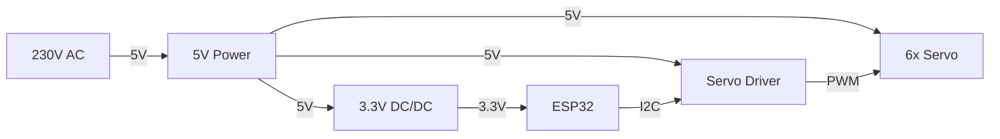

# Hardware

## Einleitung

Dieses Dokument beschreibt die Hardwaregrundlage des Projekts zur Steuerung eines 6-achsigen Roboterarms. Es ergänzt die Projektbeschreibung um die physische Systemsicht und bildet die Basis für Verdrahtung, Inbetriebnahme, Kalibration und hardwarenahe Softwareentwicklung.

## Systemübersicht

Die Hardware des Systems besteht im Kern aus folgenden Baugruppen:

* Roboterarm mit sechs Servoantrieben
* ESP32 als zentrale Steuerplattform
* PCA9685-basierte Servoansteuerung
* Stromversorgung für Logik und Aktorik
* optionale Status- und Diagnoseelemente

Das folgende Übersichtsdiagramm zeigt die aktuell bekannten Hauptkomponenten und ihre groben Beziehungen:

Das Diagramm dient zunächst nur der Systemübersicht. Pinbelegung, genaue Spannungsführung, Kanalzuordnung und optionale Signale wie `OE` werden in späteren Kapiteln konkretisiert.

## Hardware-Ziele und Randbedingungen

Die Hardwareauslegung verfolgt insbesondere folgende Ziele:

* reproduzierbare und stabile Ansteuerung eines 6-achsigen Roboterarms
* Trennung zwischen fachlicher Steuerlogik und hardwarenaher Signalausgabe
* praktikable Inbetriebnahme ohne sensorische Rückführung
* Eignung für schrittweise Kalibration und Testbarkeit
* Auslegung auf eine erste Implementationsstufe mit einer kleinen REST-Schnittstelle für Entwicklung und Integration, jedoch weiterhin ohne zusätzliche Sensorik

## Komponentenliste

Die folgenden Hauptkomponenten sind für die erste Ausbaustufe vorgesehen:

| Komponente | Auswahl | Funktion | Bemerkung |
| --- | --- | --- | --- |
| Roboterarm | [Joy-it Grab-it](../doc/datasheet/Robot02_Datasheet_2019_09_19.pdf) | mechanische Plattform des Systems | 6 Achsen mit Greifer |
| Servoantriebe | [6x COM-Motor02](../doc/datasheet/COM-Motor02-Datasheet.pdf) | Aktorik der Gelenke und des Greifers | 6 Servos für Achsen und Greifer |
| Mikrocontroller | [Waveshare ESP32-S3 Entwicklungsboard](https://www.bastelgarage.ch/waveshare-esp32-s3-entwicklungsboard) | zentrale Steuerplattform | Auswahl für die erste Implementationsstufe |
| Servo-Treiber | [16-Kanal PWM / Servo Treiber I2C (PCA9685)](https://www.bastelgarage.ch/16-kanal-pwm-servo-treiber-i2c-pca9685), [PCA9685-Datenblatt](../doc/datasheet/PCA9685_NXP_Datasheet_Rev4_2015-04-16.pdf) | PWM-Ausgabe für die Servos | basiert auf dem PCA9685 |
| 5V-Netzteil | kleines Schaltnetzteil 230V auf 5V, Hersteller unbekannt | primäre Versorgung des Systems | Ausgangsdaten und Belastbarkeit sind noch zu verifizieren |
| 3.3V-Wandler | [S09 3.3V Step Up/Down Converter 3-15V nach 3.3V 600mA](https://www.bastelgarage.ch/s09-3-3v-step-up-down-converter-3-15v-nach-3-3v-600ma) | geregelte 3.3V-Versorgung | Eingang `3-15V`, Ausgang `3.3V`, max. `600mA` |

## Zielplattform

Als Zielplattform ist für die erste Implementationsstufe das [Waveshare ESP32-S3 Entwicklungsboard](https://www.bastelgarage.ch/waveshare-esp32-s3-entwicklungsboard) vorgesehen.

Für die Build-Konfiguration in PlatformIO wird dafür vorerst das generische Boardprofil `esp32-s3-devkitc-1` verwendet. Solange kein boardspezifisches Profil für das genaue Waveshare-Board benötigt wird, dient dieses Profil als pragmatische Entwicklungsgrundlage.

Aus aktueller Sicht ergeben sich daraus insbesondere folgende Eigenschaften und Erwartungen:

* ESP32-S3 als zentrale Mikrocontroller-Plattform
* Eignung für moderne C/C++-Entwicklung mit PlatformIO
* Nutzung einer I2C-Schnittstelle zur Anbindung des PCA9685
* Nutzung der integrierten Netzwerkfunktionen für eine kleine REST-Schnittstelle in der frühen Softwarephase
* USB-Schnittstelle für Firmware-Upload, serielle Diagnose und Entwicklung
* ausreichende Leistungsfähigkeit für Orchestrierung, Kinematik, Validierung und Ablaufsteuerung

Im aktuell verwendeten Entwicklungsaufbau erscheint das Board unter WSL als einzelnes serielles Gerät mit einem Symlink der Form
`/dev/serial/by-id/usb-1a86_USB_Single_Serial_... -> ../../ttyACM0`.

Daraus ergeben sich für den aktuellen Software- und Bring-up-Stand die folgenden pragmatischen Schlussfolgerungen:

* Upload und serieller Monitor laufen über denselben Port `/dev/ttyACM0`
* Bootmeldungen des Chips und Firmware-Logs teilen sich denselben seriellen Kanal
* für den aktuellen WSL-Workflow wird kein separater nativer USB-CDC-Kanal des `ESP32-S3` vorausgesetzt
* die erste serielle Diagnose erfolgt zuverlässig über den normalen Arduino-Serial-Pfad

Für die weitere Spezifikation sind noch konkret festzulegen:

* Versorgungskonzept des Boards im Zusammenspiel mit der externen Servo-Versorgung
* Nutzung zusätzlicher GPIOs, beispielsweise für Status-LED und das `OE`-Signal des PCA9685
* Netzwerkanbindung und Betriebsart der REST-Schnittstelle im Entwicklungsaufbau
* Boot- und Reset-relevante Pins, die bei der Verdrahtung nicht störend belegt werden dürfen

## Mechanik des Roboterarms

Dieses Kapitel beschreibt den physischen Aufbau des Arms aus Hardwaresicht. Die Benennung orientiert sich an der in der Projektbeschreibung eingeführten Nomenklatur.

Wesentliche mechanische Bezugspunkte und Gelenke sind:

* `D`: Drehteller, fest bei `(0,0,0)` als mechanischer Basispunkt des Arms
* `E`: Ellenbogen als kartesischer Gelenkpunkt `E(x,y,z)`
* `H`: Handgelenk als kartesischer Gelenkpunkt `H(x,y,z)`
* `G`: Greiferspitze als kartesischer Endpunkt `G(x,y,z)`

Die mechanisch betätigten Achsen werden wie folgt bezeichnet:

* `d`: Drehtellerachse
* `s`: Schulterachse
* `e`: Ellenbogenachse
* `hp`: Handgelenk-Pitch
* `hr`: Handgelenk-Roll
* `g`: Greiferöffnung

Für die Hardwarebetrachtung sind dabei insbesondere relevant:

* die physische Zuordnung jedes Servos zu einer dieser Achsen
* die realen mechanischen Anschläge und nutzbaren Winkelbereiche
* montagebedingte Offsets gegenüber dem idealisierten Modell
* die definierte Home Position als reproduzierbare Ausgangslage

## Aktoren

Als Aktoren werden sechs Servoantriebe des Typs [COM-Motor02](../doc/datasheet/COM-Motor02-Datasheet.pdf) eingesetzt. Sie bilden die mechanisch betätigten Achsen des Roboterarms und des Greifers ab.

Für die erste Hardwarebeschreibung wird folgende fachliche Zuordnung verwendet:

| Servo | Achse | Bedeutung | Sollbereich gemäss Projektbeschreibung |
| --- | --- | --- | --- |
| Servo 1 | `d` | Drehtellerachse | `-180° .. 90°` |
| Servo 2 | `s` | Schulterachse | `-90° .. 90°` |
| Servo 3 | `e` | Ellenbogenachse | `-100° .. 100°` |
| Servo 4 | `hp` | Handgelenk-Pitch | `0° .. 135°` |
| Servo 5 | `hr` | Handgelenk-Roll | `-180° .. 180°` |
| Servo 6 | `g` | Greiferöffnung | `0% .. 100%` |

Für alle sechs Aktoren sind aus aktueller Sicht insbesondere relevant:

* Versorgung aus der `5V`-Ebene
* Kalibration je Achse wegen mechanischer Offsets und Montageabweichungen
* spätere Zuordnung auf konkrete PWM-Kanäle des `Servo Driver`

## Ansteuerung der Servos

Die Servoansteuerung soll über das Modul [16-Kanal PWM / Servo Treiber I2C (PCA9685)](https://www.bastelgarage.ch/16-kanal-pwm-servo-treiber-i2c-pca9685) erfolgen. Das zugehörige PCA9685-Datenblatt ist lokal unter [PCA9685_NXP_Datasheet_Rev4_2015-04-16.pdf](../doc/datasheet/PCA9685_NXP_Datasheet_Rev4_2015-04-16.pdf) abgelegt.

Für die erste Hardwareplanung sind dabei folgende Punkte relevant:

* Ansteuerung über I2C mit nur zwei Steuerleitungen zwischen ESP32 und Treibermodul
* I2C-Datenleitung `SDA` auf `GPIO4` des ESP32-S3
* I2C-Taktleitung `SCL` auf `GPIO5` des ESP32-S3
* Standard-I2C-Adresse `0x40`, sofern keine Adressbrücken gesetzt werden
* 16 PWM-Kanäle, wodurch die 6 Achsen des Arms mit deutlicher Reserve angesteuert werden können
* 12-Bit-Auflösung des PCA9685
* Versorgung des Moduls mit `5V`
* separate Servo-Versorgung über `5V`
* Verwendung des `OE`-Pins des PCA9685 als Output-Enable-Signal für die PWM-Ausgänge

Für die Softwareseite wird vorläufig davon ausgegangen, dass eine etablierte PCA9685-Bibliothek verwendet wird. Auf der Produktseite wird dazu explizit die Adafruit PWM Servo Driver Library genannt.

Noch offen beziehungsweise später zu verifizieren sind insbesondere:

* konkrete PWM-Frequenz für die verwendeten Servos
* exakte Zuordnung der sechs Achsen zu den PWM-Kanälen
* konkreter ESP32-GPIO für das `OE`-Signal, sofern es softwareseitig geschaltet wird
* elektrische Qualität der Servo-Versorgung unter Last

## Stromversorgung

Die Stromversorgung ist für einen stabilen Betrieb besonders kritisch und soll daher gesondert spezifiziert werden.

Für die aktuelle Planung ist folgende Grundstruktur vorgesehen:

* ein kleines Schaltnetzteil `230V -> 5V` versorgt das System primär
* die Servos werden aus der `5V`-Ebene versorgt
* die `3.3V`-Versorgung wird über den [S09 Step Up/Down Converter](https://www.bastelgarage.ch/s09-3-3v-step-up-down-converter-3-15v-nach-3-3v-600ma) bereitgestellt
* der ESP32-S3 und weitere reine Logikkomponenten werden aus der `3.3V`-Ebene versorgt
* alle Baugruppen benötigen einen gemeinsamen Massebezug

Zum S09-Wandler sind aktuell folgende technische Eckdaten relevant:

* Eingangsspannung `3-15V DC`
* Ausgangsspannung `3.3V DC`
* maximaler Ausgangsstrom `600mA`
* Wirkungsgrad laut Produktseite etwa `75%`
* Enable-Pin `EN` zur gezielten Aktivierung oder Deaktivierung des Wandlers

Für das Versorgungskonzept bedeutet dies:

* die `5V`-Schiene ist für die Servoantriebe leistungskritisch
* die `3.3V`-Schiene ist für Mikrocontroller und Logik funktional kritisch
* Störungen oder Einbrüche auf der `5V`-Ebene können sich über Masse oder Versorgungskopplung indirekt auf die Steuerlogik auswirken
* ein Brownout oder Reset des ESP32 unter Servo-Last muss bei der Inbetriebnahme explizit beobachtet werden

Der derzeit grösste Unsicherheitsfaktor ist das verwendete `230V -> 5V`-Schaltnetzteil ohne Hersteller- oder Leistungsangaben. Solange dessen Strombelastbarkeit, Spannungsstabilität und Schutzverhalten nicht bekannt sind, bleibt offen, ob es für den gleichzeitigen Betrieb mehrerer Servos ausreichend dimensioniert ist.

## Elektrische Verschaltung

Dieses Kapitel beschreibt die konkrete Verdrahtung der Hardwarekomponenten.

Für die formale Erfassung der elektrischen Verschaltung sollen Schaltplan und gegebenenfalls spätere Layout-Arbeiten in `KiCad` erstellt werden. Dadurch bleibt die Hardwaredokumentation auch bei wachsender Verdrahtungstiefe strukturiert, nachvollziehbar und versionierbar.

Für die erste Ausbaustufe wird von folgender grundlegender Verschaltung ausgegangen:

* das `230V -> 5V`-Schaltnetzteil versorgt die `5V`-Ebene des Systems
* der `Servo Driver` wird mit `5V` versorgt
* die sechs Servos werden ebenfalls aus der `5V`-Ebene versorgt
* der `S09 3.3V DC/DC` erzeugt aus der vorhandenen Eingangsspannung die `3.3V`-Versorgung für den `ESP32`
* `ESP32` und `Servo Driver` sind über `I2C` miteinander verbunden
* der `Servo Driver` erzeugt die `PWM`-Signale für die sechs Servos
* alle Komponenten verwenden einen gemeinsamen `GND`

Konzeptionell ergeben sich daraus mindestens folgende elektrische Verbindungen:

* `5V` vom Netzteil zum `Servo Driver`
* `5V` vom Netzteil zu den Servos
* Eingangsspannung zum `S09 3.3V DC/DC`
* `3.3V` vom `S09 3.3V DC/DC` zum `ESP32`
* `SDA` zwischen `ESP32 GPIO4` und `Servo Driver`
* `SCL` zwischen `ESP32 GPIO5` und `Servo Driver`
* `OE` zwischen `ESP32` und `Servo Driver`, falls die PWM-Ausgänge softwareseitig freigegeben oder gesperrt werden
* `GND` zwischen Netzteil, `S09 3.3V DC/DC`, `ESP32`, `Servo Driver` und Servos

Für die weitere Detaillierung sind noch festzulegen:

* genaue Einspeisung der Eingangsspannung in den `S09 3.3V DC/DC`
* Servo-Kanalzuordnung `0..5` oder vergleichbare Zuordnung auf dem `Servo Driver`
* konkreter ESP32-GPIO für den `OE`-Pin des PCA9685
* zusätzliche Pufferung oder Entstörung der Versorgung

## Signal- und Kommunikationsschnittstellen

Hier werden die elektrischen und logischen Schnittstellen zwischen den Baugruppen beschrieben.

Dazu gehören insbesondere:

* I2C zwischen ESP32 und PCA9685
* WLAN als Netzwerkbasis für die REST-Schnittstelle
* serielle Schnittstelle für Debugging
* optionale Erweiterungsschnittstellen
* Reset-, Enable- oder Statussignale, falls verwendet

Für die erste Ausbaustufe ergibt sich damit folgende Hauptsignalkette:

`ESP32-S3 -> I2C -> PCA9685 -> PWM -> Servos`

Für den ersten Software-Slice wird die Kommunikation zunächst bewusst kleiner angesetzt. Bevor die Servoansteuerung eingebunden wird, darf die Firmware zunächst nur `ESP32-S3 -> WLAN -> REST API` sowie serielle Debug-Ausgaben nutzen. Die I2C- und PWM-Kette bleibt dabei weiterhin Teil der vorgesehenen Hardwarezielarchitektur, wird aber erst in einem späteren Implementationsschritt aktiv verwendet.

## Startverhalten und sichere Inbetriebnahme

Da das System ohne sensorische Rückmeldung arbeitet, ist das Startverhalten fachlich und sicherheitstechnisch besonders wichtig.

Für die erste Ausbaustufe gilt folgende Betriebsannahme:

* vor dem Einschalten wird der Arm manuell in eine definierte Startlage gebracht
* diese Startlage ist so gewählt, dass der Greifer mit leichter Krümmung vertikal vor dem Drehteller steht
* diese mechanische Ausgangslage entspricht der im Projekt verwendeten Home Position im stromlosen Zustand
* die logische Initialposition entspricht der fachlichen 0-Position aller Servoachsen

Für die sichere Inbetriebnahme wird zusätzlich folgendes Vorgehen festgelegt:

* die Achsen werden vom Greifer aus rückwärts angesteckt
* nach jedem angesteckten Aktor wird der jeweilige Fahrbereich kontrolliert
* erst nach dieser schrittweisen Prüfung wird der vollständige Arm in Betrieb genommen

Damit wird die elektrische Zuordnung von Servo, Achse und Bewegungsrichtung schrittweise überprüft, bevor alle Aktoren gleichzeitig aktiv sind.

Offen bleibt bewusst, wie die Software selbst erkennt oder nachweist, dass sich das System tatsächlich in dieser Initiallage befindet. Für die erste Ausbaustufe wird dieser Zustand nicht durch Sensorik oder Referenzfahrt verifiziert, sondern als manuell hergestellte Betriebsannahme behandelt.

## Kalibration

Dieses Kapitel beschreibt alle hardwarebezogenen Punkte, welche für die Kalibration relevant sind.

Während der Inbetriebnahme werden nicht nur elektrische Verbindungen geprüft, sondern auch die mechanischen Zusammenhänge der einzelnen Achsen ermittelt. Dazu gehören insbesondere die fachliche 0-Position jeder Achse sowie die Zuordnung zwischen mechanischem Winkel und tatsächlich ausgeführter Bewegung.

Aus dieser schrittweisen Kalibration ergeben sich pro Achse insbesondere:

* die mechanisch sinnvolle 0-Position
* die Zuordnung zwischen logischem Winkelwert und realer Achsstellung
* die Drehrichtung des Servos bezogen auf das fachliche Modell
* minimale und maximale PWM-Werte für die zulässige Ansteuerung
* achsspezifische Besonderheiten wie Offsets oder asymmetrische Fahrbereiche

Die Kalibration ist damit ein praktischer Bestandteil der Inbetriebnahme und bildet die Grundlage dafür, dass die in der Software verwendeten Gelenkwinkel konsistent auf reale Servo-Stellwerte abgebildet werden können.

## Sicherheits- und Risikobetrachtung

Für die erste Ausbaustufe wird die Sicherheitsbetrachtung bewusst auf die mechanisch relevanten Bewegungsgrenzen des Arms fokussiert.

Unkontrollierte Bewegungen beim Start werden dabei nicht separat betrachtet. Stattdessen soll die definierte Init Position sicherstellen, dass beim Aufstarten keine kritischen Kollisionen mit der eigenen Struktur oder der Umgebung entstehen.

Mechanische Anschläge werden durch die festgelegten maximalen Achsbereiche in `[°]` begrenzt. Falls erforderlich, werden diese Grenzen zusätzlich durch minimale und maximale PWM-Werte abgesichert, die im Rahmen der Kalibration bestimmt werden.

Die softwareseitige Durchsetzung dieser Grenzen ist später Aufgabe des Software HAL. Dadurch soll sichergestellt werden, dass nur zulässige Stellwerte an die Hardwareausgabe weitergegeben werden.

## Offene Punkte und Annahmen

Dieses Kapitel sammelt die zum aktuellen Zeitpunkt noch nicht abschliessend geklärten Hardwarefragen.

* `230V -> 5V`-Netzteil: Hersteller, elektrische Daten und tatsächliche Belastbarkeit sind unbekannt und müssen für den realen Betrieb noch verifiziert werden.
* Stromaufnahme unter Last: Die reale Last durch mehrere gleichzeitig bewegte Servos ist noch nicht gemessen und muss bei der Inbetriebnahme beobachtet werden.
* tatsächlich nutzbarer Stellbereich der Servos: Die fachlich definierten Winkelbereiche sind festgelegt, die real sauber nutzbaren Bereiche ergeben sich jedoch erst aus der Kalibration.
* Pinbelegung des `ESP32`: `SDA` ist auf `GPIO4` und `SCL` auf `GPIO5` festgelegt; die serielle Diagnose und der konkrete `OE`-GPIO sind noch festzulegen.
* Servo-Kanalzuordnung auf dem `PCA9685`: Die feste Zuordnung der Achsen `d`, `s`, `e`, `hp`, `hr`, `g` auf konkrete PWM-Kanäle ist noch offen.
* Umgang mit `OE`: Der `OE`-Pin des `PCA9685` ist als Output-Enable-Signal vorgesehen; offen ist noch, über welchen ESP32-GPIO er softwareseitig geschaltet wird.
* Versorgung des `ESP32`: Es ist noch festzulegen, ob das Board dauerhaft über den externen `3.3V`-Wandler oder über seine eigene Board-Versorgung betrieben werden soll.
* Initialzustand aus Sicht der Software: Offen bleibt, wie die Software erkennt oder absichert, dass die manuell eingestellte Startlage tatsächlich zur angenommenen Initialposition passt.

## Anhang

### Glossar und Abkürzungen

| Begriff / Abkürzung | Beschreibung |
| --- | --- |
| ESP32 | Mikrocontroller-Plattform der Steuerung. Im vorliegenden Projekt wird ein ESP32-S3-Entwicklungsboard verwendet. |
| GND | Gemeinsamer Massebezug aller elektrischen Baugruppen. |
| HAL | Hardware Abstraction Layer. Softwareschicht zur gekapselten hardwarenahen Ansteuerung. |
| Home Position | Definierte Ausgangslage des Roboterarms im stromlosen Zustand, welche vor dem Einschalten manuell hergestellt wird. |
| I2C | Serielle Busschnittstelle zur Kommunikation zwischen ESP32 und PCA9685. |
| Init Position | Angenommener logischer Initialzustand der Software nach dem Start. Im Projekt entspricht er den fachlichen Initialwerten der Aktoren. |
| OE | Output Enable des PCA9685. Signal zur Freigabe oder Sperrung der PWM-Ausgänge. |
| PCA9685 | 16-Kanal-PWM-Treiberbaustein für die Servo-Ansteuerung. |
| PWM | Pulsweitenmodulation zur Ausgabe der Stellwerte an die Servoantriebe. |
| SDA | Datenleitung des I2C-Busses. |
| SCL | Taktleitung des I2C-Busses. |
| Servo Driver | PWM-Ausgabemodul auf Basis des PCA9685 zur Ansteuerung der Servos. |

### Dokumentenverweise

Die folgenden Dokumente werden in der Hardwarebeschreibung direkt referenziert oder bilden eine fachliche Grundlage [[1]](#ref-1) [[2]](#ref-2) [[3]](#ref-3) [[4]](#ref-4).

[1] Projektbeschreibung. Lokale Ablage: [projektbeschreibung.md](../doc/projektbeschreibung.md)

[2] Joy-it: Robot02 Datasheet, Version vom 2019-09-19. Lokale Ablage: [Robot02_Datasheet_2019_09_19.pdf](../doc/datasheet/Robot02_Datasheet_2019_09_19.pdf)

[3] Joy-it: COM-Motor02 Datasheet. Lokale Ablage: [COM-Motor02-Datasheet.pdf](../doc/datasheet/COM-Motor02-Datasheet.pdf)

[4] NXP Semiconductors: PCA9685 - 16-Channel, 12-bit PWM Fm+ I2C-Bus LED Controller, Product Data Sheet, Rev. 4 - 16 April 2015. Lokale Ablage: [PCA9685_NXP_Datasheet_Rev4_2015-04-16.pdf](../doc/datasheet/PCA9685_NXP_Datasheet_Rev4_2015-04-16.pdf)
