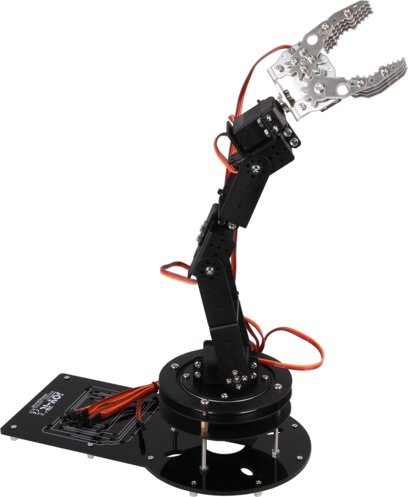

# Demo `<dilbert>` &ensp;[⬅️](experiences_ik.md) [⬆️](../slides.md) [➡️](praxis-transfer.md)

> [!note]
>
> Dilbert HTML File im Browser öffnen:
>
> `"/mnt/c/Program Files (x86)/Google/Chrome/Application/chrome.exe" 
file://wsl.localhost/Ubuntu/home/andi/git/ik/web/dilbert.html`
>
> Oder aber:  
> [http://robot.local](http://robot.local)
>
> Code: `pio run -e esp32s3 -t upload`
>
> Daten: ` pio run -e esp32s3 -t uploadfs`