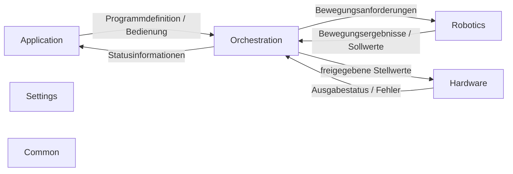

# Praxis Transfer [⬅️](demo.md) [⬆️](../slides.md)

* REST und TCP/IP auf einem ’leichten‘ ESP32  
  <i style="color: orange">Funktioniert</i> mit wiederverwendeter Library
* Dilbert als `<dilbert>`  
  <i style="color: orange">Funktioniert</i> mit ordentlichem KI Einsatz
* HW Spezifikation
  * **Controller:** ESP32-S3-WROOM-1-N8R8 240MHz, 320KB S-RAM, 8MB PS-RAM, 8MB Flash
  * **Debug:** Current (esp-builtin) On-board (esp-builtin) External (cmsis-dap, esp-bridge, esp-prog, iot-bus-jtag, jlink, minimodule, olimex-arm-usb-ocd, olimex-arm-usb-ocd-h, olimex-arm-usb-tiny-h, olimex-jtag-tiny, tumpa)
  * **Crystal frequency:**  40MHz
  * <i style="color: orange">Nicht üppig, aber gut genug.</i> Zwischen M4/STM32 und i.MX6
* IK Kalkulation von 1024 Stützstellen  
  <i style="color: orange">Machbar</i> Zeitbedarf ~1µs pro Stützpunkt
* HW Preisvergleich
  * Raspberry Pi Pico (RP2040): Dual ARM Cortex-M0+ mit 133 MHz  
  (~CHF 3 bis 5.-)
  * ESP32-S3-WROOM-1-N8R8: Xtensa Dual-Core LX7 mit bis zu 240 MHz  
  (~CHF 10 bis 15.-)
* ESP32 Konfiguration / Typen / Dev-Boards: It's a mess... 💥
* BLE Controller als Eingabegerät
  * Möglich? Möglich.
  * Nintendo: Proprietäre HID Protokolle ⛔
  * Others: z.B. Low-Energy Battery Service Protocol
  * BLE (Funk) und GATT (Profile, Services, Characteristics) besser verstehen
* Minilib Architektur  
  <i style="color: orange">Adaptiert, skaliert, passt!</i> ✔️

