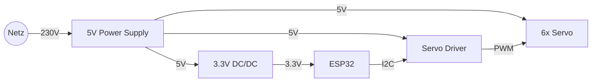

# Hardware Beschreibung[⬅️](project_frame.md) [⬆️](../slides.md) [➡️](project_implementation.md#projekt-umsetzung-und-hindernisse️)

* Bausatz Joy-it Grab-it: [z.B. Conrad](https://www.conrad.ch/de/p/joy-it-roboterarm-bausatz-grab-it-robotarm-motor-control-arduino-cr-1774898-1774898.html)
* Waveshare ESP32-S3-DEV-KIT-N8R8 Evalboard
* ESP32-S3-Wroom-1-N8R8 Chip
* PCA9685 I²C 12-Bit PWM LED/Servo Driver
* Modellbau-Servo
  * 500-2500µs @ 50Hz
  * 5-15% Duty-cycle
  * 102-512 [-]
  * 360°/s
* 230V/5V Netzteil
* 5V/3.3V DC-DC Buck-boost

