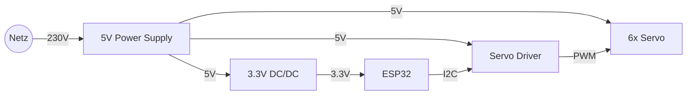

# Hardware Beschreibung[⬅️](project_frame.md) [⬆️](../slides.md) [➡️](project_implementation.md)

* Bausatz Joy-it Grab-it: [z.B. Conrad](https://www.conrad.ch/de/p/joy-it-roboterarm-bausatz-grab-it-robotarm-motor-control-arduino-cr-1774898-1774898.html)
* Modellbau-Servo
  * 500-2500us @ 50Hz
  * 5-15% Duty-cycle
  * 360°/s
* PCA9685 I²C Servo Driver
* ESP32-S3
* 230V/5V Netzteil
* 5V/3.3V DC-DC Buck-boost

