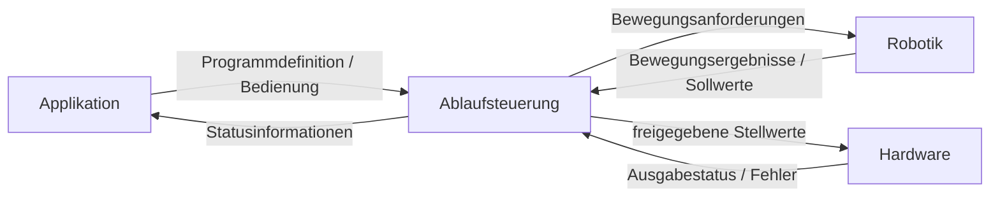
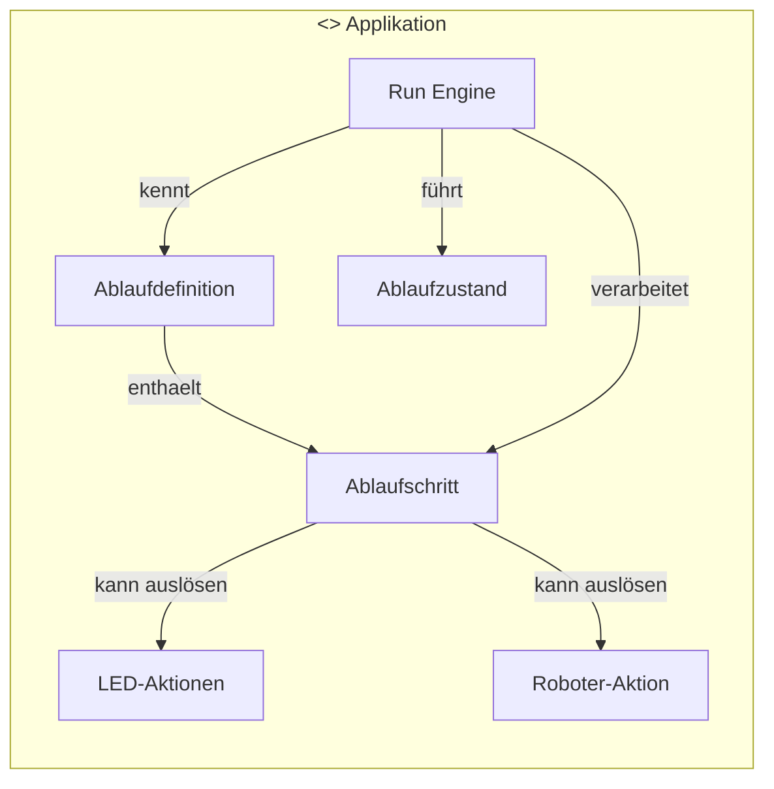
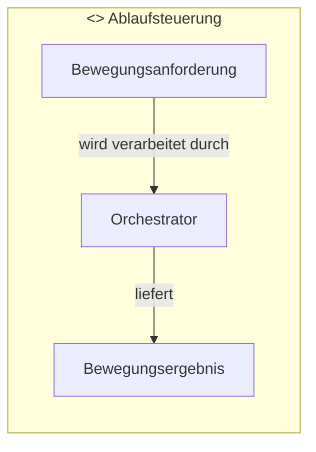
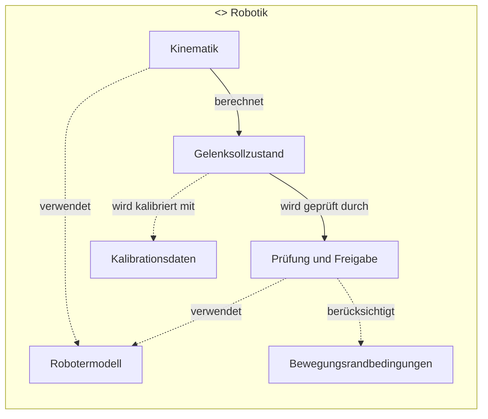
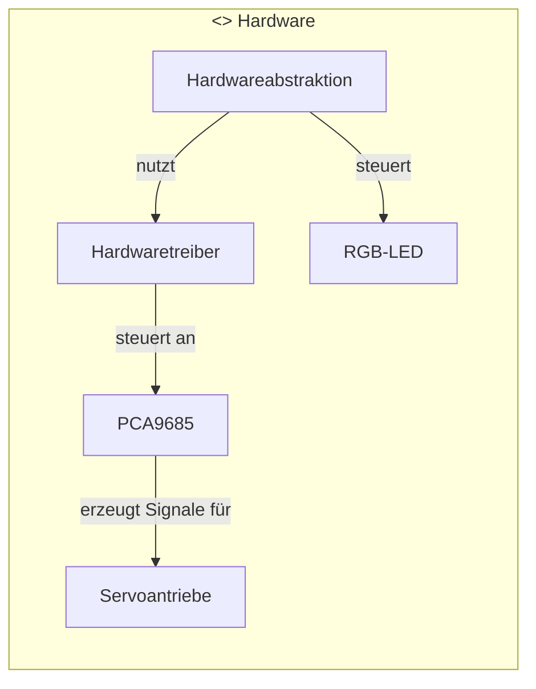
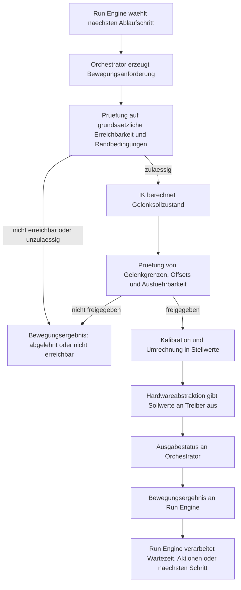

# Projektbeschreibung

Dieses Projekt befasst sich mit der Implementierung eines 6-achsigen Roboterarms von Joy-it. Der Produktname lautet „Joy-it Grab-it“; der Arm besteht aus sechs unabhängigen Servoantrieben des Typs COM-Motor02. Die technischen Daten der Servoantriebe sind in der Datei `COM-Motor02-Datasheet.pdf` dokumentiert.

Ziel des Projekts ist es, den Roboterarm mithilfe inverser Kinematik gleichmäßig und zielorientiert zu steuern. Gleichzeitig soll auf einem ESP32-Modul eine höherwertige Programmiersprache eingesetzt werden, um moderne Programmiertechniken praktisch zu erproben.

Eine weitere zentrale Anforderung ist der Einsatz einer Servokarte mit PCA9685-Chip. Dadurch können die sechs Servos mithilfe verfügbarer Bibliotheken in Echtzeit angesteuert werden.

## Inhaltsverzeichnis

[[_TOC_]]

## Technisches Konzept

### Einführung in Inverse Kinematik

Unter Kinematik versteht man die Beschreibung von Bewegungen, ohne die dabei wirkenden Kräfte zu betrachten. Für einen Roboterarm sind dabei zwei Richtungen relevant:

* Die Vorwärtskinematik berechnet aus bekannten Gelenkwinkeln die resultierende Position und Orientierung des Greifers.
* Die Inverse Kinematik löst das umgekehrte Problem: Für eine gewünschte Zielposition des Greifers sollen passende Gelenkwinkel bestimmt werden.

Die inverse Kinematik bildet damit die Grundlage, um einen Roboterarm nicht nur achsweise, sondern aufgabenorientiert zu steuern. Anstatt jede Servo-Position einzeln vorzugeben, kann ein Ziel im Arbeitsraum formuliert werden, beispielsweise: "Bewege den Greifer nach (x,y,z) und halte dabei einen bestimmten Pitch-Winkel". Die Steuerung berechnet daraus die erforderlichen Winkel für Drehteller, Schulter, Ellenbogen und Handgelenk.

Dieses Problem ist in der Praxis nicht immer eindeutig lösbar. Für dieselbe Greiferposition können mehrere Gelenkkonfigurationen existieren, beispielsweise eine "Ellenbogen-oben"- und eine "Ellenbogen-unten"-Lösung. Ebenso kann ein Ziel außerhalb des mechanisch erreichbaren Arbeitsraums liegen oder nur unter Verletzung von Gelenkgrenzen erreichbar sein. Eine IK-Implementierung muss daher nicht nur mathematisch eine Lösung finden, sondern auch Randbedingungen wie Servo-Limits, mechanische Offsets und stabile Bewegungsabläufe berücksichtigen.

Für einfache Robotergeometrien lassen sich geschlossene, analytische Lösungen herleiten. Diese sind in der Regel schnell und deterministisch, setzen jedoch ein hinreichend ideales geometrisches Modell voraus. Sobald zusätzliche Offsets, Gelenkgrenzen oder komplexere Freiheitsgrade berücksichtigt werden sollen, sind iterative Verfahren häufig robuster und einfacher erweiterbar. Zwei bekannte Verfahren in diesem Bereich sind CCD (Cyclic Coordinate Descent) und FABRIK (Forward And Backward Reaching Inverse Kinematics). Beide arbeiten schrittweise auf eine Zielposition hin und sind deshalb für spätere Erweiterungen dieses Projekts besonders interessant.

Für den hier betrachteten Roboterarm bietet sich zunächst ein vereinfachtes Modell an, bei dem die Geometrie des Arms in Segmente und Gelenke zerlegt wird. Auf dieser Grundlage kann zunächst eine grundlegende IK für Position und einfache Orientierung implementiert werden. Anschließend kann das Modell schrittweise um reale mechanische Abweichungen ergänzt werden, sodass die inverse Kinematik zunehmend besser zum tatsächlichen Verhalten des Roboters passt.

Einen guten Überblick über die Eigenschaften, Stärken und Schwächen verschiedener IK-Verfahren geben Aristidou et al. in ihrer Survey zu Inverse-Kinematik-Verfahren [1]. Für FABRIK ist insbesondere die Originalarbeit von Aristidou und Lasenby relevant [2], in der das Verfahren beschrieben und gegenüber etablierten iterativen Ansätzen eingeordnet wird. Für CCD kann ergänzend die Einführung von Kenwright herangezogen werden [3].

### Beschreibung des idealen Roboterarms

#### Weltkoordinatensystem (task space)

Der Sollzustand des Endeffektors wird durch die Größen
(x,y,z,p,r,g)
beschrieben.
* Dabei beschreiben (x,y,z) die Position des Greifers im Raum.
* p beschreibt die Neigung des Handgelenks
* r beschreibt die Rotation des Handgelenks um seine Längsachse
* g beschreibt die Greiferöffnung

Damit wird festgelegt, an welcher Position (x,y,z) sich der Greifer relativ zum Nullpunkt befinden soll. Zusätzlich werden seine Neigung (p), seine Drehung (r) sowie seine Öffnung (g) beschrieben.

Die Positionen werden in [mm] gemessen. Der Bezugspunkt ist (0,0,0) auf der Standfläche des Motors, genau unterhalb der Achse des Drehtellers.
Pitch und Roll werden in [°] gemessen; Bezugsebene ist die Horizontalebene.
Die Greiferöffnung wird in [%] gemessen, 0% entspricht vollständig geschlossen, 100% entspricht vollständig geöffnet.

#### Definition des Arbeitsraumes (cartesian space)

Der Arbeitsraum beschreibt die Positionen der einzelnen Gelenkpunkte in kartesischen Koordinaten (x,y,z).

Für die Modellierung werden folgende Positionen als kartesische 3D-Vektoren benötigt:
* Drehteller D liegt fest bei (0,0,0)
* Ellenbogen E(x,y,z)
* Handgelenk H(x,y,z)
* Greiferspitze G(x,y,z)

#### Definition des Gelenkraumes (joint space)
Abschließend wird der Gelenkraum definiert. Mit Ausnahme des Greifers werden alle Achsen in [°] angegeben.
* Drehteller d (-90°..90°), 0° zeigt in Richtung der y-Achse des Welt-Koordinatensystems.
* Schulter s (-90°..90°), -90° ist horizontal in Richtung der y-Achse, 0° zeigt vertikal nach oben (Richtung der z-Achse) und 90° kippt die Schulter in Richtung der negativen z-Achse.
* Ellenbogen e (-90°..90°). Hier ist die 0°-Position, wenn Oberarm und Unterarm in dieselbe Richtung zeigen. -90° kippt nach unten, +90° kippt nach oben.
* Handgelenk-Pitch h (-90°..90°) analog zur Ellenbogenachse.
* Handgelenk-Roll w (-90°..90°): Bei -90° dreht das Handgelenk nach links, bei 90° dreht das Handgelenk nach rechts. Blickrichtung: vom Drehteller nach vorne.
* Greifer g (0%..100%): 0% entspricht vollständig geschlossen, 100% vollständig geöffnet.

### Beschreibung des realen Roboterarms

Die mechanische Konstruktion des Arms weist folgende Abweichungen vom idealen Modell auf:
* Die Schulter besitzt einen festen Offset nach vorne (positive y-Achse)
* Pitch und Roll haben einen festen Offset zueinander.
* Roll und das Zentrum des Greifers haben einen festen Offset (Achsen) zueinander.

Weitere Offsets werden im aktuellen Modell zunächst vernachlässigt.

### Servo-Kalibration

Damit die mathematisch berechneten Gelenkwinkel in eine reproduzierbare reale Bewegung überführt werden können, ist eine Kalibration der Servoantriebe erforderlich. Die inverse Kinematik liefert zunächst nur ideale Sollwinkel im Gelenkraum. Zwischen diesen Sollwinkeln und der tatsächlichen mechanischen Stellung des Roboterarms können jedoch systematische Abweichungen bestehen.

Solche Abweichungen entstehen beispielsweise durch unterschiedlich montierte Servohörner, mechanische Toleranzen, Nullpunktverschiebungen oder unterschiedlich nutzbare Winkelbereiche einzelner Antriebe. Ohne Kalibration würde dieselbe berechnete Gelenkkonfiguration in der Praxis nicht zwingend zur erwarteten Pose des Roboterarms führen.

Ziel der Servo-Kalibration ist es daher, für jede Achse eine eindeutige Zuordnung zwischen dem fachlichen Gelenkwinkel und dem realen Ansteuersignal herzustellen. Dazu gehören insbesondere:

* die Bestimmung einer mechanisch sinnvollen Nullstellung
* die Ermittlung von Minimal- und Maximalwerten pro Achse
* die Berücksichtigung eines möglichen Vorzeichenwechsels der Drehrichtung
* die Erfassung fester Offsets zwischen idealem Modell und realer Montage

Konzeptionell kann die Kalibration als Transformationsschritt zwischen Gelenkraum und Hardwareansteuerung verstanden werden. Die Kinematik arbeitet dabei weiterhin mit idealisierten Winkeln und Grenzwerten, während die hardwarenahe Ansteuerung diese Werte mithilfe der Kalibrationsdaten in konkrete Servosignale umsetzt.

Darüber hinaus bildet die Kalibration eine wichtige Grundlage für die Wiederholgenauigkeit des Systems. Erst wenn die Zuordnung zwischen Modell und realem Roboterarm konsistent ist, können berechnete Zielpositionen verlässlich angefahren und spätere Erweiterungen wie Bahnplanung oder automatisierte Bewegungsfolgen sinnvoll umgesetzt werden.

### Erreichbarkeitsprüfung

Nicht jeder vorgegebene Sollzustand des Endeffektors kann vom Roboterarm tatsächlich eingenommen werden. Eine Erreichbarkeitsprüfung ist daher notwendig, um bereits vor oder während der IK-Berechnung zu bewerten, ob ein Zielpunkt unter den gegebenen mechanischen und geometrischen Randbedingungen grundsätzlich realisierbar ist.

Die einfachste Form dieser Prüfung betrachtet zunächst die geometrische Reichweite des Arms. Ein Ziel ist nur dann erreichbar, wenn sich seine Position innerhalb des durch Segmentlängen und Gelenkanordnung definierten Arbeitsraums befindet. Darüber hinaus müssen jedoch weitere Randbedingungen einbezogen werden:

* Gelenkgrenzen der einzelnen Achsen
* feste mechanische Offsets des realen Roboterarms
* Abhängigkeiten zwischen Pitch, Roll und Position des Greifers
* die Frage, ob für einen Zielpunkt mehrere oder gar keine gültigen Gelenkkonfigurationen existieren

Die Erreichbarkeitsprüfung hat damit nicht nur eine mathematische, sondern auch eine sicherheitsrelevante Funktion. Unerreichbare oder kritische Ziele sollen frühzeitig erkannt werden, bevor unzulässige Ansteuerwerte an die Servos übergeben werden. Das reduziert das Risiko von mechanischer Überlastung, Anschlagfahrten oder unkontrollierten Bewegungen.

Im technischen Konzept kann zwischen einer groben und einer detaillierten Prüfung unterschieden werden. Eine grobe Prüfung bewertet, ob ein Zielpunkt prinzipiell im Arbeitsraum liegt. Eine detaillierte Prüfung berücksichtigt zusätzlich Gelenkgrenzen, Offsets und mögliche Konflikte zwischen Position und Orientierung. Auf diese Weise kann ein Ziel entweder direkt freigegeben, verworfen oder nur in modifizierter Form weiterverarbeitet werden.

Langfristig bildet die Erreichbarkeitsprüfung auch die Grundlage für weitergehende Funktionen wie Bahnplanung, Kollisionsvermeidung oder die Auswahl mehrerer möglicher IK-Lösungen nach zusätzlichen Kriterien, etwa minimaler Gelenkbewegung oder mechanisch günstiger Armhaltung.

### Dynamische und physikalische Randbedingungen

Neben geometrischen und kinematischen Randbedingungen sind auch physikalische Grenzen des realen Systems zu berücksichtigen. Diese Grenzen beeinflussen nicht zwingend, ob ein Zielpunkt prinzipiell erreichbar ist, wohl aber, ob eine Bewegung sicher, reproduzierbar und materialschonend ausgeführt werden kann.

Für das vorliegende System sind insbesondere folgende Randbedingungen relevant:

* maximale Winkelgeschwindigkeiten der einzelnen Servoantriebe
* begrenzte Winkelbeschleunigungen und damit verbundene Lastspitzen bei abrupten Bewegungswechseln
* begrenzte Drehmomente der Servos in Abhängigkeit von Hebelarm und Nutzlast
* mechanisches Spiel, elastische Verformungen und mögliches Nachschwingen des Arms
* Grenzen der Stromversorgung bei gleichzeitiger Belastung mehrerer Antriebe
* thermische Belastung der Servos bei längerem Halten oder wiederholter Bewegung unter Last
* begrenzte Greifkraft und begrenzter Greiferweg

Aus technischer Sicht ist daher zwischen Erreichbarkeit und Ausführbarkeit zu unterscheiden. Ein Ziel kann geometrisch erreichbar sein, gleichzeitig aber nur mit zu hoher Geschwindigkeit, zu hoher Last oder in einer mechanisch ungünstigen Armhaltung angesteuert werden. In solchen Fällen ist die Bewegung zwar theoretisch möglich, praktisch jedoch nur eingeschränkt oder gar nicht sinnvoll ausführbar.

Diese Randbedingungen sind insbesondere für spätere Erweiterungen der Steuerung von Bedeutung. Dazu zählen beispielsweise Bewegungsprofile mit begrenzter Geschwindigkeit und Beschleunigung, die Überwachung kritischer Lastsituationen oder die Begrenzung gleichzeitiger Servoaktivitäten. Bereits im technischen Konzept sollte daher berücksichtigt werden, dass die reine Positionsberechnung allein nicht ausreicht, um ein robustes Gesamtsystem zu erhalten.

### Ablaufsteuerung durch eine Run Engine

Da zunächst keine grafische Benutzeroberfläche vorgesehen ist, soll die Anwendungsschicht in einer ersten Ausbaustufe durch eine einfache, programmierbare Ablaufkomponente beschrieben werden. Diese Komponente wird im Folgenden als Run Engine bezeichnet. Ihre Aufgabe besteht darin, eine definierte Folge von Bewegungsanweisungen auszuführen und diese nacheinander an die Steuerungslogik zu übergeben.

Die Run Engine beschreibt damit keinen einzelnen Zielpunkt, sondern einen vollständigen Ablauf aus einer oder mehreren Bewegungsstationen. Jede Station kann insbesondere enthalten:

* einen Sollzustand des Endeffektors
* eine optionale Warte- oder Haltezeit
* optionale Zusatzaktionen wie Statussignale über die RGB-LED
* optionale Roboter-Aktionen, die nicht allein durch eine kartesische Zielvorgabe beschrieben werden

Konzeptionell kann ein solcher Ablauf als generische Liste von Ablaufschritten verstanden werden. Die konkrete Herkunft dieser Liste bleibt zunächst offen. Sie kann beispielsweise fest im Programm hinterlegt, zur Compile-Zeit generiert oder später durch eine andere Konfigurationsquelle bereitgestellt werden. Da auf der Zielhardware möglicherweise keine Speicherkarte vorhanden ist, wird bewusst keine persistente Dateistruktur vorausgesetzt.

Die Run Engine erweitert damit die Anwendungsebene um eine einfache Form der Bewegungsprogrammierung. Anstatt ausschließlich einzelne Zielpositionen ad hoc zu übergeben, kann ein vollständiger Bewegungsablauf beschrieben, gestartet und in definierter Reihenfolge abgearbeitet werden. Dies ist insbesondere für wiederkehrende Demonstrationsabläufe, einfache Pick-and-Place-Sequenzen oder Testprogramme sinnvoll.

## SW Architektur

Die Softwarearchitektur dieses Projekts soll so aufgebaut sein, dass fachliche Logik, mathematische Modellierung und hardwarenahe Ansteuerung klar voneinander getrennt sind. Dadurch bleibt das System übersichtlich, testbar und später erweiterbar, auch wenn sich einzelne Algorithmen oder Hardwarekomponenten ändern.

### Architekturziele

Die Architektur verfolgt insbesondere folgende Ziele:

* Trennung zwischen fachlicher Beschreibung des Roboters und konkreter Hardwareansteuerung
* Austauschbarkeit der IK-Lösungsverfahren
* klare Datenflüsse zwischen Ablaufdefinition, Zielvorgabe, Modellberechnung und Aktoransteuerung
* Berücksichtigung mechanischer Randbedingungen wie Gelenkgrenzen und Offsets
* Berücksichtigung dynamischer und physikalischer Randbedingungen bei der Bewegungsausführung
* Erweiterbarkeit für spätere Funktionen wie Bahnplanung, Kalibrierung oder alternative Greifer
* klare Trennung zwischen fachlicher Berechnung, Orchestrierung, Bewegungsfreigabe und hardwarenaher Ausgabe
* Unterstützung sequenzieller Bewegungsabläufe durch eine einfache Anwendungskomponente

### Logische Schichten

Eine sinnvolle logische Zerlegung besteht aus mehreren Schichten mit klar abgegrenzten Verantwortlichkeiten.

#### Bedien- und Anwendungsschicht

Diese Schicht nimmt Sollvorgaben entgegen und stellt die Schnittstelle zur Benutzerinteraktion oder zu höheren Programmlogiken dar. In der ersten Ausbaustufe wird sie insbesondere durch eine Run Engine geprägt, welche vordefinierte Bewegungsabläufe verwaltet und schrittweise an die darunterliegende Steuerung übergibt. Die Anwendungsschicht arbeitet dabei ausschließlich mit fachlichen Größen wie Zielposition, Orientierung, Greiferöffnung, Wartezeiten, optionalen Statusaktionen und optionalen Roboter-Aktionen.

#### Orchestrierungs- und Steuerungsschicht

Da es sich um eine Steuerung ohne sensorische Rückkopplung handelt, ist eine zentrale Orchestrierungsinstanz erforderlich, welche den gesamten Ablauf von der Zielvorgabe bis zur Stellwertausgabe verantwortet. Diese Instanz kann als Orchestrator verstanden werden. Die Schicht ruft Prüf- und Berechnungskomponenten in der richtigen Reihenfolge auf, koordiniert die fachlichen Verarbeitungsschritte und entscheidet, ob eine Bewegungsanforderung freigegeben, verworfen oder mit einer Fehlermeldung an die Anwendung zurückgegeben wird. Rückmeldungen dieser Schicht beschreiben dabei den fachlichen und technischen Bearbeitungsstatus einer Anforderung, nicht jedoch eine physisch verifizierte Zielerreichung.

#### Kinematik- und Modellschicht

In dieser Schicht wird das mathematische Modell des Roboterarms beschrieben. Sie enthält die geometrischen Eigenschaften des idealen Arms, die Segmentlängen, die Lage der Gelenke sowie später mögliche Korrekturen für reale mechanische Abweichungen. Zudem bildet sie die Grundlage für Vorwärtskinematik und inverse Kinematik.

#### Prüf- und Freigabeschicht

Zwischen Zielvorgabe und direkter Aktoransteuerung ist eine Prüfung und Freigabe der Bewegung zweckmäßig. In dieser Schicht wird bewertet, ob ein Ziel grundsätzlich erreichbar ist, ob Gelenkgrenzen eingehalten werden und ob die berechnete Lösung mechanisch plausibel ist. Darüber hinaus wird hier zwischen prinzipieller Erreichbarkeit und praktischer Ausführbarkeit unterschieden, beispielsweise im Hinblick auf Geschwindigkeitsgrenzen, Beschleunigungen oder Lastsituationen. Die Schicht hat damit die Aufgabe, Bewegungen fachlich zu bewerten und nur solche Sollwerte zur Ausgabe freizugeben, die unter den definierten Randbedingungen zulässig sind.

#### Hardwareabstraktionsschicht

Diese Schicht setzt freigegebene Gelenksollwerte in konkrete Ansteuersignale für die Servos um. Dazu gehören insbesondere die Umrechnung von Winkeln in hardwaregeeignete Stellgrößen, die Berücksichtigung servoindividueller Kalibrierwerte sowie die Kommunikation mit der Servokarte. Ebenso ist diese Schicht der geeignete Ort, um letzte hardwarenahe Schutzmechanismen wie Signalbegrenzungen, sichere Startpositionen oder die Begrenzung gleichzeitiger Servoaktivitäten zu verankern. Die mathematische Logik der Kinematik soll von diesen Details unabhängig bleiben.

### Komponenten und Verantwortlichkeiten

Innerhalb der beschriebenen Schichten kann die Architektur weiter in logisch getrennte Komponenten unterteilt werden. Diese Unterteilung dient dazu, die Verantwortlichkeiten des Systems präziser zu beschreiben, ohne bereits eine konkrete Implementierungsform festzulegen.

#### Orchestrator

Der Orchestrator ist die zentrale Ablaufkomponente der Softwarearchitektur. Er nimmt Bewegungsanforderungen aus der Anwendungsschicht entgegen und steuert deren Verarbeitung durch die übrigen Komponenten. Dabei hält er selbst möglichst wenig fachliche Detaillogik, sondern koordiniert den Ablauf, sammelt Ergebnisse und trifft die abschließende Entscheidung über Freigabe oder Ablehnung einer Bewegung. Im Zusammenspiel mit der Run Engine verarbeitet er nicht nur Einzelziele, sondern auch geordnete Folgen mehrerer Ablaufschritte.

Zu den Aufgaben des Orchestrators gehören insbesondere:

* Entgegennahme und Verwaltung von Bewegungsanforderungen
* Entgegennahme einzelner Ablaufschritte aus der Run Engine
* Aufruf von Erreichbarkeitsprüfung, IK-Berechnung und Freigabeprüfung
* Zusammenführung von Teilergebnissen zu einem einheitlichen Bewegungsergebnis
* Rückgabe von Freigaben, Ablehnungen oder Fehlermeldungen an die Anwendung
* Übergabe freigegebener Stellwerte an die Hardwareabstraktion

#### Run Engine

Die Run Engine ist die zentrale Anwendungskomponente für die Ausführung vordefinierter Bewegungsabläufe. Sie verwaltet eine Folge von Ablaufschritten und übergibt diese nacheinander an den Orchestrator. Dadurch trennt sie die Beschreibung eines Bewegungsprogramms von dessen fachlicher Prüfung und technischer Ausführung.

Zu den Aufgaben der Run Engine gehören insbesondere:

* Verwaltung eines Ablaufs aus einem oder mehreren Schritten
* sequentielle Übergabe von Sollpositionen an den Orchestrator
* Berücksichtigung von Haltezeiten zwischen zwei Bewegungsschritten
* Auslösung einfacher Begleitaktionen wie LED-Signalen
* Auslösung einfacher Roboter-Aktionen außerhalb einer reinen kartesischen Zielbeschreibung
* definierte Behandlung von Freigaben, Ablehnungen oder Abbruchbedingungen innerhalb eines Ablaufs

#### Kinematikkomponente

Die Kinematikkomponente stellt die mathematischen Berechnungsverfahren des Systems bereit. Dazu gehören insbesondere die inverse Kinematik zur Berechnung von Gelenksollwerten aus einem Endeffektorziel sowie gegebenenfalls die Vorwärtskinematik zur Analyse oder Plausibilisierung von Gelenkkonfigurationen. Sie arbeitet auf Basis des Robotermodells und bleibt von hardwarebezogenen Details unabhängig.

#### Prüfkomponente

Die Prüfkomponente bewertet Bewegungsanforderungen und berechnete Gelenksollzustände unter fachlichen Randbedingungen. Sie führt insbesondere die Erreichbarkeitsprüfung, die Prüfung von Gelenkgrenzen sowie die Bewertung der praktischen Ausführbarkeit durch. Ihre Aufgabe besteht nicht in der Berechnung einer Bewegung, sondern in deren fachlicher Beurteilung.

#### Kalibrationskomponente

Die Kalibrationskomponente beschreibt die Abbildung zwischen idealisierten Gelenkwinkeln und realen hardwarebezogenen Stellgrößen. Sie nutzt die hinterlegten Kalibrationsdaten, um Sollwerte in eine Form zu überführen, die von der Hardwareabstraktion verarbeitet werden kann. Gleichzeitig sorgt sie dafür, dass Montageabweichungen und servoindividuelle Besonderheiten nicht in die mathematische Kinematiklogik eindringen.

#### Hardwaretreiber

Die Hardwareabstraktionsschicht kann konzeptionell in einen allgemeinen Abstraktionsanteil und einen konkreten Hardwaretreiber unterteilt werden. Der Treiber ist für die tatsächliche Kommunikation mit der Servokarte verantwortlich und setzt vorbereitete Stellwerte in die entsprechenden Ausgabesignale um. Dadurch bleibt die darüberliegende Architektur unabhängig von einer konkreten Ansteuerbibliothek oder Kommunikationsschnittstelle.

### Zentrale Datenmodelle

Unabhängig von der späteren Implementierung bietet sich eine Trennung der wichtigsten fachlichen Datenstrukturen an.

#### Zielbeschreibung des Endeffektors

Die Zielbeschreibung enthält die gewünschte Position des Greifers im Raum, seine Orientierung sowie die Greiferöffnung. Dieses Modell repräsentiert die Eingabe aus Sicht der Anwendung und beschreibt, was erreicht werden soll, jedoch nicht, wie dies auf Gelenkebene umgesetzt wird.

#### Ablaufschritt

Ein Ablaufschritt beschreibt eine einzelne Anweisung innerhalb eines Bewegungsprogramms. Er enthält mindestens eine Zielbeschreibung des Endeffektors und kann zusätzlich eine Haltezeit, optionale Begleitaktionen oder optionale Roboter-Aktionen umfassen. Unter Roboter-Aktionen werden dabei diskrete, fachlich benennbare Aktionen verstanden, die nicht ausschließlich über eine kartesische Zielbeschreibung modelliert werden, beispielsweise das gezielte Öffnen oder Schließen des Greifers. Dadurch bildet der Ablaufschritt die kleinste fachliche Einheit, welche von der Run Engine an den Orchestrator übergeben wird.

#### Bewegungsanforderung

Die Bewegungsanforderung ist das fachliche Übergabeobjekt zwischen Anwendungsschicht beziehungsweise Run Engine und Orchestrator. In der einfachsten Form enthält sie genau einen auszuführenden Ablaufschritt oder eine daraus abgeleitete Zielbeschreibung. Dadurch wird klar zwischen der internen Struktur eines Bewegungsprogramms und der einzelnen fachlichen Anforderung unterschieden, welche der Orchestrator konkret verarbeitet.

#### Ablaufdefinition

Die Ablaufdefinition beschreibt eine geordnete Liste von einem oder mehreren Ablaufschritten. Sie repräsentiert damit das eigentliche Bewegungsprogramm, das von der Run Engine verarbeitet wird. Die konkrete Speicherform bleibt bewusst offen, damit das Konzept unabhängig von Dateisystem, Speicherkarte oder externer Konfigurationsquelle bleibt.

#### Gelenksollzustand

Der Gelenksollzustand beschreibt die berechnete Konfiguration des Roboterarms im Gelenkraum. Dazu gehören die Winkel aller relevanten Achsen sowie die Öffnung des Greifers. Dieses Modell ist das Ergebnis der kinematischen Berechnung und die zentrale Schnittstelle zwischen Kinematik, Freigabe und Hardwareansteuerung.

#### Robotermodell

Das Robotermodell enthält die geometrischen und mechanischen Eigenschaften des Arms. Dazu gehören Segmentlängen, Gelenkdefinitionen, Vorzeichenkonventionen, Offsets und zulässige Bewegungsbereiche. Es bildet damit die gemeinsame Grundlage für Berechnung, Validierung und spätere Kalibrierung.

#### Kalibrationsdaten

Zusätzlich zu den idealisierten Modellparametern sind Kalibrationsdaten erforderlich, welche die Abbildung zwischen fachlichen Gelenkwinkeln und realer Servoansteuerung beschreiben. Dazu gehören beispielsweise Nullpunktkorrekturen, Minimal- und Maximalwerte, Drehrichtungen und achsspezifische Offsets. Dieses Modell ergänzt das Robotermodell um reale hardwarebezogene Eigenschaften.

#### Bewegungsrandbedingungen

Für die Ausführbarkeit von Bewegungen ist ein weiteres Modell für dynamische und physikalische Randbedingungen sinnvoll. Dieses umfasst beispielsweise zulässige Geschwindigkeiten, Beschleunigungen, Lastgrenzen oder weitere sicherheitsrelevante Begrenzungen. Auf diese Weise können Positionsberechnung und Bewegungsausführung konzeptionell voneinander getrennt bleiben.

#### Bewegungsergebnis

Da die Architektur als Steuerung ohne sensorische Rückmeldung ausgelegt ist, ist ein explizites Ergebnis der Bewegungsanforderung sinnvoll. Dieses Modell beschreibt nicht die physisch verifizierte Zielerreichung, sondern den fachlichen und technischen Bearbeitungsstatus einer Anforderung. Es kann beispielsweise ausdrücken, dass ein Ziel nicht erreichbar ist, fachlich abgelehnt wurde, zur Ausführung freigegeben wurde oder dass die vorgesehene Sollwertausgabe vollständig abgearbeitet wurde. Zusätzlich kann es Begründungen enthalten, etwa Nichterreichbarkeit, Verletzung von Gelenkgrenzen, Überschreitung dynamischer Randbedingungen oder technische Fehler in der Ausgabe.

#### Ablaufzustand

Für die Abarbeitung eines mehrschrittigen Programms ist zusätzlich ein Ablaufzustand sinnvoll. Dieser beschreibt beispielsweise, welcher Schritt aktuell bearbeitet wird, ob sich der Ablauf in einer Wartephase befindet und ob ein Programm erfolgreich beendet, angehalten oder abgebrochen wurde. Damit kann die Run Engine ihren internen Fortschritt verwalten, ohne hardwarebezogene Details kennen zu müssen.

### Schnittstellen und Datenflüsse

Die Qualität der Architektur hängt nicht nur von der Trennung der Komponenten, sondern auch von klar definierten Übergaben zwischen ihnen ab. Deshalb ist es sinnvoll, die wesentlichen Schnittstellen auf fachlicher Ebene zu beschreiben.

#### Schnittstelle zwischen Anwendung und Orchestrator

Die Anwendung übergibt dem Orchestrator in der einfachsten Form eine Bewegungsanforderung. Im vorgesehenen Betriebsmodell erfolgt diese Übergabe typischerweise durch die Run Engine, welche einzelne Ablaufschritte aus einer Ablaufdefinition nacheinander in solche Anforderungen überführt. Diese Schnittstelle ist bewusst fachlich formuliert und enthält keine hardwarebezogenen Angaben. Als Ergebnis erhält die Anwendung beziehungsweise die Run Engine ein Bewegungsergebnis, aus dem hervorgeht, ob die Anforderung beispielsweise nicht erreichbar, abgelehnt, freigegeben oder ausgabeseitig vollständig abgearbeitet wurde.

#### Schnittstelle zwischen Orchestrator und Kinematik

Der Orchestrator übergibt der Kinematikkomponente eine gültige Zielbeschreibung sowie den Bezug auf das Robotermodell. Die Kinematik liefert daraufhin einen Gelenksollzustand oder meldet zurück, dass unter den gegebenen Annahmen keine geeignete Lösung berechnet werden konnte.

#### Schnittstelle zwischen Orchestrator und Prüfkomponente

Die Prüfkomponente erhält entweder eine Zielbeschreibung oder einen berechneten Gelenksollzustand zusammen mit den zugehörigen Randbedingungen. Sie liefert ein fachliches Prüfergebnis zurück, etwa erreichbar, nicht erreichbar, ausführbar oder nicht freigegeben. Dadurch bleibt die Bewertungslogik von der eigentlichen Bewegungsberechnung getrennt.

#### Schnittstelle zwischen Orchestrator, Kalibration und Hardwareabstraktion

Nach der fachlichen Freigabe übergibt der Orchestrator den Gelenksollzustand an die Kalibrations- und Hardwareabstraktionsseite. Dort werden die idealisierten Sollwerte zunächst in hardwarenahe Stellwerte umgerechnet und anschließend an den Hardwaretreiber weitergereicht. Erst an diesem Punkt erfolgt der Übergang von der fachlichen Beschreibung zur konkreten Servo-Ansteuerung.

#### Fehler- und Rückgabepfade

Da die Architektur ohne sensorische Rückmeldung arbeitet, kommt den Rückgabepfaden besondere Bedeutung zu. Jede beteiligte Komponente sollte deshalb nicht nur erfolgreiche Ergebnisse, sondern auch klar interpretierbare Ablehnungs-, Abschluss- und Fehlerzustände an den Orchestrator zurückgeben. Dieser bündelt die Resultate und stellt sie der Anwendung beziehungsweise der Run Engine in konsistenter Form zur Verfügung. Auf diese Weise bleibt die Verantwortung für die Ablaufsteuerung zentralisiert, auch wenn die fachlichen Bewertungen in verschiedenen Komponenten stattfinden.

### Verarbeitungsablauf

Ein typischer Ablauf innerhalb der Softwarearchitektur kann unabhängig von einer konkreten Implementierung wie folgt beschrieben werden:

1. Die Run Engine lädt oder verwaltet eine Ablaufdefinition aus einem oder mehreren Ablaufschritten.
2. Die Run Engine übergibt den nächsten Ablaufschritt an den Orchestrator.
3. Der darin enthaltene Sollzustand wird anhand des Robotermodells auf Erreichbarkeit und grundsätzliche Randbedingungen geprüft.
4. Ein IK-Verfahren berechnet daraus eine passende Gelenkkonfiguration.
5. Die berechnete Lösung wird gegen Gelenkgrenzen, mechanische Offsets und Kalibrationsdaten validiert.
6. Zusätzlich wird geprüft, ob die Bewegung unter den geltenden dynamischen und physikalischen Randbedingungen sinnvoll ausführbar ist.
7. Das Ergebnis dieser Prüfung wird als Bewegungsfreigabe oder Ablehnung an den Orchestrator und von dort an die Run Engine zurückgegeben.
8. Nur freigegebene Sollwerte werden in hardwarenahe Stellgrößen umgerechnet und an die Servoansteuerung übergeben.
9. Nach Abschluss eines Schritts verarbeitet die Run Engine gegebenenfalls Wartezeiten oder Begleitaktionen und fährt anschließend mit dem nächsten Ablaufschritt fort.

### Erweiterbarkeit

Die Architektur soll bewusst offen für spätere Erweiterungen bleiben. Dazu gehören insbesondere:

* Austausch oder Vergleich verschiedener IK-Verfahren wie analytische Lösungen, CCD oder FABRIK
* Einführung von Kalibrierungsdaten für den realen Roboterarm
* Unterstützung für Bewegungsprofile anstelle sprunghafter Sollwertänderungen
* Protokollierung und Diagnose von Zielvorgaben, Berechnungsergebnissen und Servozuständen
* Ergänzung um Modelle für Ausführbarkeit, Lastgrenzen und dynamische Begrenzungen
* Ausbau des Orchestrators um komplexere Bewegungsabläufe oder Befehlsfolgen
* Erweiterung der Run Engine um zusätzliche Schrittarten oder alternative Konfigurationsquellen
* Erweiterung um Sicherheitsmechanismen, beispielsweise zur Begrenzung kritischer Bewegungen

Durch diese Struktur kann die Software schrittweise weiterentwickelt werden, ohne dass fachliche Modellierung, numerische Verfahren und hardwarenahe Steuerung unnötig stark miteinander gekoppelt werden.

### Architekturdiagramme

#### Blockschaltbild

Das folgende High-Level-Diagramm zeigt die grobe Struktur der Softwarearchitektur mit den vier Hauptbereichen Applikation, Ablaufsteuerung, Robotik und Hardware. Ziel dieser Darstellung ist eine gut lesbare Übersicht über die zentralen fachlichen Zusammenhänge.

#### Komponentendiagramm

Die folgenden Komponentendiagramme verfeinern die vier Hauptbereiche des High-Level-Diagramms jeweils separat. Dadurch werden die internen Bausteine und ihre Beziehungen innerhalb eines Bereichs besser lesbar, auch wenn die Querverbindungen zwischen den Hauptkomponenten hier bewusst nicht im Mittelpunkt stehen.

#### Applikation

#### Ablaufsteuerung

#### Robotik

#### Hardware

#### Ablaufdiagramm

Das folgende Ablaufdiagramm beschreibt den typischen fachlichen und technischen Verarbeitungsfluss einer einzelnen Bewegungsanforderung. Dabei wird bewusst zwischen fachlicher Prüfung, kinematischer Berechnung, Freigabe und hardwarenaher Ausgabe unterschieden.

## SW Design

### Entwurfsgrundsätze

Das Softwaredesign soll die im Architekturkapitel beschriebenen Schichten so konkretisieren, dass daraus eine robuste und wartbare Implementierung auf dem ESP32 entstehen kann. Dabei steht nicht die maximale funktionale Breite im Vordergrund, sondern ein schrittweiser Entwurf mit klaren Verantwortlichkeiten und gut testbaren Einheiten.

Für das Design gelten insbesondere folgende Grundsätze:

* fachliche Modelle und Hardwarezugriff werden strikt getrennt
* Datenflüsse werden bevorzugt explizit über klar benannte Modelle beschrieben
* Berechnungslogik bleibt deterministisch und frei von Seiteneffekten, soweit dies praktisch möglich ist
* hardwareabhängige Bibliotheken werden hinter schmalen Abstraktionen gekapselt
* Fehler- und Ablehnungszustände werden als reguläre Ergebnisse modelliert und nicht nur als Ausnahmefall betrachtet
* Bewegungsabläufe werden schrittweise verarbeitet, sodass jeder Schritt nachvollziehbar geprüft und protokolliert werden kann
* eine erste Implementierung darf bewusst einfach bleiben, solange spätere Erweiterungen nicht verbaut werden

Diese Grundsätze unterstützen insbesondere die spätere Erweiterung um alternative IK-Verfahren, detailliertere Kalibration, zusätzliche Sicherheitsprüfungen oder neue Anwendungsszenarien.

### Statische Struktur

Die statische Struktur beschreibt die wichtigsten Softwarebausteine und ihre Abhängigkeiten. Sie leitet sich aus der logischen Architektur ab, konkretisiert diese jedoch stärker im Hinblick auf implementierbare Module.

Eine zweckmäßige Struktur besteht aus den folgenden Bausteinen:

* `application`: enthält die Run Engine, die Ablaufdefinitionen sowie einfache anwendungsnahe Aktionen
* `orchestration`: enthält den Orchestrator und die Verarbeitung einzelner Bewegungsanforderungen
* `kinematics`: enthält Vorwärts- und inverse Kinematik sowie mathematische Hilfsfunktionen
* `robot_model`: enthält Segmentlängen, Offsets, Gelenkgrenzen und weitere Modellparameter
* `validation`: enthält Erreichbarkeitsprüfungen, Freigabelogik und Ausführbarkeitsregeln
* `calibration`: enthält die Abbildung von fachlichen Gelenkwinkeln auf reale Stellwerte
* `hardware`: kapselt PCA9685, Servoausgabe, LED-Ansteuerung und weitere gerätenahe Funktionen
* `common`: enthält gemeinsam genutzte Datentypen, Ergebnisobjekte und Hilfsstrukturen

Zwischen diesen Bausteinen sollen gerichtete Abhängigkeiten gelten. Die Anwendung hängt von der Orchestrierung ab, die Orchestrierung von fachlichen Modellen und Berechnungskomponenten, und erst die hardwarenahen Bausteine kennen die konkrete Ausgabetechnik. Umgekehrte Abhängigkeiten sollen vermieden werden.

Besonders wichtig ist dabei, dass Modelle wie Zielbeschreibung, Bewegungsanforderung, Gelenksollzustand und Bewegungsergebnis nicht implizit in mehreren Komponenten unterschiedlich interpretiert werden. Sie bilden die verbindenden Vertragsobjekte zwischen den Bausteinen.

### Dynamisches Verhalten

Das dynamische Verhalten beschreibt, wie die statischen Bausteine zur Laufzeit zusammenwirken. Im Mittelpunkt steht die sequenzielle Verarbeitung einzelner Bewegungsanforderungen durch die Run Engine und den Orchestrator.

Ein typischer Laufzeitablauf ist wie folgt aufgebaut:

* Die Run Engine hält einen internen Ablaufzustand und wählt den nächsten Ablaufschritt aus.
* Aus diesem Schritt wird eine Bewegungsanforderung an den Orchestrator übergeben.
* Der Orchestrator stößt zunächst eine fachliche Vorprüfung an.
* Nur bei positiver Vorprüfung wird ein IK-Verfahren zur Berechnung des Gelenksollzustands ausgeführt.
* Der berechnete Gelenksollzustand wird anschließend validiert und gegebenenfalls zur Ausgabe freigegeben.
* Nach der Kalibration werden die resultierenden Stellwerte an die Hardwareabstraktion übergeben.
* Die Hardwareabstraktion meldet an den Orchestrator zurück, ob die Ausgabe erfolgreich abgearbeitet wurde oder ein technischer Fehler vorliegt.
* Der Orchestrator verdichtet diese Informationen zu einem Bewegungsergebnis, das an die Run Engine zurückgegeben wird.
* Die Run Engine entscheidet anhand dieses Ergebnisses über Fortsetzung, Warten, Wiederholen oder Abbruch des Ablaufs.

Da keine sensorische Positionsrückmeldung vorhanden ist, basiert das dynamische Verhalten auf einer Kombination aus berechneter Plausibilität, Freigaberegeln und technischer Ausgabebestätigung. Die Software darf daher nicht behaupten, dass eine Pose physisch verifiziert erreicht wurde, sondern nur, dass eine Anforderung fachlich akzeptiert und ausgabeseitig abgearbeitet wurde.

### Erweiterungsperspektiven

Das Design soll von Anfang an so gestaltet werden, dass spätere Erweiterungen möglich bleiben, ohne die Grundstruktur neu aufbauen zu müssen.

Wichtige Erweiterungsperspektiven sind:

* mehrere austauschbare IK-Strategien mit gemeinsamem fachlichem Eingabe- und Ergebnisformat
* alternative Bewegungsprofile mit Begrenzung von Geschwindigkeit und Beschleunigung
* feinere Kalibrationsmodelle mit achsspezifischen Kennlinien statt rein linearer Zuordnungen
* zusätzliche Schrittarten in der Run Engine, beispielsweise Referenzfahrt, Initialisierung oder Diagnose
* Protokollierung von Bewegungsanforderungen, Prüfergebnissen und Treiberstatus zu Analysezwecken
* spätere Einbindung von Sensorik, etwa Endschaltern oder Strommessung, ohne die bestehende Fachlogik aufzulösen
* Trennung zwischen Simulationsbetrieb und realer Hardwareausgabe

Die Erweiterbarkeit soll jedoch nicht durch unnötige Abstraktion um ihrer selbst willen erkauft werden. Für die erste Ausbaustufe ist eine einfache, nachvollziehbare und gut testbare Struktur wichtiger als ein vollständig generisches Framework.

## Entwicklungshilfsmittel (Off-the-shelf software)

Für die Umsetzung des Projekts werden bewusst etablierte Entwicklungshilfsmittel eingesetzt, um die technische Komplexität auf die eigentlichen Projektziele zu konzentrieren.

* Platform IO
* Unit-test Framework
* SBOM

Platform IO dient als Build-, Konfigurations- und Upload-Umgebung für den ESP32. Dadurch können Abhängigkeiten, Board-Konfigurationen und Build-Schritte reproduzierbar verwaltet werden.

Ein Unit-Test-Framework wird eingesetzt, um mathematische Logik, Datenmodelle und zentrale Prüfregeln frühzeitig automatisiert abzusichern. Dies ist insbesondere für IK, Kalibration und Validierung von Bedeutung.

Für die vorliegenden Randbedingungen bietet sich als primäres Unit-Test-Framework `Unity` an. Die Wahl begründet sich durch die gute Integration in Platform IO, die Eignung für ressourcenbeschränkte Embedded-Systeme sowie die Möglichkeit, Tests sowohl nativ auf dem Entwicklungsrechner als auch eingebettet auf dem ESP32 auszuführen. Für das Projekt ist dies besonders passend, da mathematische Kernlogik ohne Hardware lokal getestet werden kann, während hardwarenahe Komponenten bei Bedarf direkt auf dem Zielsystem geprüft werden.

Ein schwergewichtiges C++-Testframework mit umfangreicher Mocking-Unterstützung ist für die erste Ausbaustufe nicht zwingend erforderlich. Stattdessen ist eine leichte Testlösung vorteilhaft, die sich gut mit den begrenzten Ressourcen eines Mikrocontrollers verträgt und ohne zusätzlichen Infrastrukturaufwand in die bestehende Toolchain eingebunden werden kann.

Eine SBOM (Software Bill of Materials) ist sinnvoll, um eingesetzte Bibliotheken und externe Abhängigkeiten nachvollziehbar zu dokumentieren. Das unterstützt Transparenz, Wartbarkeit und spätere Sicherheitsbetrachtungen.

Für die Erstellung einer solchen SBOM bietet sich `Syft` als leichtgewichtiges Werkzeug an. Es kann das Projektverzeichnis analysieren und die enthaltenen Komponenten in etablierten SBOM-Formaten wie SPDX oder CycloneDX ausgeben. Auch wenn die konkrete Umsetzung im Projektverlauf noch offen ist, bleibt der Einsatz eines solchen Werkzeugs in der Projektbeschreibung sinnvoll, um den Aspekt der Abhängigkeits- und Herkunftstransparenz früh zu berücksichtigen.

## Methoden

Die Entwicklung des Systems soll nicht nur funktional, sondern auch methodisch nachvollziehbar erfolgen. Da der Kern des Projekts aus mathematischer Logik, klaren Datenflüssen und sicherer Hardwareansteuerung besteht, eignen sich inkrementelle und testorientierte Vorgehensweisen besonders gut.

* Test driven development
* Unit tests

Testgetriebene Entwicklung ist vor allem dort sinnvoll, wo kleine, klar überprüfbare Regeln vorliegen, beispielsweise bei Koordinatentransformationen, Winkelberechnungen, Grenzwertprüfungen oder Kalibrationsabbildungen.

Unit-Tests bilden die Grundlage, um Regressionsfehler früh zu erkennen und die schrittweise Erweiterung der Architektur sicher zu begleiten. Besonders kritisch sind dabei mathematische Kernfunktionen, Bewegungsfreigaben und Randbedingungen.

Im konkreten Projektkontext soll dafür primär `Unity` verwendet werden. Für fachlich und mathematisch unabhängige Komponenten ist eine Ausführung als Native-Test auf dem Entwicklungsrechner sinnvoll. Für hardwarenahe Komponenten wie Treiberanbindung, Servoausgabe oder serielle Testkommunikation können ergänzend Embedded-Tests auf dem ESP32 eingesetzt werden. Dadurch entsteht ein hybrider Testansatz, der schnelle Rückmeldung in der Entwicklung mit realitätsnahen Zielsystemtests verbindet.

## Anforderungen

### Funktionale Anforderungen

Die funktionalen Anforderungen beschreiben, welche fachlichen Fähigkeiten das System bereitstellen soll.

* Das System muss Zielzustände des Endeffektors im kartesischen Raum entgegennehmen können.
* Das System muss Bewegungsanforderungen auf Erreichbarkeit und fachliche Zulässigkeit prüfen können.
* Das System muss für zulässige Zielzustände passende Gelenksollzustände berechnen können.
* Das System muss Gelenksollzustände unter Berücksichtigung von Kalibrationsdaten in hardwaregeeignete Stellwerte überführen können.
* Das System muss vordefinierte Bewegungsabläufe aus mehreren Ablaufschritten ausführen können.
* Das System muss für jede Bewegungsanforderung ein Bewegungsergebnis bereitstellen können.
* Das System muss Begleitaktionen wie Wartezeiten oder LED-Signale innerhalb eines Ablaufs unterstützen können.
* Das System muss unerreichbare oder unzulässige Zielzustände erkennen und ablehnen können.

### Nichtfunktionale Anforderungen

Zusätzlich zu den fachlichen Funktionen muss das System verschiedene qualitative Anforderungen erfüllen.

* Die Software soll modular aufgebaut und gut testbar sein.
* Die mathematische Berechnung soll nachvollziehbar, deterministisch und ausreichend reproduzierbar sein.
* Hardwarenahe Komponenten sollen austauschbar oder zumindest lokal gekapselt sein.
* Die Bewegungsverarbeitung soll fehlertolerant gegenüber ungültigen Zielvorgaben sein.
* Die Architektur soll spätere Erweiterungen um neue IK-Verfahren oder zusätzliche Prüfregeln unterstützen.
* Die Implementierung soll auf die Ressourcen und Echtzeitanforderungen eines ESP32 abgestimmt sein.
* Die Dokumentation soll die fachlichen Modelle, Datenflüsse und Grenzen der Steuerung verständlich beschreiben.

### Randbedingungen und Annahmen

Die folgenden Randbedingungen und Annahmen prägen den Entwurf des Systems:

* Der Roboterarm wird zunächst ohne sensorische Rückmeldung betrieben.
* Die reale Zielerreichung kann daher nicht physisch verifiziert, sondern nur ausgabeseitig und fachlich bewertet werden.
* Die Geometrie des Arms wird in einer ersten Ausbaustufe vereinfacht modelliert.
* Mechanische Offsets und Kalibrationsabweichungen werden schrittweise in das Modell integriert.
* Als Zielhardware wird ein ESP32 mit PCA9685-basierter Servoansteuerung verwendet.
* Auf der Zielhardware steht möglicherweise kein komfortables Dateisystem oder keine Speicherkarte zur Verfügung.
* Bewegungsabläufe werden deshalb zunächst als programmnahe oder zur Build-Zeit bereitgestellte Definitionen betrachtet.

## Spezifikationen

Die Spezifikationen konkretisieren die im Konzept beschriebenen Modelle und Anforderungen in eine umsetzungsnahe Form. Dabei sollen insbesondere die folgenden Aspekte präzise beschrieben werden:

* Format und Wertebereich der Zielbeschreibung `(x, y, z, p, r, g)`
* Definition des Gelenkraums mit Vorzeichenkonventionen und zulässigen Wertebereichen
* Struktur von Ablaufschritt, Bewegungsanforderung und Bewegungsergebnis
* mathematische und mechanische Parameter des Robotermodells
* Kalibrationsparameter pro Achse
* Regeln für Freigabe, Ablehnung und technische Fehlerzustände
* minimale Schnittstellen zwischen Orchestrator, Kinematik, Prüfung und Hardwareabstraktion

Dieses Kapitel kann im weiteren Verlauf als Übergang zwischen Projektbeschreibung und technischer Detaildokumentation dienen.

## Test Konzept

Das Testkonzept soll sicherstellen, dass fachliche Modelle, mathematische Berechnungen und zentrale Freigaberegeln bereits vor der Hardwareintegration ausreichend geprüft werden. Aufgrund der Trennung zwischen Berechnungslogik und Hardwareabstraktion bietet sich ein mehrstufiges Testvorgehen an.

* Unit tests
* Unit test coverage >75%
* Hardware in the Loop?

Unit-Tests bilden die erste und wichtigste Ebene. Sie sollen insbesondere für Kinematik, Erreichbarkeitsprüfung, Kalibrationsabbildung und Bewegungsfreigabe eingesetzt werden.

Als Testframework wird hierfür primär `Unity` vorgesehen. Die Testorganisation sollte zwischen Native-Tests und Embedded-Tests unterscheiden. Native-Tests eignen sich vor allem für Robotermodell, Kinematik, Prüfregeln und Kalibrationslogik, während Embedded-Tests zusätzlich das Zusammenspiel mit Plattformbibliotheken, serieller Ausgabe und hardwarenaher Abstraktion prüfen können.

Eine hohe Testabdeckung ist vor allem in den fachlichen Kernkomponenten sinnvoll. Die Zahl allein ist jedoch nicht ausreichend; entscheidend ist, dass kritische Rechen- und Entscheidungslogik durch aussagekräftige Testfälle abgesichert wird.

Hardware-in-the-Loop-Tests können ergänzend sinnvoll sein, um das Zusammenspiel aus Kalibration, Servoausgabe und Ablaufsteuerung unter realen Randbedingungen zu prüfen. Für die erste Ausbaustufe kann dies optional bleiben, sollte aber als späterer Ausbauschritt vorgesehen werden.

## Test Plan

Der Testplan beschreibt, welche Testarten in welcher Reihenfolge durchgeführt werden sollen und welche Ziele damit jeweils verbunden sind.

1. Prüfung der mathematischen Grundfunktionen, etwa Vektorrechnung, Winkelberechnung und Koordinatentransformation.
2. Prüfung der IK-Komponente mit erreichbaren, grenzwertigen und unerreichbaren Zielzuständen.
3. Prüfung der Validierungslogik für Gelenkgrenzen, Offsets und Bewegungsrandbedingungen.
4. Prüfung der Kalibrationskomponente mit repräsentativen Sollwerten je Achse.
5. Prüfung des Orchestrators mit simulierten Bewegungsanforderungen und erwarteten Bewegungsergebnissen.
6. Prüfung der Run Engine mit mehrschrittigen Abläufen, Wartezeiten und Abbruchbedingungen.
7. Optionaler Integrationstest mit realer Hardware oder einer hardwareähnlichen Testumgebung.

Für jeden Testfall sollen Eingabe, erwartetes Ergebnis und fachliche Begründung dokumentiert werden.

## Test Report

Der Test Report dient zur dokumentierten Zusammenfassung der tatsächlich durchgeführten Tests und ihrer Ergebnisse. Er sollte mindestens enthalten:

* getestete Komponenten und Versionen
* durchgeführte Testfälle
* bestandene und fehlgeschlagene Prüfungen
* bekannte Einschränkungen oder offene Defekte
* Bewertung, welche Projektziele bereits ausreichend abgesichert sind und wo weiterer Testbedarf besteht

Dieses Kapitel kann im Projektverlauf schrittweise mit konkreten Resultaten ergänzt werden.

## Anhang

### Literaturverzeichnis

[1] Aristidou, A., Lasenby, J., Chrysanthou, Y. und Shamir, A.: Inverse Kinematics Techniques in Computer Graphics: A Survey. Computer Graphics Forum, 37(6), 2018. URL: https://onlinelibrary.wiley.com/doi/10.1111/cgf.13310

[2] Aristidou, A. und Lasenby, J.: FABRIK: A fast, iterative solver for the inverse kinematics problem. Graphical Models, 73(5), 243-260, 2011. URL: https://andreasaristidou.com/FABRIK

[3] Kenwright, B.: Inverse Kinematics - Cyclic Coordinate Descent (CCD). Technische Einführung zu CCD. URL: https://alogicalmind.com/paper/ik_ccd/
