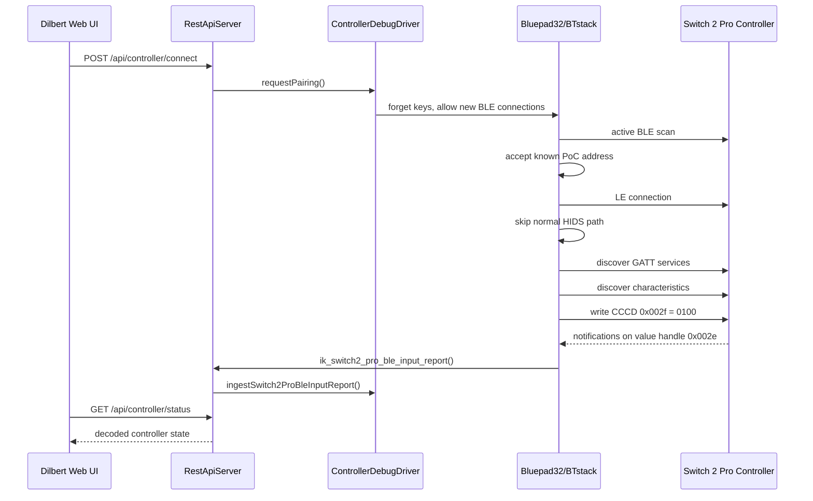

# Detail-Design: Switch 2 Pro Controller ueber BLE

## Einleitung

Dieses Dokument beschreibt den aktuellen Proof-of-Concept fuer die Anbindung eines Nintendo Switch 2 Pro Controllers an die ESP32-S3-Firmware von Dilbert. Es dokumentiert den Stand, der im praktischen Test mit dem realen Controller bestaetigt wurde, und haelt die aktuellen Designentscheidungen sowie offene Punkte fest.

Der Fokus liegt bewusst auf dem aktuellen Integrationsstand. Es handelt sich noch nicht um eine bereinigte, allgemeine Bluetooth-Controller-Abstraktion, sondern um einen funktionierenden, hardware-nahen PoC fuer genau diesen Controller und dieses Roboterarm-Projekt.

## Ziel

Ziel des PoC ist der Nachweis, dass der Nintendo Switch 2 Pro Controller per BLE vom ESP32-S3 erkannt, verbunden und als Eingabegeraet fuer Dilbert genutzt werden kann.

Konkret soll der aktuelle Stand zeigen:

* der Controller wird im BLE-Scan gefunden
* der Controller kann verbunden werden
* der proprietaere BLE-GATT-Datenstrom des Controllers kann abonniert werden
* Eingabedaten werden in ein projektinternes Eingabemodell dekodiert
* Sticks, D-Pad und Buttons werden im Dilbert-Web-UI visualisiert
* der Controller-Pfad ist aktuell read-only und loest noch keine Roboterbewegung aus

## Bisherige Befunde

Der urspruenglich erwartete einfache Weg ueber Bluepad32 als fertige HID-Gamepad-Integration hat fuer diesen Controller nicht direkt funktioniert. Der Controller wurde zwar per BLE sichtbar, bot aber im getesteten Pfad keinen Standard-HID-Service an, den Bluepad32 ohne Anpassungen oeffnen konnte.

Die beobachteten Eigenschaften des Controllers waren:

| Eigenschaft | Beobachtung |
| --- | --- |
| BLE-Adresse | `A4:C1:E8:50:BC:2B` |
| Adresstyp | public |
| Name im Scan | leer / unnamed |
| Appearance | im Scan zeitweise `0x03c4` |
| HID-Service im Advertisement | nicht sichtbar |
| Generic Access Service | vorhanden |
| Bluepad32-HIDS-Verbindung | schlug mit `0x11` fehl, weil kein HID-Service gefunden wurde |

Nach dem Fehlschlag des Standard-HIDS-Pfads wurde ein GATT-Dump eingebaut. Dabei wurden unter anderem folgende Services beobachtet:

| Handle-Bereich | UUID |
| --- | --- |
| `0x0001-0x0007` | `00c5af5d19644e308f511956f96bd280` |
| `0x0008-0x0032` | `ab7de9be89fe49ad828f118f09df7fd0` |
| `0x0033-0x0037` | `0x1800` Generic Access |
| `0x0038-0x0038` | `0x1801` Generic Attribute |

Der relevante Eingabedatenstrom wurde schliesslich als Notification auf Value-Handle `0x002e` identifiziert. Die Notifications haben im Test eine Laenge von 112 Byte; fuer die aktuelle Auswertung werden mindestens die ersten 63 Byte benoetigt.

## Aktueller Integrationsansatz

Der aktuelle PoC nutzt Bluepad32 und BTstack weiterhin als Bluetooth- und BLE-Grundlage. Die normale Bluepad32-HID-Gamepad-Verarbeitung wird fuer den Switch-2-Pro-Controller jedoch gezielt umgangen, weil der Controller im getesteten Zustand keinen passenden HID-Service fuer den Bluepad32-HIDS-Client bereitstellt.

Stattdessen wird fuer die bekannte Controller-Adresse ein proprietaerer GATT-Pfad verwendet:

1. Bluepad32/BTstack startet einen aktiven BLE-Scan.
2. Der Controller wird auch ohne HID-Service im Advertisement akzeptiert.
3. Bei Verbindung mit der bekannten Adresse `A4:C1:E8:50:BC:2B` wird der normale HIDS-Pfad uebersprungen.
4. Die Firmware fuehrt eine GATT-Service- und Characteristic-Discovery aus.
5. Die Characteristic mit Value-Handle `0x002e` und Notify-Property wird als Eingabekandidat verwendet.
6. Notifications werden durch direkten CCCD-Write auf Handle `0x002f` mit Wert `0100` aktiviert.
7. Eingehende Notifications werden an die Anwendungsschicht uebergeben.

Die direkte Behandlung der bekannten MAC-Adresse ist eine bewusste PoC-Entscheidung. Sie reduziert die Unsicherheit waehrend des Bring-ups, ist aber noch keine finale Geraeteerkennung.

## Build- und Komponentenstruktur

Fuer die Bluepad32-Integration wurde eine separate PlatformIO-Umgebung eingefuehrt:

```ini
[env:esp32s3_bluepad32]
platform = https://github.com/pioarduino/platform-espressif32/releases/download/54.03.21/platform-espressif32.zip
board = esp32-s3-devkitc-1
framework = espidf
board_build.partitions = partitions_bluepad32.csv
build_flags =
    -std=gnu++17
    -DBOARD_HAS_PSRAM
    -DIK_REQUIRE_BLUEPAD32
```

Die bestehende Arduino-Umgebung `esp32s3` bleibt weiterhin vorhanden. Die Bluepad32-Variante verwendet dagegen ESP-IDF mit Arduino-Kompatibilitaet, weil Bluepad32 in diesem Setup nicht als normale PlatformIO-Arduino-Library eingebunden werden konnte.

Wichtige Dateien und Ordner:

| Pfad | Bedeutung |
| --- | --- |
| `platformio.ini` | Enthaelt die neue Build-Umgebung `esp32s3_bluepad32` |
| `partitions_bluepad32.csv` | Groessere App-Partition fuer das Bluepad32-Firmware-Image |
| `sdkconfig.defaults` | ESP-IDF/Arduino-Konfigurationsvorgaben |
| `src/bluepad32_app_main.c` | Einstiegspunkt fuer Bluepad32/BTstack im ESP-IDF-Build |
| `src/idf_component.yml` | ESP-IDF-Komponentenbeschreibung |
| `components/bluepad32/` | Lokal eingebundener Bluepad32-Code inklusive PoC-Anpassungen |
| `components/btstack/` | Lokal eingebundener BTstack-Code |

Die lokale Ablage von Fremdcode unter `components/` ist derzeit eine PoC-Loesung. Sie macht den funktionierenden Stand reproduzierbar, sollte aber vor einem langfristigen Projektstand nochmals bewusst bewertet werden.

## BLE/GATT-Ablauf

Der aktuelle Verbindungsablauf ist wie folgt:



Der normale HIDS-Pfad bleibt fuer andere Bluepad32-faehige Controller prinzipiell im Code vorhanden. Fuer das aktuelle Projekt ist aber nur der Switch-2-Pro-PoC-Pfad relevant.

## Bruecke zwischen BTstack und Anwendung

Die Bluepad32/BTstack-Seite ist C-Code, waehrend die Anwendungsschicht in C++ implementiert ist. Die Uebergabe erfolgt deshalb ueber eine kleine C-kompatible Brueckenfunktion:

```cpp
extern "C" void ik_switch2_pro_ble_input_report(const uint8_t *report, uint16_t report_size)
{
  restApi.ingestSwitch2ProBleInputReport(report, report_size, millis());
}
```

Diese Funktion liegt in `src/main.cpp`. Sie leitet den rohen BLE-Report an den `RestApiServer` weiter. Der Server delegiert anschliessend an den `ControllerDebugDriver`, der den Report dekodiert und den aktuellen Controller-Zustand haelt.

## Eingabemodell

Das projektinterne Eingabemodell ist in `src/application/ControllerInput.h` definiert:

| Feld | Bedeutung |
| --- | --- |
| `left_x`, `left_y` | Linker Analogstick, normalisiert um die Mitte |
| `right_x`, `right_y` | Rechter Analogstick, normalisiert um die Mitte |
| `buttons` | Digitale Button-Bitmaske |
| `dpad` | Digitale D-Pad-Bitmaske |
| `valid` | Gibt an, ob die Eingabe gueltig ist |
| `updated_at_ms` | Zeitpunkt der letzten gueltigen Eingabe |

Analoge Triggerwerte wurden wieder aus dem Modell entfernt. Fuer den getesteten Nintendo-Controller werden `L`, `ZL`, `R` und `ZR` als digitale Buttons behandelt. Es gibt daher keine separaten analogen Felder fuer `leftTrigger` oder `rightTrigger`.

### Stick-Dekodierung

Der aktuelle Report-Pfad erwartet:

| Byte-Bereich | Bedeutung |
| --- | --- |
| `report[1]` | Status-/Reportkennung, erwartet `0x20` |
| `report[2]` | rechter Button-Block |
| `report[3]` | linker Button- und D-Pad-Block |
| `report[4]` | weiterer Button-Block |
| `report[5..7]` | linker Stick, zwei gepackte 12-Bit-Achsen |
| `report[8..10]` | rechter Stick, zwei gepackte 12-Bit-Achsen |

Die Stick-Achsen werden als 12-Bit-Werte gelesen und um den Mittelpunkt `2048` normalisiert. Nach dem letzten Teststand gilt fuer beide Y-Achsen: Bewegung nach oben ist positiv.

### Button-Mapping

Die aktuelle Button-Bitmaske enthaelt:

| Bit | Button |
| ---: | --- |
| 0 | `B` |
| 1 | `A` |
| 2 | `Y` |
| 3 | `X` |
| 4 | `R` |
| 5 | `ZR` |
| 6 | `+` |
| 7 | rechter Stick |
| 8 | `L` |
| 9 | `ZL` |
| 10 | `-` |
| 11 | linker Stick |
| 12 | Home |
| 13 | Capture |
| 14 | Grip R |
| 15 | Grip L |
| 16 | Camera |

Die D-Pad-Bitmaske enthaelt:

| Bit | Richtung |
| ---: | --- |
| 0 | Down |
| 1 | Right |
| 2 | Left |
| 3 | Up |

## REST- und UI-Verhalten

Der Controller-Pfad ist aktuell ein read-only Debug-Pfad. Er zeigt Controller-Zustand und Eingaben an, steuert aber noch keine Servos.

Wichtige REST-Endpunkte:

| Methode | Pfad | Bedeutung |
| --- | --- | --- |
| `POST` | `/api/controller/connect` | Aktiviert Pairing/Discovery fuer den Controller |
| `POST` | `/api/controller/disconnect` | Trennt den PoC-GATT-Pfad und stoppt neue Verbindungen |
| `GET` | `/api/controller/status` | Liefert den aktuellen Controller-Zustand ohne periodisches REST-Logging |
| `GET` | `/api/controller/debug` | Liefert Controller-Zustand plus BLE-Advertisement-Debugdaten |

Das `input`-Objekt in der Statusantwort enthaelt aktuell:

```json
{
  "valid": true,
  "leftX": 0,
  "leftY": 0,
  "rightX": 0,
  "rightY": 0,
  "buttons": 0,
  "dpad": 0,
  "updatedAtMs": 12345
}
```

Das Dilbert-Web-UI visualisiert:

* Verbindungsstatus
* Treibername und Controllername
* linken und rechten Stick
* D-Pad-Bits
* digitale Buttons inklusive `L`, `ZL`, `R`, `ZR`
* rohe Button- und D-Pad-Bitmasken

Die Anzeige fuer analoge Trigger wurde entfernt, weil sie fuer den Zielcontroller nicht sinnvoll ist.

## Logging

Das Logging wurde waehrend des Bring-ups bewusst erweitert und danach teilweise reduziert.

Aktueller Stand:

* `GET /api/controller/status` wird nicht mehr pro Poll geloggt.
* Notifications werden nicht mehr vollstaendig ausgegeben, sondern nur als Stichprobe: die ersten acht Samples und danach ungefaehr einmal pro Sekunde.
* GATT-Service- und Characteristic-Discovery loggt weiterhin detailliert, weil dieser Teil noch PoC-Charakter hat.
* Disconnects werden mit `GATT-POC disconnect con_handle=...` sichtbar gemacht.

Diese Logs sind fuer die Fehlersuche noch hilfreich, sollten aber vor einer finalen Integration weiter reduziert oder hinter eine Debug-Option gelegt werden.

## Sicherheits- und Betriebsannahmen

Der Controller-PoC ist aktuell bewusst vom Bewegungsoutput getrennt. Das ist wichtig, weil der BLE-Pfad zuerst stabil beobachtet werden sollte, bevor Eingaben reale Servo-Kommandos ausloesen.

Aktuelle Annahmen:

* Controller-Eingaben sind nur Diagnosezustand.
* Es gibt keine direkte Kopplung von Stick- oder Buttonwerten an den Roboterarm.
* Der Servo-Ausgang bleibt durch die bestehenden Motion-, Sequence- und PWM-Endpunkte kontrolliert.
* Ein Timeout setzt den Controller-Zustand wieder von `connected` auf einen sicheren Debug-Zustand, wenn keine Reports mehr eintreffen.

Vor einer echten manuellen Robotersteuerung muss eine separate Mapping- und Sicherheitslogik definiert werden.

## Verifikation

Der aktuelle Stand wurde mit folgenden Pruefungen validiert:

| Pruefung | Ergebnis |
| --- | --- |
| Native Tests | `109/109` erfolgreich |
| Controller-Parser-Tests | erfolgreich |
| Web-JavaScript-Syntaxcheck | erfolgreich |
| ESP32-S3-Bluepad32-Build | erfolgreich |
| Hardware-Test mit Controller | Verbindung und Eingabevisualisierung funktionieren |

Bekannte Build-Auffaelligkeit:

* `esp-idf-size` meldet im PlatformIO-Build ein unbekanntes Argument `--ng`.
* Der Fehler ist aktuell nicht build-blockierend; das Firmware-Image wird erfolgreich erzeugt.

## Aktuelle Designentscheidungen

Die wichtigsten Designentscheidungen fuer den PoC sind:

* Bluepad32/BTstack bleiben die Bluetooth-Basis.
* Fuer den Switch-2-Pro-Controller wird ein eigener proprietaerer GATT-Pfad verwendet.
* Die bekannte Controller-MAC wird im PoC hart verwendet.
* Der Standard-HIDS-Pfad wird fuer diesen Controller uebersprungen.
* Der Notification-Handle `0x002e` ist aktuell der relevante Eingabekanal.
* Der CCCD wird direkt ueber Handle `0x002f` aktiviert.
* Die Anwendung sieht nur ein normalisiertes `ControllerInput`-Modell.
* Der Controller-Pfad bleibt read-only, bis ein sicheres Bewegungsmapping definiert ist.
* `L`, `ZL`, `R` und `ZR` sind digitale Buttons, keine analogen Trigger.
* Der aktuelle Commit-Stand eignet sich als PoC-Checkpoint, aber noch nicht als bereinigte Dauerloesung fuer Fremdcode-Integration.

## Offene Punkte

Vor einer bereinigten Weiterentwicklung sind insbesondere folgende Punkte offen:

* Fremdcode-Strategie fuer Bluepad32/BTstack klaeren: vendored Code, Fork, Submodule oder Patch-Serie.
* PoC-Anpassungen in `components/bluepad32/bt/uni_bt_le.c` isolieren und besser dokumentieren.
* Harte MAC-Adresse durch eine robustere Controller-Erkennung ersetzen oder konfigurierbar machen.
* Proprietaere UUIDs, Handles und Reportstruktur sauberer benennen.
* GATT-Discovery- und Notification-Logging weiter reduzieren oder konfigurierbar machen.
* `esp-idf-size --ng` Warning im PlatformIO-Setup untersuchen.
* Thread- beziehungsweise Kontextgrenzen zwischen BTstack-Callback und Anwendungsschicht pruefen.
* Input-Mapping fuer echte Robotersteuerung entwerfen.
* Sicherheitsmodell fuer manuelle Steuerung definieren, inklusive Deadzone, Rate-Limits, Not-Aus/Disconnect-Verhalten und Servo-Freigabe.
* REST-API-Dokumentation an das finale Controller-JSON anpassen.

## Naechster sinnvoller Schritt

Der aktuelle Stand sollte als funktionierender PoC-Checkpoint festgehalten werden. Danach bietet sich ein Cleanup-Schritt an, der den heute gewachsenen Bring-up-Code von einer reproduzierbaren Debug-Loesung in eine klarere Projektstruktur ueberfuehrt.

Erst danach sollte die Controller-Eingabe auf echte Roboterbewegungen gemappt werden. Fuer diese naechste Ausbaustufe sollte zuerst fachlich definiert werden, welcher Stick oder Button welche Achse oder Pose veraendert und welche Sicherheitsgrenzen dabei gelten.
