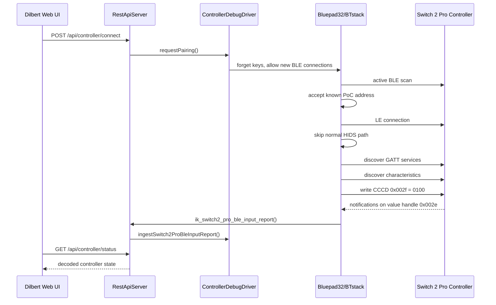

# Detail-Design: Switch 2 Pro Controller über BLE

## Einleitung

Dieses Dokument beschreibt den aktuellen Proof-of-Concept für die Anbindung eines Nintendo Switch 2 Pro Controllers an die ESP32-S3-Firmware von Dilbert. Es dokumentiert den Stand, der im praktischen Test mit dem realen Controller bestätigt wurde, und hält die aktuellen Designentscheidungen sowie offene Punkte fest.

Der Fokus liegt bewusst auf dem aktuellen Integrationsstand. Es handelt sich noch nicht um eine bereinigte, allgemeine Bluetooth-Controller-Abstraktion, sondern um einen funktionierenden, hardware-nahen PoC für genau diesen Controller und dieses Roboterarm-Projekt.

## Ziel

Ziel des PoC ist der Nachweis, dass der Nintendo Switch 2 Pro Controller per BLE vom ESP32-S3 erkannt, verbunden und als Eingabegerät für Dilbert genutzt werden kann.

Konkret soll der aktuelle Stand zeigen:

* der Controller wird im BLE-Scan gefunden
* der Controller kann verbunden werden
* der proprietäre BLE-GATT-Datenstrom des Controllers kann abonniert werden
* Eingabedaten werden in ein projektinternes Eingabemodell dekodiert
* Sticks, D-Pad und Buttons werden im Dilbert-Web-UI visualisiert
* der Controller-Pfad ist aktuell read-only und löst noch keine Roboterbewegung aus

## Bisherige Befunde

Der ursprünglich erwartete einfache Weg über Bluepad32 als fertige HID-Gamepad-Integration hat für diesen Controller nicht direkt funktioniert. Der Controller wurde zwar per BLE sichtbar, bot aber im getesteten Pfad keinen Standard-HID-Service an, den Bluepad32 ohne Anpassungen öffnen konnte.

Die beobachteten Eigenschaften des Controllers waren:

| Eigenschaft | Beobachtung |
| --- | --- |
| BLE-Adresse | `A4:C1:E8:50:BC:2B` |
| Adresstyp | public |
| Name im Scan | leer / unnamed |
| Appearance | im Scan zeitweise `0x03c4` |
| HID-Service im Advertisement | nicht sichtbar |
| Generic Access Service | vorhanden |
| Bluepad32-HIDS-Verbindung | schlug mit `0x11` fehl, weil kein HID-Service gefunden wurde |

Nach dem Fehlschlag des Standard-HIDS-Pfads wurde ein GATT-Dump eingebaut. Dabei wurden unter anderem folgende Services beobachtet:

| Handle-Bereich | UUID |
| --- | --- |
| `0x0001-0x0007` | `00c5af5d19644e308f511956f96bd280` |
| `0x0008-0x0032` | `ab7de9be89fe49ad828f118f09df7fd0` |
| `0x0033-0x0037` | `0x1800` Generic Access |
| `0x0038-0x0038` | `0x1801` Generic Attribute |

Der relevante Eingabedatenstrom wurde schliesslich als Notification auf Value-Handle `0x002e` identifiziert. Die Notifications haben im Test eine Länge von 112 Byte; für die aktuelle Auswertung werden mindestens die ersten 63 Byte benötigt.

## Aktueller Integrationsansatz

Der aktuelle PoC nutzt Bluepad32 und BTstack weiterhin als Bluetooth- und BLE-Grundlage. Die normale Bluepad32-HID-Gamepad-Verarbeitung wird für den Switch-2-Pro-Controller jedoch gezielt umgangen, weil der Controller im getesteten Zustand keinen passenden HID-Service für den Bluepad32-HIDS-Client bereitstellt.

Stattdessen wird für die bekannte Controller-Adresse ein proprietärer GATT-Pfad verwendet:

1. Bluepad32/BTstack startet einen aktiven BLE-Scan.
2. Der Controller wird auch ohne HID-Service im Advertisement akzeptiert.
3. Bei Verbindung mit der bekannten Adresse `A4:C1:E8:50:BC:2B` wird der normale HIDS-Pfad übersprungen.
4. Die Firmware führt eine GATT-Service- und Characteristic-Discovery aus.
5. Die Characteristic mit Value-Handle `0x002e` und Notify-Property wird als Eingabekandidat verwendet.
6. Notifications werden durch direkten CCCD-Write auf Handle `0x002f` mit Wert `0100` aktiviert.
7. Eingehende Notifications werden an die Anwendungsschicht übergeben.

Die direkte Behandlung der bekannten MAC-Adresse ist eine bewusste PoC-Entscheidung. Sie reduziert die Unsicherheit während des Bring-ups, ist aber noch keine finale Geräteerkennung.

## Build- und Komponentenstruktur

Für die Bluepad32-Integration wurde eine separate PlatformIO-Umgebung eingeführt:

```ini
[env:esp32s3]
platform = https://github.com/pioarduino/platform-espressif32/releases/download/54.03.21/platform-espressif32.zip
board = esp32-s3-devkitc-1
framework = espidf
board_build.partitions = partitions_bluepad32.csv
build_flags =
    -std=gnu++17
    -DIK_REQUIRE_BLUEPAD32
```

Die Bluepad32-Variante ist nach Abschluss des PoC die Firmware-Standardumgebung (`default_envs = esp32s3`). Die bestehende Arduino-Umgebung `esp32s3_arduino_native` bleibt weiterhin als schlankerer Vergleichs- und Bring-up-Build vorhanden. Die Bluepad32-Variante verwendet ESP-IDF mit Arduino-Kompatibilität, weil Bluepad32 in diesem Setup nicht als normale PlatformIO-Arduino-Library eingebunden werden konnte.

## Entscheidung: Zwei PlatformIO-Umgebungen behalten

Nach Abschluss des Controller-PoC bleiben bewusst beide ESP32-S3-Environments in `platformio.ini`:

| Environment | Status | Zweck |
| --- | --- | --- |
| `esp32s3` | Firmware-Default | baut den aktuellen PoC-Stand mit Bluepad32, BTstack, ESP-IDF-Komponenten und grösserer App-Partition |
| `esp32s3_arduino_native` | behalten | schlanker Arduino-Build für Vergleich, Bring-up, Debugging von Basishardware und Abgrenzung zu Bluepad32-/ESP-IDF-spezifischen Effekten |

Diese Entscheidung ist absichtlich konservativ. Der PoC hat gezeigt, dass der Bluepad32-Pfad funktioniert, aber auch, dass dafür mehrere Integrationsannahmen zusammenkommen:

* lokaler Fremdcode unter `components/`,
* ESP-IDF-Build mit Arduino-Kompatibilität,
* projektspezifische Anpassungen im Bluepad32-GATT-Pfad,
* grössere Partition über `partitions_bluepad32.csv`,
* Build-Flag `IK_REQUIRE_BLUEPAD32` für den Controller-Pfad.

Der ursprüngliche Arduino-Build `esp32s3_arduino_native` bildet dagegen einen einfacheren Referenzpunkt. Er ist nicht der Zielpfad für die Controller-Firmware, aber hilfreich, wenn Basisfunktionen wie REST API, Servoansteuerung, Kalibration, Status-LED oder allgemeine ESP32-S3-Toolchain-Fragen unabhängig vom Bluepad32-Stack betrachtet werden sollen.

Damit die doppelte Konfiguration nicht auseinanderläuft, sind die gemeinsamen Board- und Portwerte in `esp32s3_common` zusammengezogen:

* Boardprofil `esp32-s3-devkitc-1`,
* Flashgrösse `8 MB` und maximale Firmwaregrösse,
* Upload- und Monitor-Port `/dev/ttyACM0`,
* Monitor-Speed `115200`,
* gemeinsame C++17-Build-Flags.

Das Board besitzt `8 MB` PSRAM, die aktuelle Firmware aktiviert PSRAM jedoch nicht. Für den Controller-PoC und die bisherige REST-/Robotiklogik ist internes SRAM ausreichend und wegen Latenz und Determinismus vorzuziehen.

Die Unterschiede sollen dadurch explizit bleiben. Wenn später eine Konfiguration entfernt wird, sollte die Entscheidung anhand der bis dahin benötigten Workflows fallen:

* `esp32s3` entfernen nur dann, wenn der Controller-Pfad komplett aufgegeben oder anders integriert wird.
* `esp32s3_arduino_native` entfernen nur dann, wenn der ESP-IDF-/Bluepad32-Build alle Bring-up- und Vergleichsaufgaben vollständig ersetzt.
* Vor einer Entfernung beide Environments mindestens einmal bauen und die betroffenen Doku- und CI-/Script-Verweise nachziehen.

Wichtige Dateien und Ordner:

| Pfad | Bedeutung |
| --- | --- |
| `platformio.ini` | Enthält die gemeinsame ESP32-S3-Basiskonfiguration, die aktuelle Standardumgebung `esp32s3` und den Vergleichs-Build `esp32s3_arduino_native` |
| `partitions_bluepad32.csv` | Grössere App-Partition für das Bluepad32-Firmware-Image |
| `sdkconfig.defaults` | ESP-IDF/Arduino-Konfigurationsvorgaben |
| `src/bluepad32_app_main.c` | Einstiegspunkt für Bluepad32/BTstack im ESP-IDF-Build |
| `src/idf_component.yml` | ESP-IDF-Komponentenbeschreibung |
| `components/bluepad32/` | Lokal eingebundener Bluepad32-Code inklusive PoC-Anpassungen |
| `components/btstack/` | Lokal eingebundener BTstack-Code |

Die lokale Ablage von Fremdcode unter `components/` ist derzeit eine PoC-Lösung. Sie macht den funktionierenden Stand reproduzierbar, sollte aber vor einem langfristigen Projektstand nochmals bewusst bewertet werden.

Die aktuelle Cleanup-Bewertung ist in [third-party-cleanup.md](third-party-cleanup.md) festgehalten. Für den nächsten Schritt bleibt der Fremdcode bewusst lokal versioniert, damit der hardwaregetestete BLE-Stand reproduzierbar bleibt. Vor grösseren funktionalen Erweiterungen soll daraus aber eine klarere Patch- oder Fork-Strategie entstehen.

## PoC-Anpassungen im Fremdcode

Die projektspezifischen Anpassungen liegen nach aktueller Bestandsaufnahme hauptsächlich in `components/bluepad32/bt/uni_bt_le.c`. `components/btstack/` wird als darunterliegende Bluetooth-Basis verwendet, enthält aber in der aktuellen Suche keine direkt erkennbaren `GATT-POC`- oder `Switch 2 Pro`-Projektmarkierungen.

Aktuell relevante Anpassungspunkte:

| Bereich | Code-Stelle | Bedeutung |
| --- | --- | --- |
| C/C++-Bridge | `extern void ik_switch2_pro_ble_input_report(...)` in `components/bluepad32/bt/uni_bt_le.c` und Implementierung in `src/main.cpp` | leitet rohe BLE-Notifications in die Anwendungsschicht |
| Notification-Erkennung | Value-Handle `0x002e`, Mindestlänge `63`, Statusbyte `0x20` | filtert den proprietären Switch-2-Pro-Datenstrom |
| Notification-Aktivierung | CCCD-Write auf `value_handle + 1`, praktisch `0x002f = 0100` | aktiviert Notifications ohne vollständige generische Descriptor-Abstraktion |
| Service-/Characteristic-Dump | `GATT-POC`-Service- und Characteristic-Discovery | Bring-up-Hilfe zur Identifikation der proprietären Handles |
| Verbindungszustand | `uni_bt_le_switch2_pro_poc_disconnect()` und `uni_bt_le_switch2_pro_poc_is_connected()` | erlaubt der Anwendung, den PoC-GATT-Pfad kontrolliert zu trennen und Status abzufragen |
| Geräteerkennung | feste Adresse `A4:C1:E8:50:BC:2B` | akzeptiert den getesteten Controller auch ohne HID-Service im Advertisement |
| HIDS-Bypass | Verbindung zur bekannten Adresse überspringt den normalen Bluepad32-HIDS-Pfad | verhindert, dass der fehlende HID-Service den getesteten Controller blockiert |
| Scan-/Pairing-Verhalten | aktiver BLE-Scan, Secure-Connection-ohne-Bonding-Annahme | verbessert die Sichtbarkeit des Controllers im aktuellen Testaufbau |

Diese Punkte bilden faktisch die Patch-Liste, die bei einer Bereinigung aus dem vendorten Bluepad32-Code herausgelöst werden muss. Bis dahin sollten neue Controller-Änderungen entweder in projektinternen Dateien unter `src/application/` erfolgen oder in `components/bluepad32/` deutlich als PoC-Erweiterung markiert bleiben.

## BLE/GATT-Ablauf

Der aktuelle Verbindungsablauf ist wie folgt:



Der normale HIDS-Pfad bleibt für andere Bluepad32-fähige Controller prinzipiell im Code vorhanden. Für das aktuelle Projekt ist aber nur der Switch-2-Pro-PoC-Pfad relevant.

## Brücke zwischen BTstack und Anwendung

Die Bluepad32/BTstack-Seite ist C-Code, während die Anwendungsschicht in C++ implementiert ist. Die Übergabe erfolgt deshalb über eine kleine C-kompatible Brückenfunktion:

```cpp
extern "C" void ik_switch2_pro_ble_input_report(const uint8_t *report, uint16_t report_size)
{
  restApi.ingestSwitch2ProBleInputReport(report, report_size, millis());
}
```

Diese Funktion liegt in `src/main.cpp`. Sie leitet den rohen BLE-Report an den `RestApiServer` weiter. Der Server delegiert anschliessend an den `ControllerDebugDriver`, der den Report dekodiert und den aktuellen Controller-Zustand hält.

## Eingabemodell

Das projektinterne Eingabemodell ist in `src/application/ControllerInput.h` definiert:

| Feld | Bedeutung |
| --- | --- |
| `left_x`, `left_y` | Linker Analogstick, normalisiert um die Mitte |
| `right_x`, `right_y` | Rechter Analogstick, normalisiert um die Mitte |
| `buttons` | Digitale Button-Bitmaske |
| `dpad` | Digitale D-Pad-Bitmaske |
| `valid` | Gibt an, ob die Eingabe gültig ist |
| `updated_at_ms` | Zeitpunkt der letzten gültigen Eingabe |

Analoge Triggerwerte wurden wieder aus dem Modell entfernt. Für den getesteten Nintendo-Controller werden `L`, `ZL`, `R` und `ZR` als digitale Buttons behandelt. Es gibt daher keine separaten analogen Felder für `leftTrigger` oder `rightTrigger`.

### Stick-Dekodierung

Der aktuelle Report-Pfad erwartet:

| Byte-Bereich | Bedeutung |
| --- | --- |
| `report[1]` | Status-/Reportkennung, erwartet `0x20` |
| `report[2]` | rechter Button-Block |
| `report[3]` | linker Button- und D-Pad-Block |
| `report[4]` | weiterer Button-Block |
| `report[5..7]` | linker Stick, zwei gepackte 12-Bit-Achsen |
| `report[8..10]` | rechter Stick, zwei gepackte 12-Bit-Achsen |
| `report[11]` | aktuell nur als roher Batteriestatuswert weitergereicht |

Die Stick-Achsen werden als 12-Bit-Werte gelesen und um den Mittelpunkt `2048` normalisiert. Nach dem letzten Teststand gilt für beide Y-Achsen: Bewegung nach oben ist positiv.

### Button-Mapping

Die aktuelle Button-Bitmaske enthält:

| Bit | Button |
| ---: | --- |
| 0 | `B` |
| 1 | `A` |
| 2 | `Y` |
| 3 | `X` |
| 4 | `R` |
| 5 | `ZR` |
| 6 | `+` |
| 7 | rechter Stick |
| 8 | `L` |
| 9 | `ZL` |
| 10 | `-` |
| 11 | linker Stick |
| 12 | Home |
| 13 | Capture |
| 14 | Grip R |
| 15 | Grip L |
| 16 | Camera |

Die D-Pad-Bitmaske enthält:

| Bit | Richtung |
| ---: | --- |
| 0 | Down |
| 1 | Right |
| 2 | Left |
| 3 | Up |

## REST- und UI-Verhalten

Der Controller-Pfad ist aktuell ein read-only Debug-Pfad. Er zeigt Controller-Zustand und Eingaben an, steuert aber noch keine Servos.

Wichtige REST-Endpunkte:

| Methode | Pfad | Bedeutung |
| --- | --- | --- |
| `POST` | `/api/controller/connect` | Aktiviert Pairing/Discovery für den Controller |
| `POST` | `/api/controller/disconnect` | Trennt den PoC-GATT-Pfad und stoppt neue Verbindungen |
| `GET` | `/api/controller/status` | Liefert den aktuellen Controller-Zustand ohne periodisches REST-Logging |
| `GET` | `/api/controller/debug` | Liefert Controller-Zustand plus BLE-Advertisement-Debugdaten |

Das `input`-Objekt in der Statusantwort enthält aktuell:

```json
{
  "valid": true,
  "leftX": 0,
  "leftY": 0,
  "rightX": 0,
  "rightY": 0,
  "buttons": 0,
  "dpad": 0,
  "updatedAtMs": 12345
}
```

Das Dilbert-Web-UI visualisiert:

* Verbindungsstatus
* Treibername und Controllername
* rohen Batteriestatuswert ohne Prozentumrechnung
* linken und rechten Stick
* D-Pad-Bits
* digitale Buttons inklusive `L`, `ZL`, `R`, `ZR`
* rohe Button- und D-Pad-Bitmasken

Die Anzeige für analoge Trigger wurde entfernt, weil sie für den Zielcontroller nicht sinnvoll ist.

Die Batterieanzeige bleibt vorerst bewusst roh. Für ältere Switch-Pro-HID-Reports gibt es Hinweise, dass ein Controller-Datenbyte `battery_level` und `connection_info` enthält. Der aktuelle Switch-2-Pro-PoC nutzt jedoch keinen bestätigten Standard-HID-Report, sondern die proprietäre GATT-Notification auf Value-Handle `0x002e`. Deshalb wertet die Firmware `report[11]` aktuell nicht als Prozentangabe aus, sondern gibt das Byte unverändert als `batteryRaw` aus. Das bisherige REST-Feld `batteryLevel` bleibt nur als Kompatibilitätsalias bestehen und enthält ebenfalls diesen Rohwert.

## Logging

Das Logging wurde während des Bring-ups bewusst erweitert und danach teilweise reduziert.

Aktueller Stand:

* `GET /api/controller/status` wird nicht mehr pro Poll geloggt.
* Notifications werden nicht mehr vollständig ausgegeben, sondern nur als Stichprobe: die ersten acht Samples und danach ungefähr einmal pro Sekunde.
* GATT-Service- und Characteristic-Discovery loggt weiterhin detailliert, weil dieser Teil noch PoC-Charakter hat.
* Disconnects werden mit `GATT-POC disconnect con_handle=...` sichtbar gemacht.

Diese Logs bleiben vorerst in diesem Umfang bestehen.

## Sicherheits- und Betriebsannahmen

Der Controller-PoC ist aktuell bewusst vom Bewegungsoutput getrennt. Das ist wichtig, weil der BLE-Pfad zuerst stabil beobachtet werden sollte, bevor Eingaben reale Servo-Kommandos auslösen.

Aktuelle Annahmen:

* Controller-Eingaben sind nur Diagnosezustand.
* Es gibt keine direkte Kopplung von Stick- oder Buttonwerten an den Roboterarm.
* Der Servo-Ausgang bleibt durch die bestehenden Motion-, Sequence- und PWM-Endpunkte kontrolliert.
* Ein Timeout setzt den Controller-Zustand wieder von `connected` auf einen sicheren Debug-Zustand, wenn keine Reports mehr eintreffen.

Vor einer echten manuellen Robotersteuerung muss nur die Anbindung der dokumentierten digitalen Jog-Zuordnung an den bestehenden Bewegungs- und Ausgabepfad umgesetzt werden. Ein separates Controller-Sicherheitsmodell wird bewusst nicht eingeführt; die gemeinsamen Achsen-Limits bleiben die relevante Softwaregrenze.

## Verifikation

Der aktuelle Stand wurde mit folgenden Prüfungen validiert:

| Prüfung | Ergebnis |
| --- | --- |
| Native Tests | `109/109` erfolgreich |
| Controller-Parser-Tests | erfolgreich |
| Web-JavaScript-Syntaxcheck | erfolgreich |
| ESP32-S3-Bluepad32-Build | erfolgreich |
| Hardware-Test mit Controller | Verbindung und Eingabevisualisierung funktionieren |

Nach dem PoC-Cleanup wurden die Native-Tests erneut ausgeführt:

| Prüfung | Ergebnis |
| --- | --- |
| Native Tests | `116/116` erfolgreich |
| Controller-Jog-Tests | an die aktuelle Default-Belegung angepasst und erfolgreich |

Bekannte Build-Auffälligkeit:

* Der normale `esp32s3`-Build erzeugt das Firmware-Image erfolgreich.
* Die `esp-idf-size --ng`-Auffälligkeit kann beim PlatformIO-Size-/Metrics-Pfad auftreten und ist nicht build-blockierend.
* Ursache ist der installierte `pioarduino/platform-espressif32`-Builder: `/home/andi/.platformio/platforms/espressif32/builder/main.py` ruft im Target `metrics` weiterhin `python -m esp_idf_size --ng` auf.
* Die installierte `esp-idf-size`-Version `2.2.1` akzeptiert `--ng` nicht mehr; laut eigener Doku ist diese Option ab `2.0.0` nicht mehr nötig.
* Projektlokaler Workaround: erst `~/.platformio/penv/bin/pio run -e esp32s3`, dann `scripts/firmware_metrics.sh` ausführen.

## Aktuelle Designentscheidungen

Die wichtigsten Designentscheidungen für den PoC sind:

* Bluepad32/BTstack bleiben die Bluetooth-Basis.
* Für den Switch-2-Pro-Controller wird ein eigener proprietärer GATT-Pfad verwendet.
* Die bekannte Controller-MAC wird im PoC hart verwendet.
* Der Standard-HIDS-Pfad wird für diesen Controller übersprungen.
* Der Notification-Handle `0x002e` ist aktuell der relevante Eingabekanal.
* Der CCCD wird direkt über Handle `0x002f` aktiviert.
* Die Anwendung sieht nur ein normalisiertes `ControllerInput`-Modell.
* Die feste Controller-MAC bleibt vorerst bewusst als PoC-/Debug-Annahme bestehen.
* Für manuelle Controller-Bedienung wird vorerst kein zusätzliches Sicherheitsmodell eingeführt; die relevante technische Grenze sind die gemeinsamen Achsen-Limits.
* `L`, `ZL`, `R` und `ZR` sind digitale Buttons, keine analogen Trigger.
* Der aktuelle Commit-Stand eignet sich als PoC-Checkpoint, aber noch nicht als bereinigte Dauerlösung für Fremdcode-Integration.

## Offene Punkte

Vor einer bereinigten Weiterentwicklung sind insbesondere folgende Punkte offen:

* Proprietäre UUIDs, Handles und Reportstruktur sauberer benennen.
* Thread- beziehungsweise Kontextgrenzen zwischen BTstack-Callback und Anwendungsschicht prüfen.
* REST-API-Dokumentation an das finale Controller-JSON anpassen.

Bewusst ausgeklammert:

* Harte MAC-Adresse wird vorerst nicht ersetzt oder konfigurierbar gemacht.
* Analogsticks werden vorerst nicht für manuelle Steuerung verwendet.
* Ein separates Sicherheitsmodell für manuelle Steuerung wird vorerst nicht definiert; Achsen-Limits bleiben die relevante Softwaregrenze.
* Eine finale Patch-Strategie für Bluepad32/BTstack wird vorerst nicht entschieden; der vendored Stand bleibt bestehen.
* Der PlatformIO-Target `metrics` bleibt trotz `--ng`-Warnung unverändert; für Firmware-Grössen wird der projektlokale Workaround genutzt.

## Nächster sinnvoller Schritt

Der aktuelle Stand sollte als funktionierender PoC-Checkpoint festgehalten werden. Danach bietet sich ein Cleanup-Schritt an, der den heute gewachsenen Bring-up-Code von einer reproduzierbaren Debug-Lösung in eine klarere Projektstruktur überführt.

Erst danach sollte die Controller-Eingabe auf echte Roboterbewegungen gemappt werden. Für diese nächste Ausbaustufe ist der aktuelle digitale Jog-Zwischenstand in [controller.md](controller.md) massgeblich; Analogsticks, MAC-Konfiguration und ein separates Sicherheitsmodell bleiben bewusst ausserhalb dieses Schnitts.
