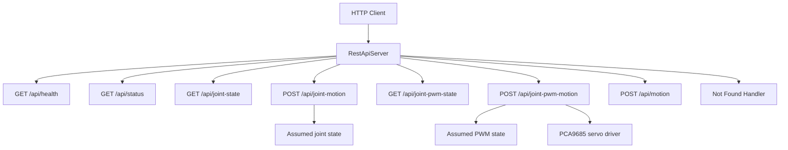
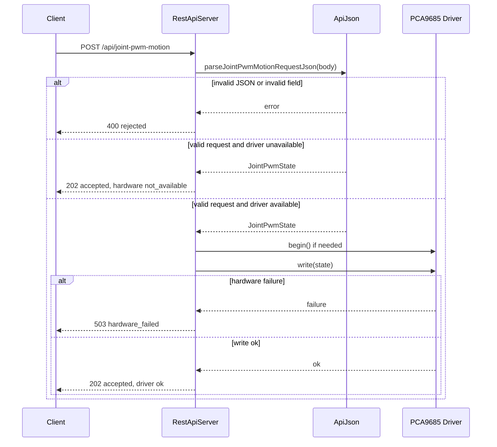
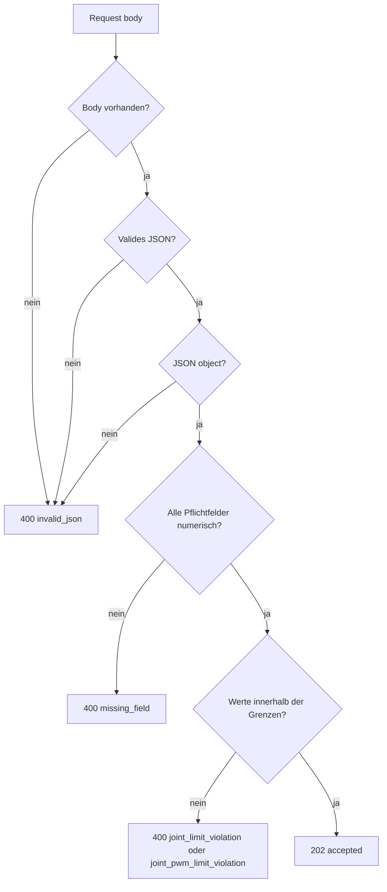

# Design: REST API

Dieses Dokument beschreibt die aktuelle HTTP/JSON-Schnittstelle der ESP32-S3-Firmware.

Die API wird vom `RestApiServer` bereitgestellt und ist als Bring-up-Schnittstelle für direkte Gelenk- und PWM-Kommandos gedacht. Eine spätere Orchestrator-Anbindung ist vorbereitet, aber noch nicht implementiert.

## Basisverhalten

- Protokoll: HTTP
- Payload-Format: JSON
- Response-Header: `Content-Type: application/json`
- Cache-Header: `Cache-Control: no-store`
- API-Name: `inverse_kinematic`
- API-Version: `v1`
- Projekt-Hostname: `robot`

Der Server ist nach erfolgreicher WLAN-Initialisierung über die IP-Adresse des ESP32 erreichbar. Wenn mDNS erfolgreich gestartet wurde, ist zusätzlich der lokale Hostname `http://robot.local` verfügbar.

## Übersicht

| Methode | Pfad | Zweck | Status Erfolg |
| --- | --- | --- | --- |
| `GET` | `/api/health` | Minimaler Health-Check | `200` |
| `GET` | `/api/status` | Verfügbare API- und Hardware-Fähigkeiten | `200` |
| `GET` | `/api/joint-state` | Aktueller angenommener Gelenkzustand in Grad/Prozent | `200` |
| `POST` | `/api/joint-motion` | Direkten Gelenkzustand setzen | `202` |
| `GET` | `/api/joint-pwm-state` | Aktueller angenommener PWM-Zustand | `200` |
| `POST` | `/api/joint-pwm-motion` | Direkten PWM-Zustand setzen und optional an Hardware schreiben | `202` |
| `POST` | `/api/motion` | Reservierter Orchestrator-Endpunkt | `501` |
| `GET` | `/favicon.ico` | Browser-Favicon unterdrücken | `204` |
| alle | sonstige Pfade | Unbekannter Pfad | `404` |

## Ablauf



## Status- und Fehlerwerte

### Capability-Status

| Wert | Bedeutung |
| --- | --- |
| `available` | Funktion ist verfügbar |
| `not_available` | Funktion ist nicht verfügbar |

### API-Result-Codes

| Wert | Bedeutung |
| --- | --- |
| `ok` | Request wurde akzeptiert oder erfolgreich beantwortet |
| `invalid_json` | Request-Body fehlt, ist kein JSON oder kein JSON-Objekt |
| `missing_field` | Pflichtfeld fehlt oder hat den falschen Typ |
| `joint_limit_violation` | Gelenkwert liegt außerhalb der konfigurierten Grenzen |
| `joint_pwm_limit_violation` | PWM-Wert liegt außerhalb `0..4095` |
| `hardware_driver_failure` | PCA9685-Treiber konnte nicht initialisiert oder beschrieben werden |
| `orchestrator_unavailable` | Orchestrator-Endpunkt ist reserviert, aber noch nicht implementiert |
| `unknown_route` | Pfad ist nicht registriert |

### Hardware-Driver-Status

| Wert | Bedeutung |
| --- | --- |
| `ok` | Hardware-Operation erfolgreich |
| `driver_begin_failed` | Initialisierung des PCA9685-Treibers fehlgeschlagen |
| `invalid_channel` | PCA9685-Kanal liegt außerhalb `0..15` |
| `invalid_pwm_value` | PWM-Wert liegt außerhalb `0..4095` |
| `not_initialized` | Treiber wurde vor dem Schreiben nicht initialisiert |

## Datenmodelle

### JointState

Gelenkwerte werden als JSON-Zahlen übertragen. Responses geben Werte mit drei Nachkommastellen aus.

| Feld | Einheit | Minimum | Maximum |
| --- | --- | ---: | ---: |
| `d_deg` | Grad | `-180.0` | `90.0` |
| `s_deg` | Grad | `-90.0` | `90.0` |
| `e_deg` | Grad | `-100.0` | `100.0` |
| `hp_deg` | Grad | `0.0` | `135.0` |
| `hr_deg` | Grad | `-180.0` | `180.0` |
| `g_pct` | Prozent | `0.0` | `100.0` |

Beispiel:

```json
{
  "d_deg": 0,
  "s_deg": 15.5,
  "e_deg": -20,
  "hp_deg": 45,
  "hr_deg": 0,
  "g_pct": 50
}
```

### JointPwmState

PWM-Werte entsprechen dem 12-Bit-Bereich des PCA9685.

| Feld | Minimum | Maximum |
| --- | ---: | ---: |
| `d_pwm` | `0` | `4095` |
| `s_pwm` | `0` | `4095` |
| `e_pwm` | `0` | `4095` |
| `hp_pwm` | `0` | `4095` |
| `hr_pwm` | `0` | `4095` |
| `g_pwm` | `0` | `4095` |

Beispiel:

```json
{
  "d_pwm": 1500,
  "s_pwm": 1500,
  "e_pwm": 1500,
  "hp_pwm": 1500,
  "hr_pwm": 1500,
  "g_pwm": 1500
}
```

## Endpunkte

Die Beispiele verwenden für Linux und macOS normales `curl` mit dem mDNS-Namen `robot.local`. In WSL funktioniert mDNS je nach Netzwerksetup nicht zuverlässig; die WSL-Beispiele verwenden deshalb den FritzBox-DNS-Namen `robot.fritz.box`. Für PowerShell wird explizit `curl.exe` verwendet, damit nicht versehentlich der PowerShell-Alias `curl` für `Invoke-WebRequest` greift.

Für WSL gibt es zusätzlich ein ausführbares Sammelskript:

```sh
scripts/rest_api_wsl_examples.sh
```

### Health Check

`GET /api/health`

Liefert einen minimalen Health-Check.

#### Ausführen

Linux, macOS:

```sh
curl http://robot.local/api/health
```

WSL:

```sh
curl http://robot.fritz.box/api/health
```

PowerShell:

```powershell
curl.exe http://robot.local/api/health
```

#### Antwort

Response `200`:

```json
{
  "service": "inverse_kinematic",
  "apiVersion": "v1",
  "status": "ok",
  "orchestrator": "not_available",
  "uptimeMs": 12345
}
```

### Auflisten der HW Fähigkeiten

`GET /api/status`

Liefert die aktuell verfügbaren API- und Hardware-Fähigkeiten.

#### Ausführen

Linux, macOS:

```sh
curl http://robot.local/api/status
```

WSL:

```sh
curl http://robot.fritz.box/api/status
```

PowerShell:

```powershell
curl.exe http://robot.local/api/status
```
#### Antwort

Response `200`:

```json
{
  "restApi": "available",
  "orchestrator": "not_available",
  "jointStateEndpoint": "available",
  "jointMotionEndpoint": "available",
  "jointPwmStateEndpoint": "available",
  "jointPwmMotionEndpoint": "available",
  "jointPwmHardwareOutput": "available",
  "motionEndpoint": "reserved",
  "uptimeMs": 12345
}
```

`jointPwmHardwareOutput` ist `available`, wenn der `RestApiServer` mit einem `Pca9685ServoDriver` konstruiert wurde. Andernfalls ist der Wert `not_available`.

### Gelenkzustand auslesen

`GET /api/joint-state`

Liefert den aktuell angenommenen Gelenkzustand. Dieser Zustand wird durch erfolgreiche Requests auf `/api/joint-motion` aktualisiert. Aktuell ist er ein angenommener Low-Level-Zielzustand und kein Sensor-Feedback.

#### Ausführen

Linux, macOS:

```sh
curl http://robot.local/api/joint-state
```

WSL:

```sh
curl http://robot.fritz.box/api/joint-state
```

PowerShell:

```powershell
curl.exe http://robot.local/api/joint-state
```

#### Antwort

Response `200`:

```json
{
  "status": "ok",
  "code": "ok",
  "source": "assumed_low_level_state",
  "jointState": {
    "d_deg": 0.000,
    "s_deg": 0.000,
    "e_deg": 0.000,
    "hp_deg": 0.000,
    "hr_deg": 0.000,
    "g_pct": 0.000
  }
}
```

### Gelenkzustand setzen

`POST /api/joint-motion`

Setzt einen direkten Gelenkzustand. Der Request wird validiert, aber noch nicht an Hardware ausgegeben.

Request:

```json
{
  "d_deg": 0,
  "s_deg": 15,
  "e_deg": -20,
  "hp_deg": 45,
  "hr_deg": 0,
  "g_pct": 50
}
```

#### Ausführen

Linux, macOS:

```sh
curl -X POST http://robot.local/api/joint-motion \
  -H 'Content-Type: application/json' \
  -d '{"d_deg":0,"s_deg":15,"e_deg":-20,"hp_deg":45,"hr_deg":0,"g_pct":50}'
```

WSL:

```sh
curl -X POST http://robot.fritz.box/api/joint-motion \
  -H 'Content-Type: application/json' \
  -d '{"d_deg":0,"s_deg":15,"e_deg":-20,"hp_deg":45,"hr_deg":0,"g_pct":50}'
```

PowerShell:

```powershell
curl.exe -X POST http://robot.local/api/joint-motion -H "Content-Type: application/json" -d '{"d_deg":0,"s_deg":15,"e_deg":-20,"hp_deg":45,"hr_deg":0,"g_pct":50}'
```

#### Antworten

Response `202`:

```json
{
  "status": "accepted",
  "code": "ok",
  "mode": "joint_space_direct",
  "hardware": "not_available",
  "jointState": {
    "d_deg": 0.000,
    "s_deg": 15.000,
    "e_deg": -20.000,
    "hp_deg": 45.000,
    "hr_deg": 0.000,
    "g_pct": 50.000
  },
  "message": "Joint state accepted as assumed low-level target; hardware output is not connected yet."
}
```

Response `400`, Beispiel bei fehlendem Feld:

```json
{
  "status": "rejected",
  "code": "missing_field",
  "field": "s_deg",
  "message": "Joint motion request is missing a numeric joint field."
}
```

### PWM Zustand auslesen

`GET /api/joint-pwm-state`

Liefert den aktuell angenommenen PWM-Zustand. Dieser Zustand wird durch erfolgreiche Requests auf `/api/joint-pwm-motion` aktualisiert.

#### Ausführen

Linux, macOS:

```sh
curl http://robot.local/api/joint-pwm-state
```

WSL:

```sh
curl http://robot.fritz.box/api/joint-pwm-state
```

PowerShell:

```powershell
curl.exe http://robot.local/api/joint-pwm-state
```

#### Antwort

Response `200`:

```json
{
  "status": "ok",
  "code": "ok",
  "source": "assumed_low_level_pwm_state",
  "jointPwmState": {
    "d_pwm": 0,
    "s_pwm": 0,
    "e_pwm": 0,
    "hp_pwm": 0,
    "hr_pwm": 0,
    "g_pwm": 0
  }
}
```

### PWM Zustand setzen

`POST /api/joint-pwm-motion`

Setzt einen direkten PWM-Zustand. Wenn ein `Pca9685ServoDriver` verfügbar ist, wird der Zustand auf die Hardware geschrieben. Wenn kein Treiber verfügbar ist, wird der Zustand nur als angenommener Low-Level-Zielzustand gespeichert.

Request:

```json
{
  "d_pwm": 1500,
  "s_pwm": 1500,
  "e_pwm": 1500,
  "hp_pwm": 1500,
  "hr_pwm": 1500,
  "g_pwm": 1500
}
```

#### Ausführen

Linux, macOS:

```sh
curl -X POST http://robot.local/api/joint-pwm-motion \
  -H 'Content-Type: application/json' \
  -d '{"d_pwm":1500,"s_pwm":1500,"e_pwm":1500,"hp_pwm":1500,"hr_pwm":1500,"g_pwm":1500}'
```

WSL:

```sh
curl -X POST http://robot.fritz.box/api/joint-pwm-motion \
  -H 'Content-Type: application/json' \
  -d '{"d_pwm":1500,"s_pwm":1500,"e_pwm":1500,"hp_pwm":1500,"hr_pwm":1500,"g_pwm":1500}'
```

PowerShell:

```powershell
curl.exe -X POST http://robot.local/api/joint-pwm-motion -H "Content-Type: application/json" -d '{"d_pwm":1500,"s_pwm":1500,"e_pwm":1500,"hp_pwm":1500,"hr_pwm":1500,"g_pwm":1500}'
```



#### Antworten

Response `202`, ohne Hardware-Treiber:

```json
{
  "status": "accepted",
  "code": "ok",
  "mode": "joint_pwm_direct",
  "hardware": "not_available",
  "jointPwmState": {
    "d_pwm": 1500,
    "s_pwm": 1500,
    "e_pwm": 1500,
    "hp_pwm": 1500,
    "hr_pwm": 1500,
    "g_pwm": 1500
  },
  "message": "Joint PWM state accepted as assumed low-level target; hardware output is not connected yet."
}
```

Response `202`, mit erfolgreichem Hardware-Schreibzugriff:

```json
{
  "status": "accepted",
  "code": "ok",
  "mode": "joint_pwm_direct",
  "hardware": "available",
  "driver": {
    "status": "ok",
    "message": "ok"
  },
  "jointPwmState": {
    "d_pwm": 1500,
    "s_pwm": 1500,
    "e_pwm": 1500,
    "hp_pwm": 1500,
    "hr_pwm": 1500,
    "g_pwm": 1500
  }
}
```

Response `400`, Beispiel bei Grenzwertverletzung:

```json
{
  "status": "rejected",
  "code": "joint_pwm_limit_violation",
  "field": "d_pwm",
  "message": "PWM value is outside the PCA9685 12-bit range 0..4095."
}
```

Response `503`, Beispiel bei Hardwarefehler:

```json
{
  "status": "hardware_failed",
  "code": "hardware_driver_failure",
  "mode": "joint_pwm_direct",
  "hardware": "available",
  "driver": {
    "status": "driver_begin_failed",
    "message": "PCA9685 driver begin failed."
  }
}
```

### Orchestrator

`POST /api/motion`

Reservierter Endpunkt für eine spätere Orchestrator-Integration.

> [!NOTE]
> Dieser Teil muss überarbeitet werden, sobald der Orchestrator verfügbar ist.

#### Ausführen

Linux, macOS:

```sh
curl -X POST http://robot.local/api/motion
```

WSL:

```sh
curl -X POST http://robot.fritz.box/api/motion
```

PowerShell:

```powershell
curl.exe -X POST http://robot.local/api/motion
```

#### Antwort

Response `501`:

```json
{
  "status": "not_implemented",
  "code": "orchestrator_unavailable",
  "message": "Motion endpoint is reserved for Orchestrator integration."
}
```

### Unbekannte Pfade

Alle nicht registrierten Pfade liefern `404`.

#### Ausführen

Linux, macOS:

```sh
curl http://robot.local/api/unknown
```

WSL:

```sh
curl http://robot.fritz.box/api/unknown
```

PowerShell:

```powershell
curl.exe http://robot.local/api/unknown
```

#### Antwort

Response `404`:

```json
{
  "status": "not_found",
  "code": "unknown_route",
  "path": "/api/unknown"
}
```

## Prüfung exemplarischer Fehlerfälle

Die folgenden Requests sind absichtlich ungültig. Sie dienen dazu, die Fehlerantworten der API zu prüfen.

### Fehlendes Joint-Feld

Dieser Request lässt `s_deg` aus und soll deshalb `missing_field` für `s_deg` liefern.

Linux, macOS:

```sh
curl -X POST http://robot.local/api/joint-motion \
  -H 'Content-Type: application/json' \
  -d '{"d_deg":0,"e_deg":-20,"hp_deg":45,"hr_deg":0,"g_pct":50}'
```

WSL:

```sh
curl -X POST http://robot.fritz.box/api/joint-motion \
  -H 'Content-Type: application/json' \
  -d '{"d_deg":0,"e_deg":-20,"hp_deg":45,"hr_deg":0,"g_pct":50}'
```

PowerShell:

```powershell
curl.exe -X POST http://robot.local/api/joint-motion -H "Content-Type: application/json" -d '{"d_deg":0,"e_deg":-20,"hp_deg":45,"hr_deg":0,"g_pct":50}'
```

Erwartete Response:

```json
{
  "status": "rejected",
  "code": "missing_field",
  "field": "s_deg",
  "message": "Joint motion request is missing a numeric joint field."
}
```

### PWM-Grenzwertverletzung

Dieser Request setzt `d_pwm` auf `4096`. Der gültige PCA9685-Bereich ist `0..4095`, deshalb soll `joint_pwm_limit_violation` für `d_pwm` geliefert werden.

#### Ausführen

Linux, macOS:

```sh
curl -X POST http://robot.local/api/joint-pwm-motion \
  -H 'Content-Type: application/json' \
  -d '{"d_pwm":4096,"s_pwm":1500,"e_pwm":1500,"hp_pwm":1500,"hr_pwm":1500,"g_pwm":1500}'
```

WSL:

```sh
curl -X POST http://robot.fritz.box/api/joint-pwm-motion \
  -H 'Content-Type: application/json' \
  -d '{"d_pwm":4096,"s_pwm":1500,"e_pwm":1500,"hp_pwm":1500,"hr_pwm":1500,"g_pwm":1500}'
```

PowerShell:

```powershell
curl.exe -X POST http://robot.local/api/joint-pwm-motion -H "Content-Type: application/json" -d '{"d_pwm":4096,"s_pwm":1500,"e_pwm":1500,"hp_pwm":1500,"hr_pwm":1500,"g_pwm":1500}'
```

#### Antwort

Response:

```json
{
  "status": "rejected",
  "code": "joint_pwm_limit_violation",
  "field": "d_pwm",
  "message": "PWM value is outside the PCA9685 12-bit range 0..4095."
}
```

## Validierungsregeln



- Request-Bodies müssen JSON-Objekte sein.
- Alle Pflichtfelder müssen vorhanden sein.
- Joint-Werte müssen numerisch und endlich sein.
- PWM-Werte müssen ganzzahlig sein.
- PWM-Werte müssen im Bereich `0..4095` liegen.
- Bei Fehlern enthält die Response nach Möglichkeit das Feld `field` mit dem ersten betroffenen Feldnamen.
