# Software

## Einleitung

Dieses Dokument beschreibt die umsetzungsnahe Softwaresicht des Projekts. Es ergänzt die Projektbeschreibung um die konkrete Perspektive auf Implementierung, Modulzuschnitt, Datenmodelle, Initialisierung und Testbarkeit.

## Zweck und Abgrenzung

Dieses Dokument beschreibt die Softwaresicht des Projekts in einer umsetzungsnahen Form. Es steht damit zwischen der fachlich und architektonisch geprägten Projektbeschreibung und der konkreten Implementierung in `src/`.

Die Projektbeschreibung definiert insbesondere Ziele, Randbedingungen, Architekturbausteine, Datenflüsse und fachliche Modelle. Dieses Dokument wiederholt diese Inhalte nicht vollständig, sondern konkretisiert sie im Hinblick auf die spätere Umsetzung im Code. Im Mittelpunkt stehen daher vor allem Modulzuschnitt, Verzeichnisstruktur, Datenmodelle, Schnittstellen, Initialisierung, Kalibration, Fehlerbehandlung und Teststruktur.

Bewusst nicht Gegenstand dieses Dokuments sind ausführliche fachliche Herleitungen der Inversen Kinematik, allgemeine Hardwarebeschreibungen oder eine erneute vollständige Darstellung der Softwarearchitektur auf konzeptioneller Ebene. Diese Inhalte bleiben in der Projektbeschreibung beziehungsweise in der Hardwarebeschreibung verankert.

Ebenso ersetzt dieses Dokument nicht den Quellcode selbst. Konkrete Implementierungsdetails, private Hilfsfunktionen, temporäre Workarounds oder kleinteilige technische Entscheidungen sollen nicht vollständig in der Dokumentation dupliziert werden, sondern primär in `src/` sichtbar sein. Das Dokument soll stattdessen diejenige Struktur und Terminologie festhalten, die für ein konsistentes Verständnis und eine nachvollziehbare Weiterentwicklung der Software erforderlich ist.

## Implementationsziele

Die erste Software-Ausbaustufe soll eine fachlich nachvollziehbare und technisch beherrschbare Grundlage für die Steuerung des Roboterarms schaffen. Im Vordergrund steht nicht die maximale funktionale Breite, sondern ein schrittweise erweiterbarer Kern aus Ablaufsteuerung, Kinematik, Prüfung, Modellkalibration und hardwarenaher Ausgabe.

Konkret soll die Implementierung zunächst insbesondere folgende Ziele erfüllen:

* Abbildung der in der Projektbeschreibung beschriebenen fachlichen Kernmodelle in klar benannte C++-Strukturen
* Umsetzung einer einfachen, testbaren Modulstruktur mit klaren Verantwortlichkeiten
* sequentielle Verarbeitung einzelner Bewegungsanforderungen über `Run Engine`, `Orchestrator`, `Validation`, `Kinematics` und `Hardware Abstraction`
* kontrollierte Bewegungsübergänge zwischen zwei Gelenkzuständen mit austauschbaren Bewegungsprofilen
* reproduzierbare Initialisierung auf Basis der definierten Startlage und der angenommenen Initialwerte
* nachvollziehbare Abbildung zwischen fachlichen Gelenkwerten und realen Stellwerten
* frühzeitige Testbarkeit mathematischer und fachlicher Kernlogik unabhängig von der realen Hardware

Für die erste Ausbaustufe sollen bestimmte Aspekte bewusst einfach gehalten werden. Dazu gehören insbesondere:

* eine klar lesbare und deterministische Verarbeitung statt frühzeitiger Optimierung
* eine einfache und direkte Datenweitergabe zwischen den Modulen
* eine begrenzte Anzahl gut verständlicher Schnittstellen
* Verzicht auf unnötige Abstraktion, solange sie für die konkrete Implementierung noch keinen praktischen Nutzen bringt

Darüber hinaus verfolgt die Implementierung folgende Qualitätsziele:

* gute Nachvollziehbarkeit der fachlichen Datenflüsse
* klare Trennung zwischen fachlicher Logik und hardwarenaher Ansteuerung
* klare Trennung zwischen Zielberechnung und zeitlicher Bewegungsausführung
* leichte Erweiterbarkeit für spätere Iterationen
* gute lokale Testbarkeit zentraler Komponenten
* konsistente Benennung zwischen Dokumentation, Verzeichnisstruktur und Quellcode

## Voraussetzungen
* WSL unter Windows installiert
* PlatformIO in VS Code installiert
* G++ in WSL installiert (`sudo apt update && sudo apt install build-essential`)

### Nutzung serieller USB-Geräte in WSL
* `usbipd-win` unter Windows installiert (`winget install --interactive --exact dorssel.usbipd-win`)
* PowerShell als **Administrator** starten
* verfügbare USB-Geräte unter Windows anzeigen (`usbipd list`)
* gewünschtes USB-Gerät anhand seiner aktuellen `BUSID` einmalig binden (`usbipd bind --busid <BUSID>`)
* gewünschtes USB-Gerät **nach Neustart, Reconnect oder Reset** erneut in WSL einhängen (`usbipd attach --wsl --busid <BUSID>`)
* in WSL prüfen, unter welchem Gerätenamen das Interface erscheint, z. B. `ls /dev/ttyUSB* /dev/ttyACM*`
* für eine stabilere Identifikation zusätzlich Symlinks unter `ls -l /dev/serial/by-id` prüfen

Im aktuellen Entwicklungsaufbau wird unter WSL der serielle Board-Port als `/dev/ttyACM0` verwendet. Je nach USB-Aufzählung kann dieser Port über den CH343-USB-Seriell-Wandler oder über das native USB-CDC-Interface des ESP32-S3 bereitgestellt werden.

Die Firmware aktiviert aktuell `ARDUINO_USB_CDC_ON_BOOT=1`. Dadurch kann Arduino-`Serial` auf dem ESP32-S3 als USB-CDC-Backend bereitstehen. Der `SerialLogger` unterstützt deshalb sowohl klassische `HardwareSerial`-Backends als auch das USB-CDC-Backend `HWCDC`.

Für diesen Stand gelten daher die folgenden praktischen Annahmen:

* `upload_port = /dev/ttyACM0`
* `monitor_port = /dev/ttyACM0`
* serielle Log-Ausgabe aus der Firmware über Arduino-`Serial`
* `ARDUINO_USB_CDC_ON_BOOT=1` für den aktuellen ESP32-S3-Serial-Pfad

Die Gerätenamen `/dev/ttyUSB0` und `/dev/ttyACM0` sind dabei nicht allein entscheidend. Maßgeblich ist, welches konkrete Gerät unter `/dev/serial/by-id` erscheint und ob Upload sowie Monitor darüber zuverlässig funktionieren.

Falls der serielle Port in WSL sichtbar ist, aber nicht geöffnet werden kann, muss der Benutzer gegebenenfalls zur Gruppe `dialout` hinzugefügt werden:
`sudo usermod -a -G dialout $USER`

### ESP32-S3-Hardware-Debugging in WSL
Für Hardware-Debugging über `debug_tool = esp-builtin` reicht der CH343-Seriell-Wandler nicht aus. Zusätzlich muss das native ESP32-S3 USB-JTAG-Gerät in WSL sichtbar sein. Unter Windows erscheint es typischerweise mit der USB-ID `303a:1001` und einer Beschreibung wie `USB JTAG/serial debug unit`.

Der funktionierende Debug-Aufbau benötigt daher zwei USB-Geräte in WSL:

* `1a86:55d3` für CH343/UART, Upload und seriellen Monitor
* `303a:1001` für ESP32-S3 USB-JTAG-Debugging

Das JTAG-Gerät muss über `usbipd` separat an WSL gebunden und angehängt werden:

```powershell
usbipd bind --busid <BUSID>
usbipd attach --wsl --busid <BUSID>
```

Nach Reset, Reconnect oder Neuaufzählung des USB-Geräts kann ein erneutes `usbipd attach --wsl --busid <BUSID>` erforderlich sein. Wiederholte OpenOCD-Meldungen wie `LIBUSB_ERROR_NO_DEVICE` deuten darauf hin, dass die USB-JTAG-Verbindung in WSL verloren gegangen ist.

Auf Ubuntu 24.04 ist der von der Arduino-ESP32-S3-Toolchain mitgelieferte alte GDB nicht zuverlässig nutzbar, weil er eine nicht mehr vorhandene Python-2.7-Bibliothek erwartet. Die `platformio.ini` bindet deshalb das aktuelle Paket `platformio/tool-xtensa-esp-elf-gdb` ein; das Script `scripts/use_modern_esp32s3_gdb.py` setzt den PlatformIO-GDB-Pfad auf dieses Paket, ohne den Compiler für den Firmware-Build zu ersetzen.

Zusätzlich werden `ARDUINO_RUNNING_CORE` und `ARDUINO_EVENT_RUNNING_CORE` auf `0` gesetzt. Damit laufen `setup()` und `loop()` auf dem von OpenOCD/GDB standardmäßig verwendeten Target `esp32s3_arduino_native.cpu0`; Source-Breakpoints in `src/main.cpp` können so zuverlässig auf demselben Core greifen.

### PlatformIO-Nutzung in WSL
Im aktuellen Entwicklungssetup soll für CLI-Aufrufe in WSL nicht das Systemkommando `/usr/bin/pio` verwendet werden. Dort war eine alte PlatformIO-Version vorhanden, die mit der lokalen Python-Umgebung nicht zuverlässig funktionierte.

Stattdessen wird der projektnahe PlatformIO-Interpreter unter
`~/.platformio/penv/bin/pio`
verwendet.

Für den funktionierenden ersten Workflow sind insbesondere die folgenden Befehle relevant:

* Upload der aktuellen Bluepad32-Firmware:
  `~/.platformio/penv/bin/pio run -e esp32s3 -t upload`
* Vergleichs-Build ohne vollständigen Bluepad32-Controller-Pfad:
  `~/.platformio/penv/bin/pio run -e esp32s3_arduino_native`
* Serieller Monitor:
  `~/.platformio/penv/bin/pio device monitor -p /dev/ttyACM0 -b 115200`
* Es kann nur entweder der Monitor oder aber der FW Upload aktiv sein.
* Hardware-Debugging über GDB:
  `~/.platformio/penv/bin/pio debug -e esp32s3_arduino_native --interface gdb`

Der Befehl `pio debug` ohne `--interface gdb` führt nur den PlatformIO-Pre-Debug-Schritt aus und kann mit `SUCCESS` enden, ohne eine interaktive Debug-Sitzung zu starten. In VS Code soll stattdessen die Debug-Konfiguration `PIO Debug` aus dem Run-and-Debug-Bereich verwendet werden.

### ESP32-S3-Build-Umgebungen

Nach Abschluss des Controller-PoC bleiben zwei ESP32-S3-Build-Umgebungen erhalten:

* `esp32s3` ist der aktuelle Firmware-Default. Diese Umgebung baut den Controller-PoC mit Bluepad32/BTstack, ESP-IDF und Arduino-Kompatibilität.
* `esp32s3_arduino_native` bleibt als schlankerer Arduino-Build erhalten. Diese Umgebung dient als Vergleichs- und Bring-up-Pfad ohne vollständigen Bluepad32-Controller-Stack.

Die gemeinsamen Board- und Portannahmen liegen in `platformio.ini` im Abschnitt `esp32s3_common`. Dadurch sind Zielboard, Flashgrösse, Upload-Port, Monitor-Port, Monitor-Speed und gemeinsame Build-Flags nur einmal definiert. Das verwendete Waveshare `ESP32-S3-DEV-KIT-N8R8` wird mit `8 MB` Flash konfiguriert. Die Hardware besitzt zusätzlich `8 MB` PSRAM; die Firmware nutzt aktuell aber bewusst internes SRAM und lässt PSRAM deaktiviert. Die environmentspezifischen Abweichungen bleiben bewusst sichtbar:

* `esp32s3` nutzt die grössere Partitionstabelle `partitions_bluepad32.csv` und das Build-Flag `IK_REQUIRE_BLUEPAD32`.
* `esp32s3_arduino_native` nutzt weiterhin das Arduino-Framework und schliesst den Bluepad32-spezifischen Einstiegspunkt `src/bluepad32_app_main.c` aus.

Neue Controller-Funktionalität soll gegen `esp32s3` gebaut und verifiziert werden. Der `esp32s3_arduino_native`-Build ist vorerst kein zweiter Produktpfad, sondern ein bewusst erhaltener Referenzpunkt für Basishardware, Toolchain und Rückfallanalyse.

### Aktueller Bring-up-Stand
Der aktuell bestätigte einfache Bring-up-Pfad basiert auf den folgenden Annahmen:

* ein unter WSL sichtbarer serieller Board-Port für Upload und Monitoring
* ein zusätzlich unter WSL sichtbares ESP32-S3 USB-JTAG-Gerät für Hardware-Debugging
* Upload und Monitoring über denselben Port `/dev/ttyACM0`
* serielle Log-Ausgabe der Firmware über Arduino-`Serial`, aktuell mit aktiviertem USB-CDC-on-boot
* Hardware-Debugging über das native USB-JTAG-Interface des ESP32-S3

Die aktuelle `platformio.ini` bildet diesen Stand mit `upload_port = /dev/ttyACM0`, `monitor_port = /dev/ttyACM0`, `ARDUINO_USB_CDC_ON_BOOT=1` und `debug_tool = esp-builtin` direkt ab.

## Geplante Modulstruktur

Für die erste Ausbaustufe wird die Implementierung vollständig unter `src/` aufgebaut. Grössere fachliche Bausteine erhalten jeweils einen eigenen Komponentenordner, damit fachliche Struktur, Verzeichnisstruktur und spätere C++-Namespaces möglichst deckungsgleich bleiben. Header- und Implementierungsdateien liegen dabei bewusst innerhalb einer Komponente nebeneinander; ein separater `include/`-Hauptordner ist für den Projektstart nicht vorgesehen.

Die primären Komponenten der Softwaresicht sind:

* `application` für anwendungsnahe Einstiegspunkte wie `Run Engine`, Statusmodelle, Controller-Treiberanbindung und die externe REST-Schnittstelle
* `orchestration` für `MotionOrchestrator`, `ControllerHandler` sowie die Koordination fachlicher Verarbeitungsschritte
* `robotics` für Kinematik, Validierung, Robot Model, `RobotModelOffset` und robotiknahe Datenmodelle
* `hardware` für Hardware Abstraction, `HardwareCalibration`, Treiberanbindung und hardwarebezogene Ausgabe
* `common` für gemeinsam genutzte, modulübergreifende Datentypen und Hilfsstrukturen
* `config` für die statischen, typisierten Einstellungen des installierten Roboters

Für die Abhängigkeitsrichtung der Module gelten in der ersten Ausbaustufe folgende Grundregeln:

* `application` darf `orchestration`, gemeinsame Datentypen sowie die für REST-Ausgabe nötige Hardware-Abbildung verwenden; der `RestApiServer` bleibt dabei Adapter und enthält keine IK-, Validierungs- oder Jog-Fachlogik
* `orchestration` darf `robotics`, `config` und gegebenenfalls `common` verwenden, bleibt aber frei von HTTP-, JSON-, Controller-Treiber- oder UI-Protokolldetails
* `robotics` kennt keine konkreten Hardwaretreiber und keine REST-/Serial-Protokollschicht
* `hardware` kennt keine fachliche Ablaufsteuerung, sondern nur freigegebene hardwarenahe Eingangsdaten und technische Rückgabemodelle
* `common` enthält nur solche Typen, die tatsächlich modulübergreifend gebraucht werden
* `config` bündelt die fachlichen und hardwarebezogenen Standardwerte; andere Komponenten lesen daraus, ändern diese Werte zur Laufzeit jedoch nicht

Die konkrete Umsetzung einer Komponente kann je nach Reifegrad unterschiedlich klein oder gross ausfallen. Für frühe Bring-up-Schritte darf ein Baustein zunächst auch nur aus wenigen Dateien oder sogar aus einer noch schlanken Verdrahtung in `src/main.cpp` bestehen, solange die fachliche Zielstruktur erkennbar bleibt. Das ist insbesondere für den ersten Software-Slice relevant, in dem zunächst serielle Debug-Ausgaben, eine kleine REST-Schnittstelle und der direkte PCA9685-Bring-up aufgebaut werden, bevor `Run Engine`, `Orchestrator`, Robotik und die vollständige Hardware-Abstraktion umgesetzt sind.

Für die REST-Schnittstelle bedeutet dies konkret:

* sie gehört fachlich zur `application`-Schicht
* sie nutzt den `Orchestrator` als späteren fachlichen Einstiegspunkt
* sie kapselt HTTP-, JSON- und Netzwerkdetails gegenüber den übrigen Modulen
* sie darf in einem frühen Startzustand zunächst noch klein bleiben und beispielsweise nur Gesundheits-, Test- und Low-Level-Bring-up-Endpunkte sowie serielle Debug-Ausgaben bereitstellen

## Verzeichnisstruktur

Dieses Kapitel beschreibt die konkrete Ablage der Softwareartefakte im Repository. Im Unterschied zur Modulstruktur steht hier nicht die fachliche Verantwortung der Bausteine im Vordergrund, sondern die praktische Frage, wo Quellcode, Dokumentation, Konfiguration und Tests abgelegt werden.

Für die erste Ausbaustufe wird folgende Grundstruktur vorgesehen:

```text
doc/sw/
  software.md
  profile_calculation.md
  figures/

src/
  main.cpp
  application/
  orchestration/
  robotics/
  hardware/
  common/
  config/

test/
  native/
  embedded/
```

Dabei gelten zunächst die folgenden Strukturregeln:

* `doc/sw/` enthält die softwarebezogene Dokumentation und keine Implementierung
* `src/` enthält die produktive Implementierung des Projekts
* `main.cpp` bildet den Einstiegspunkt der Firmware und hält selbst möglichst wenig fachliche Logik
* jeder grössere Softwarebaustein erhält unter `src/` einen eigenen Komponentenordner
* `.h`- und `.cpp`-Dateien liegen innerhalb eines Komponentenordners nebeneinander
* `test/` enthält den automatisierten Testcode getrennt nach nativer und eingebetteter Ausführung

Für die Komponentenordner unter `src/` ist in der ersten Ausbaustufe grob folgende Aufteilung vorgesehen:

* `src/application/` für Run Engine und anwendungsnahe Ablaufsteuerung
* `src/orchestration/` für Orchestrator, Motion-Profile-Ausführung und Koordination der Verarbeitungsschritte
* `src/robotics/` für Kinematik, Validierung, Robot Model, `RobotModelOffset` und robotiknahe Datenmodelle
* `src/hardware/` für Hardware Abstraction, `HardwareCalibration`, Treiberanbindung und hardwarebezogene Ausgabe
* `src/common/` für gemeinsame, modulübergreifend verwendete Datentypen und Hilfsstrukturen
* `src/config/` für `RobotSettings` als zentrale Quelle statischer Robotereinstellungen

Für den ersten lauffähigen Stand werden mindestens folgende Dateien oder gleichwertige Strukturen erwartet:

* `src/main.cpp` als Programmeinstieg
* ein einfacher Startablauf mit serieller Debug-Ausgabe
* ein erster Netzwerk- und REST-Initialisierungspfad für Entwicklungs- und Integrationstests
* erste, noch kleine Strukturen in `application/` für REST- oder Statuslogik, sobald der reine Bring-up-Schritt aus `main.cpp` herausgelöst wird
* grundlegende Datenmodelle für spätere Zielbeschreibung, Gelenksollzustand, Bewegungsanforderung und Bewegungsergebnis
* ein erster hardwarenaher PCA9685-Zugang für Servo-Init und direkte PWM-Ausgabe
* erste Testdateien unter `test/native/` für fachliche Kernlogik

Ein separater Hauptordner `include/` ist für die erste Ausbaustufe bewusst nicht vorgesehen. Sollte sich später eine klarere Trennung zwischen öffentlicher Schnittstelle und interner Implementierung als hilfreich erweisen, kann diese Struktur zu einem späteren Zeitpunkt gezielt nachgeschärft werden.

## Zentrale Datenmodelle

Dieses Kapitel konkretisiert die in der Projektbeschreibung beschriebenen fachlichen Modelle in eine softwarebezogene Form. Im Vordergrund steht dabei nicht die endgültige C++-Syntax, sondern eine klare und konsistente Beschreibung der Datenstrukturen, ihrer Beziehungen und ihrer fachlichen Bedeutung.

Für die erste Ausbaustufe sollen die Datenmodelle bewusst nah an den dokumentierten Begriffen aus Task Space, Joint Space, Ablaufsteuerung und Kalibration bleiben. Dadurch kann die spätere Implementierung direkt aus den hier beschriebenen Strukturen abgeleitet werden.

Für die Benennung der zentralen Zustandsmodelle werden bewusst die Begriffe `TargetPose` und `JointState` verwendet. Auf Bezeichnungen wie `TargetVector` oder `JointVector` wird verzichtet, obwohl die Modelle jeweils mehrere Werte in fester Reihenfolge zusammenfassen. Der Grund ist, dass es sich hier nicht um mathematische Vektoren im engeren Sinn handelt, sondern um fachliche Zustandscontainer mit unterschiedlichen Bedeutungen und Einheiten. Insbesondere enthält die Zielbeschreibung mit `(x, y, z, p, r, g)` sowohl kartesische Positionen als auch Winkel- und Prozentwerte. `TargetPose` und `JointState` machen deshalb klarer, dass die Modelle eine fachliche Pose beziehungsweise einen Gelenkzustand beschreiben und nicht primär algebraische Vektoroperationen repräsentieren.

Für den Begriff Kalibration wird in diesem Dokument bewusst zwischen zwei Ebenen unterschieden:

* `RobotModelOffset` beschreibt modellbezogene Offsets und Korrekturwerte, welche das geometrische und fachliche Robotermodell betreffen. Dazu gehören beispielsweise Schulter-Offsets oder weitere Korrekturen, die `Kinematics` und `Validation` berücksichtigen müssen.
* `HardwareCalibration` beschreibt die Abbildung von logischen Aktorzuständen auf konkrete hardwarebezogene Stellwerte. Dazu gehören insbesondere fachliche Minimal- und Maximalwerte sowie die zugeordneten PWM-Endpunkte, die erst bei der hardwarenahen Ausgabe relevant werden.

Damit wird klar abgegrenzt, dass nicht jede Korrektur dieselbe Bedeutung hat: `RobotModelOffset` gehört zur Robotik- und Modellseite, `HardwareCalibration` zur Hardware Abstraction und zur Ansteuerung der realen Aktoren.

### RobotSettings

`RobotSettings` bündelt die statischen, typisierten Einstellungen des konkret installierten Roboters. Die Fabrik `config::robotSettings()` liefert eine unveränderliche Instanz und ist die alleinige Quelle für:

* die fachlichen Gelenkgrenzen aller Achsen
* die globale zulässige PWM-Spanne des PCA9685
* die gerichteten PWM-Endpunkte der Servo-Kalibration
* die angenommene Initialposition
* `RobotModel` und `RobotModelOffset`
* PCA9685-Adresse, PWM-Frequenz und Achsen-Kanalzuordnung

`JointAxis` definiert die kanonischen Achsen `d`, `s`, `e`, `hp`, `hr` und `g` sowie deren Feldnamen für Joint- und PWM-JSON. `HardwareCalibration` leitet ihre fachlichen Bereiche und PWM-Endpunkte aus `RobotSettings` ab, statt diese Werte selbst zu duplizieren. Die gerichteten PWM-Endpunkte bleiben dabei Kalibrationsdaten; für Eingabefelder veröffentlicht die REST-Schnittstelle daraus jeweils den numerisch sortierten Bereich.

Im Unterschied zur Projektbeschreibung werden in diesem Softwaredokument für Datenmodelle und spätere C++-Typen bewusst code-nahe Bezeichner ohne Leerzeichen verwendet. Der Architekturbaustein `Robot Model Offset` entspricht hier also dem Datentyp beziehungsweise Modell `RobotModelOffset`.

Das folgende Übersichtsdiagramm zeigt die zentralen Modelle und ihre Beziehungen:

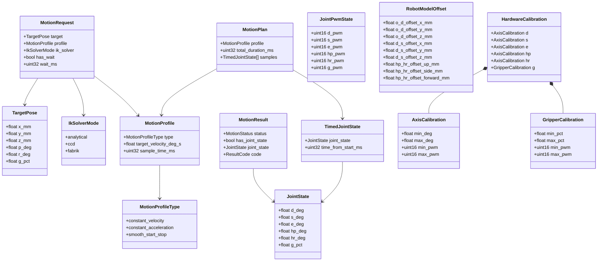

Die fachliche Trennung zwischen Task Space und Joint Space bleibt dabei zentral:

* `TargetPose` beschreibt den Sollzustand des Endeffektors im Task Space mit `(x, y, z, p, r, g)`
* `JointState` beschreibt die berechnete Gelenkkonfiguration im Joint Space mit `(d, s, e, hp, hr, g)`
* `g` bleibt in beiden Modellen bewusst dieselbe fachliche Größe, nämlich die Greiferöffnung in Prozent

### TargetPose

`TargetPose` ist das zentrale Eingabemodell für Bewegungsziele im Task Space.

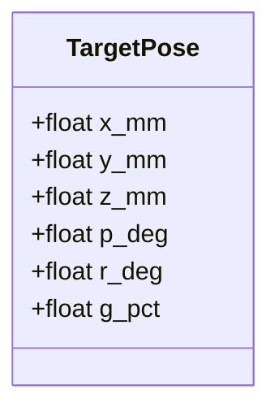

Bedeutung der Felder:

* `x_mm`, `y_mm`, `z_mm`: kartesische Position des Endeffektors in Millimetern
* `p_deg`: Weltneigung der Greifer-Längsachse gegen die horizontale Ebene in Grad. Positive Werte neigen die Achse nach oben, negative nach unten.
* `r_deg`: rechtshändige axiale Drehung um die Greifer-Längsachse in Grad. Die Roll-Nullstellung ist die Lage, in der die Werkzeug-`up`-Achse bei `p_deg = 0` nach Welt-`+z` zeigt.
* `g_pct`: Greiferöffnung in Prozent

`p_deg` und `r_deg` sind bewusst keine zwei unabhängigen globalen Euler-Winkel. Der Arm hat neben der Greiferöffnung fünf Gelenkfreiheitsgrade; bei vorgegebener Position bestimmt der Drehteller die verbleibende Welt-Yaw. Die FK liefert deshalb zusätzlich einen Werkzeugrahmen mit `side`, `forward` und `up` im Weltkoordinatensystem. Die IK verwendet `p_deg` zur Ausrichtung der Werkzeug-Längsachse und `r_deg` für die Drehung um diese Achse.

### JointState

`JointState` beschreibt das Ergebnis der kinematischen Berechnung im Joint Space.

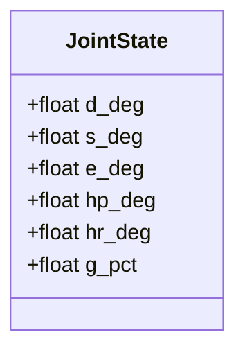

Bedeutung der Felder:

* `d_deg`: Drehtellerwinkel
* `s_deg`: Schulterwinkel
* `e_deg`: Ellenbogenwinkel
* `hp_deg`: Handgelenk-Pitch
* `hr_deg`: Handgelenk-Roll
* `g_pct`: Greiferöffnung

### MotionRequest

`MotionRequest` ist das Übergabemodell zwischen Anwendung und Orchestrierung für eine einzelne Bewegungsanforderung.

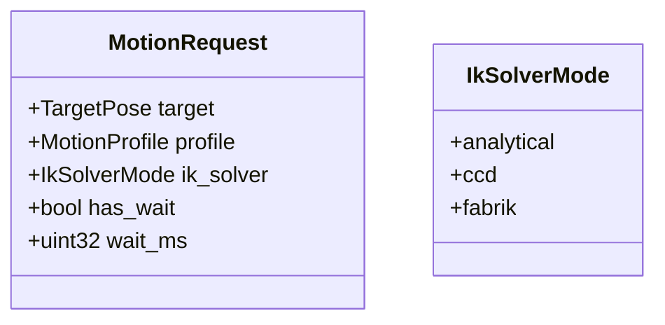

Für die erweiterte Ausbaustufe enthält dieses Modell mindestens:

* ein fachliches Bewegungsziel als `TargetPose`
* ein gewünschtes Bewegungsprofil als `MotionProfile`
* einen expliziten gewünschten IK-Solver als `IkSolverMode`
* eine optionale Wartezeit nach der Zielverarbeitung

Für die erste Implementierung ist `analytical` der Standardwert, wenn kein Solver angegeben wird. Ein eigener `automatic`-Modus wird bewusst noch nicht eingeführt. Ob eine automatische Solver-Policy sinnvoll ist, soll erst entschieden werden, nachdem analytische IK, CCD und FABRIK praktisch vergleichbar implementiert sind.

Spätere Erweiterungen wie LED-Aktionen, Roboter-Aktionen oder Prioritäten können auf diesem Modell aufbauen.

### MotionProfile

`MotionProfile` beschreibt, wie der Übergang zwischen aktuellem und neu berechnetem `JointState` zeitlich ausgeführt werden soll.

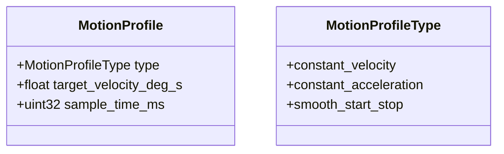

Das Modell trennt bewusst zwischen Zielberechnung und Bewegungsausführung:

* `Kinematics` bestimmt, welcher `JointState` das Ziel fachlich beschreibt
* das Bewegungsprofil bestimmt, wie dieser Zielzustand vom aktuellen Zustand aus zeitlich angefahren wird

Für die aktuell vorgesehenen Bewegungsarten sind insbesondere folgende Profiltypen relevant:

* `constant_velocity`: lineare Interpolation mit konstanter Sollgeschwindigkeit
* `constant_acceleration`: trapezförmiges oder dreieckiges Profil mit begrenzter Beschleunigung
* `smooth_start_stop`: S-Kurven-artiges Profil mit sanftem Losfahren und Abbremsen

Für die vereinfachte Ausbaustufe wird das Profilmodell bewusst auf wenige, gut verständliche Angaben reduziert:

* `type` wählt eines der drei konkret unterstützten Bewegungsprofile
* `target_velocity_deg_s` beschreibt die gewünschte Zielgeschwindigkeit des Profils
* `sample_time_ms` beschreibt den festen zeitlichen Abstand zwischen zwei aufeinanderfolgenden Stützstellen des `MotionPlan`

Damit ist die zeitliche Diskretisierung des `MotionPlan` nicht mehr adaptiv, sondern bewusst fest vorgegeben. Ein typischer Wert kann beispielsweise `20 ms` sein.

### MotionPlan und TimedJointState

Die zeitliche Bewegungsausführung wird nicht als einzelner Sprung von einem `JointState` zum nächsten modelliert, sondern als Folge diskreter Zwischenstände.

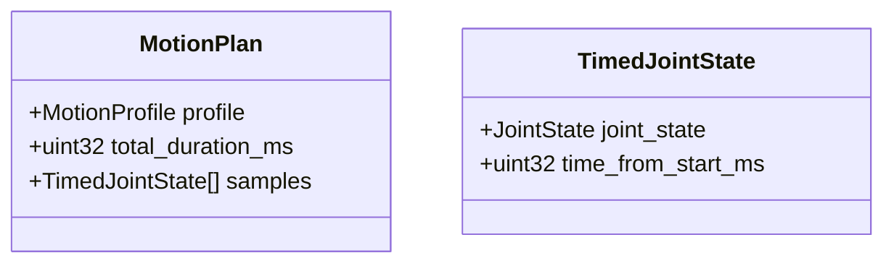

Dabei gilt:

* `MotionPlan` beschreibt einen vollständigen Übergang von Start- zu Zielzustand
* `MotionPlan` enthält zusätzlich die daraus abgeleitete Gesamtdauer `T` in Form von `total_duration_ms`
* jeder `TimedJointState` enthält einen zeitlich eingeordneten Zwischenzustand im Gelenkraum
* die Hardwareseite arbeitet weiterhin nur mit fachlichen Gelenkzuständen und deren zeitlicher Taktung, nicht mit Task-Space-Zielen

Diese Zwischenrepräsentation ist bewusst einfach gehalten. Sie reicht für konstante Geschwindigkeit, konstante Beschleunigung und sanfte Anfahr- und Bremsprofile aus, ohne bereits eine vollständige kartesische Bahnplanung einzuführen.

Bedeutung der Felder:

* `profile`: das für diesen Bewegungsübergang verwendete `MotionProfile`
* `total_duration_ms`: Gesamtdauer des berechneten Bewegungsübergangs
* `samples`: geordnete Folge zeitlich parametrisierter Zwischenzustände mit festem zeitlichem Abstand gemäss `sample_time_ms`

Bedeutung der Felder von `TimedJointState`:

* `joint_state`: fachlicher Zwischenzustand im Gelenkraum
* `time_from_start_ms`: Sollzeit relativ zum Start des `MotionPlan`

### MotionResult

`MotionResult` beschreibt das fachliche und technische Ergebnis einer verarbeiteten Bewegungsanforderung.

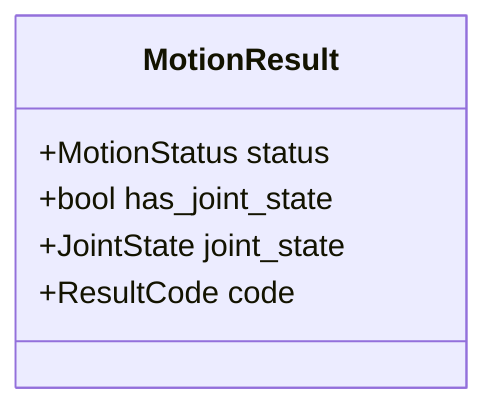

Für die erste Ausbaustufe sollte das Modell insbesondere ausdrücken:

* ob eine Bewegungsanforderung akzeptiert, abgelehnt oder nicht erreichbar war
* ob ein berechneter `JointState` vorliegt
* ob ein technischer Fehler oder ein fachlicher Ablehnungsgrund zurückgegeben wurde

Die genaue Ausgestaltung von `MotionStatus` und `ResultCode` wird im Kapitel zur Fehlerbehandlung weiter konkretisiert.

### JointPwmState

`JointPwmState` beschreibt die PWM-bezogene Aktoransteuerung nach Anwendung der `HardwareCalibration`.

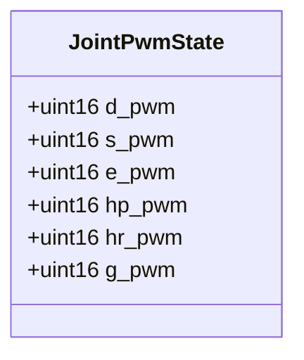

Dieses Modell bildet die Brücke zwischen logischem Gelenkzustand und konkreter Hardwareausgabe:

* es enthält keine fachlichen Winkel oder Prozentwerte mehr
* es beschreibt die kanalbezogenen PWM-Sollwerte pro Aktor
* es ist das naheliegende Übergabemodell zwischen `Hardware Abstraction` und `Hardware Driver`

### RobotModelOffset

`RobotModelOffset` beschreibt modellbezogene Offsets und Korrekturwerte, welche das fachliche Robotermodell betreffen.

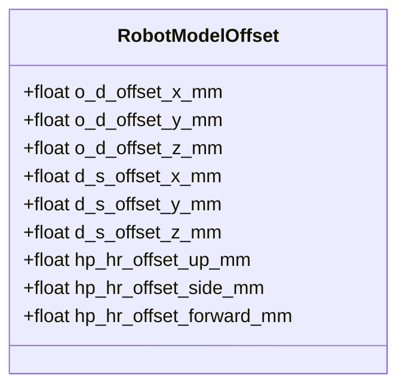

Diese Werte werden nicht zur direkten PWM-Erzeugung verwendet, sondern zur Korrektur und Präzisierung des mathematischen Modells. Sie gehören damit auf die Robotik-Seite und müssen von `Kinematics`, `Validation` und gegebenenfalls einem `Robot Model` berücksichtigt werden. Wird die Korrektur als eigener Verarbeitungsschritt modelliert, entsteht daraus eine `OffsetTargetPose`. Die Länge vom Handgelenk-Roll zum Greifer wird nicht als separater Offset geführt, sondern als Segmentlänge `hr_g_length_mm` im `RobotModel`.

### HardwareCalibration

`HardwareCalibration` beschreibt die Abbildung zwischen fachlichen Sollwerten und realen hardwarebezogenen Stellwerten.

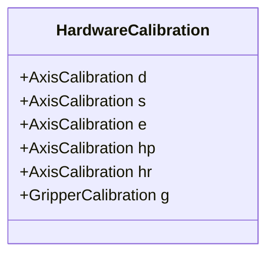

Für Rotationsachsen wird jeweils ein `AxisCalibration`-Eintrag verwendet:

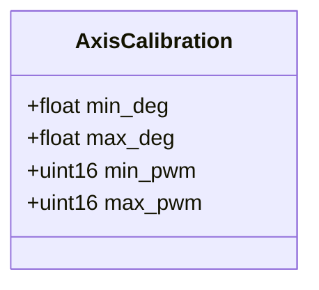

Für den Greifer wird ein separates Modell mit Prozentbezug verwendet:

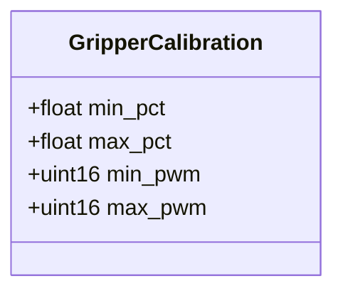

Die PWM-Endpunkte sind gerichtete Kalibrationswerte. `min_pwm` muss deshalb nicht kleiner als `max_pwm` sein: Wenn kleinere fachliche Werte größere PWM-Ticks benötigen, wird diese Richtung direkt durch `min_pwm > max_pwm` ausgedrückt. Damit bleibt die Kalibration konsistent mit der fachlichen Entscheidung, dass `g` in Task Space und Joint Space dieselbe Größe beschreibt, während die interne Abbildung auf PWM-Werte dennoch separat dokumentiert wird. `HardwareCalibration` ist damit ausdrücklich von `RobotModelOffset` abgegrenzt und gehört zur hardwarenahen Abbildung in der `Hardware Abstraction`.


## Schnittstellen der Kernmodule

Dieses Kapitel beschreibt die fachlichen und technischen Übergaben zwischen den zentralen Softwarebausteinen. Im Vordergrund stehen die Modelle auf den Schnittstellen sowie die Verantwortungsgrenzen der Module, nicht die konkrete C++-Signatur einzelner Methoden.

Für die erste Ausbaustufe sollen die zentralen Schnittstellen bewusst einfach, synchron und deterministisch gehalten werden. Jede Komponente soll klar benannte Eingaben verarbeiten, ein fachlich interpretierbares Ergebnis zurückgeben und dabei möglichst wenig Wissen über interne Details anderer Bausteine benötigen.

Das folgende Diagramm zeigt die geplanten Hauptschnittstellen zwischen den Kernmodulen:

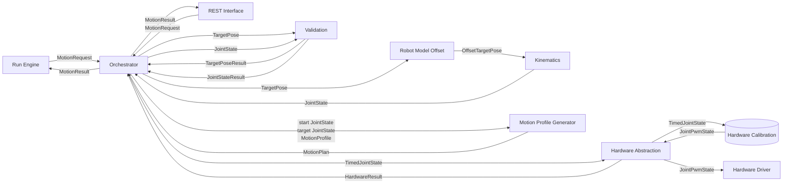

Das Diagramm ist bewusst als Datenflussdiagramm zu lesen. Die Pfeile beschreiben daher in erster Linie, welche Modelle oder Ergebnisobjekte von einer Komponente an die nächste übergeben werden. Es geht an dieser Stelle also nicht nur um statische Abhängigkeiten, sondern um den fachlichen Verarbeitungsfluss einer Bewegungsanforderung.

Mit der ergänzten `REST Interface`-Komponente wird außerdem sichtbar, dass die Anwendungsschicht mehrere fachliche Eingangsquellen besitzen kann. Sowohl `Run Engine` als auch REST-basierte Bedien- oder Testzugriffe erzeugen dabei dieselben internen Kernmodelle und münden bewusst in denselben `Orchestrator`.

Besonders wichtig ist dabei die Unterscheidung zwischen fachlichen Zuständen und transformierten Zwischenständen:

* `TargetPose` ist das fachliche Ziel aus Sicht der Anwendung
* `OffsetTargetPose` ist eine durch bekannte Modell-Offsets korrigierte Zwischenrepräsentation für die Kinematik
* `JointState` ist das Ergebnis der kinematischen Berechnung im Gelenkraum
* `MotionPlan` ist die zeitlich ausgeformte Folge von Gelenkzuständen zwischen Start und Ziel einschließlich der berechneten Gesamtdauer
* `JointPwmState` ist die hardwarebezogene Ausgabeform nach Anwendung der Hardwarekalibration

Auf diese Weise wird im Diagramm sichtbar, an welcher Stelle sich die Darstellung einer Bewegung ändert: von der fachlichen Zielbeschreibung über modellkorrigierte Zwischenstände bis hin zur konkreten PWM-Ausgabe für die Aktoren.

Die dabei verwendeten Modellbegriffe sind zunächst fachlich zu verstehen:

* `TargetPoseResult` beschreibt das Ergebnis einer fachlichen Prüfung eines `TargetPose`
* `JointStateResult` beschreibt das Ergebnis einer fachlichen Prüfung eines `JointState`
* `OffsetTargetPose` beschreibt eine durch `RobotModelOffset` korrigierte Zielbeschreibung für die weitere Verarbeitung in der Kinematik
* `MotionPlan` beschreibt eine zeitlich getaktete Folge von Gelenkzwischenständen einschließlich ihrer Gesamtdauer
* `JointPwmState` beschreibt die PWM-bezogenen Sollwerte nach Anwendung der `HardwareCalibration`
* `HardwareResult` beschreibt den technischen Rückgabestatus der Hardwareseite
* `Statusmodelle` beschreibt zusammengefasste Zustands- und Ergebnisinformationen für externe API-Aufrufer

### Run Engine

Die Anwendungsschicht erzeugt fachliche Bewegungsanforderungen und verarbeitet deren Ergebnisse.

Eingaben und Ausgaben:

* Übergabe eines `MotionRequest` an den `Orchestrator`
* Entgegennahme eines `MotionResult`

Die Anwendung kennt dabei:

* fachliche Zielmodelle
* Ablaufzustände
* einfache Ergebniszustände

Die Anwendung kennt dabei nicht:

* konkrete IK-Details
* Kalibrationsparameter
* hardwarebezogene Stellwerte oder Treiberdetails

### Externe REST-Schnittstelle

Neben der `Run Engine` gehört auch eine externe REST-Schnittstelle zur vorgesehenen Anwendungsschicht. Diese Schnittstelle ist im aktuellen Dokument noch kein detailliert ausgearbeitetes API-Design, wird aber für die frühe Implementationsphase bereits als kleiner erster Software-Slice ausdrücklich vorgesehen.

Die konkrete HTTP/JSON-Schnittstelle des aktuellen Stands ist im separaten Dokument [rest_api.md](./rest_api.md) beschrieben.

Die REST-Schnittstelle hat dabei insbesondere folgende Aufgaben:

* Entgegennahme externer Bedien- und Steueranfragen über HTTP
* Abbildung von HTTP- und JSON-Nutzdaten auf interne Modelle wie `MotionRequest`
* Übergabe fachlicher Anfragen an den `Orchestrator`
* Rückgabe fachlicher und technischer Ergebnisse auf Basis von `MotionResult` und Statusmodellen
* serielle Debug-Ausgaben für Startup, Request-Eingang, Request-Ergebnis und Fehlerzustände während der frühen Entwicklungsphase

Eingaben und Ausgaben:

* Eingabe externer REST-Aufrufe
* Übergabe eines `MotionRequest` an den `MotionOrchestrator`
* Entgegennahme eines `MotionResult` oder anderer Zustandsinformationen aus Orchestrierung und Controller-Handler
* Rückgabe von HTTP-Antworten mit fachlichen Ergebnissen und Statusdaten

Damit gilt bewusst:

* die REST-Schnittstelle gehört zur Anwendungs- beziehungsweise Interfaceschicht
* sie ersetzt nicht den `Orchestrator`, sondern nutzt ihn als fachlichen Einstiegspunkt
* sie kapselt Protokollthemen wie HTTP, JSON und gegebenenfalls statische HMI-Seiten vom restlichen System ab
* sie ruft weder `Kinematics` noch `Validation` direkt auf; Task-Space-Ziele gehen an den `MotionOrchestrator`
* sie übernimmt als Adapter die Kalibration und die Ausgabe eines bereits freigegebenen `JointState` an den Hardwaretreiber

Für den frühen Bring-up ist zusätzlich ein bewusst niedriger angesetzter REST-Pfad vorgesehen. Dieser Pfad dient dazu, den Roboter zunächst ohne inverse Kinematik und ohne vollständigen `Orchestrator` schrittweise bedienbar zu machen:

* `GET /api/joint-state` liefert den aktuell angenommenen fachlichen `JointState`
* `GET /api/settings/motion-limits` liefert die für Bedienoberflächen bestimmten Gelenk- und Servo-PWM-Grenzen aus `RobotSettings`
* `POST /api/joint-motion` nimmt einen direkten Zielzustand im Joint Space entgegen
* `GET /api/joint-pwm-state` liefert den aktuell angenommenen hardwarenahen `JointPwmState`
* `POST /api/servo-driver/init` initialisiert den PCA9685-Servo-Treiber und schreibt den initialen PWM-Zustand
* `POST /api/joint-pwm-motion` nimmt direkte PWM-Zielwerte für die einzelnen Aktorkanäle entgegen; bei angeschlossenem Hardwaretreiber ist vorher `POST /api/servo-driver/init` erforderlich

Diese Endpunkte sind ausdrücklich als Low-Level- und Inbetriebnahme-Pfad zu verstehen. Der reguläre, höherliegende Bewegungsrequest bleibt weiterhin der dokumentierte `MotionRequest` mit `TargetPose` und `MotionProfile`. Sobald `Orchestrator`, `Validation`, `Motion Profile Generator` und `Hardware Abstraction` verfügbar sind, sollen die direkten Joint- und PWM-Endpunkte nicht die fachliche Bewegungslogik ersetzen, sondern als Diagnose- und Bring-up-Werkzeuge dienen.

Für die weitere Architektur ist wichtig, dass die REST-Schnittstelle dieselben fachlichen Kernmodelle verwendet wie die `Run Engine`. Dadurch bleibt offen, ob Bewegungsanforderungen aus einem vordefinierten Ablauf, aus einem Test-HMI oder aus einer anderen externen Quelle stammen.

Noch nicht Teil dieses Dokuments sind:

* ein vollständiges API-Design für den regulären `MotionRequest`-Pfad
* vollständige JSON-Schemata
* Authentisierung oder Zugriffsschutz
* Details einer Browser-HMI

Die Architektur soll dabei so offen bleiben, dass der ESP32 zunächst ein kleines REST API und später zusätzlich eine kleine statische HMI-Seite über dieselbe Netzwerkschnittstelle anbieten kann.

### Manuelle Controller-Bedienung

Die Controller-Anbindung ist produktiv und trennt gerätespezifische Eingaben von der Bewegungslogik:

```text
Bluepad32 / Switch-2-Pro-BLE
  -> ControllerDebugDriver
  -> ControllerInput
  -> ControllerCommandMapper
  -> JogCommand
  -> ControllerHandler
  -> unmittelbarer JointState-Sollwert
  -> RestApiServer: Kalibration und PCA9685-Ausgabe
```

`ControllerInput` bleibt das projektinterne Rohmodell. `ControllerCommandMapper` in `application/` übersetzt Tasten und Sticks in den geräteunabhängigen `JogCommand`. Der `ControllerHandler` in `orchestration/` kennt weder Bluepad32 noch REST oder PWM.

Der `RestApiServer` taktet die Controller-Verarbeitung mit 5 ms, jedoch nur bei gültiger Verbindung und Eingabe, initialisiertem Servo-Treiber sowie ohne aktiven MotionPlan oder Sequenz. Damit haben geplanter Ablauf und MotionPlan Vorrang vor dem manuellen Jogging.

Der `ControllerHandler` hält die kartesische Zielpose, kartesische Geschwindigkeiten, den Gelenk-Slew-Zustand und den Weltroll-Lock. Kartesische Sollwerte werden mit Singularitätsverlangsamung integriert, über die gemeinsame planfreie Zielauflösung des `MotionOrchestrator` validiert und per IK gelöst. Die resultierenden Drehachsen sind auf 180 °/s begrenzt. Direkte Joint-Jogs erhalten Vorrang vor kartesischem Jogging.

Der Weltroll-Lock wird mit dem rechten Stick-Klick (RS) bei einer Werkzeugneigung von `p = -90° ±20°` aktiviert. Er hält die Summe aus Drehteller und Handgelenk-Roll im Weltbezug konstant und kompensiert deshalb `hr` gegenläufig zu `d`. RS deaktiviert den Lock und übernimmt die aktuelle Haltung als neue Referenz; der angefahrene Hr-Wert bleibt dadurch erhalten. Ein manueller Hr-Jog über Y/A oder eine erfolgreiche Hr-Änderung über `POST /api/joint-motion` deaktiviert den Lock. Der REST-Adapter ruft dafür `ControllerHandler::synchronizeJointState()` auf, damit der Handler die extern bestätigte Gelenkstellung als neue Referenz übernimmt.

### Switch-2-Pro-BLE und Bluepad32-Patch

Bluepad32 ist als Git-Submodule unter `third_party/bluepad32/` auf den Upstream-Commit des Tags `4.2.0` gepinnt. Die oberste `CMakeLists.txt` referenziert die darin enthaltene Komponente direkt über `EXTRA_COMPONENT_DIRS`. `scripts/bootstrap.sh` initialisiert das Submodule und wendet die Patch-Serie aus `patches/bluepad32/` idempotent an. Damit bleibt der Fremdcode ausserhalb des Projektquellcodes und der getestete Integrationsstand reproduzierbar.

Der Patch `0001-switch2-pro-ble-support.patch` ist auf die bekannte Switch-2-Pro-Controller-Firmware beschränkt. Er enthält nur die für die Verbindung erforderlichen Erweiterungen:

* Er akzeptiert die bekannte Controller-Adresse `A4:C1:E8:50:BC:2B` auch dann, wenn das BLE-Advertisement keine von Bluepad32 erwartete Gamepad-Appearance enthält.
* Für dieses Gerät umgeht er den fehlschlagenden HIDS-Pfad und abonniert nach 250 ms die bestätigte Input-Characteristic mit Value-Handle `0x002e`.
* Er aktiviert Notifications über den zugehörigen CCCD-Handle `0x002f` mit `0100` und übergibt gültige Rohreports an `ik_switch2_pro_ble_input_report()` in `main.cpp`.
* Er stellt `uni_bt_le_switch2_pro_disconnect()` und `uni_bt_le_switch2_pro_is_connected()` für den kontrollierten Verbindungszustand bereit und entfernt den Notification-Listener beim Disconnect.

Der Patch setzt ausserdem für den aktuellen Controller aktive BLE-Scans sowie LE Secure Connections ohne Bonding. Diese Einstellungen gelten momentan für den gesamten Bluepad32-BLE-Pfad und sind deshalb bei einer Erweiterung auf weitere Controller erneut zu prüfen.

Nicht mehr Teil der produktiven Patch-Serie sind die Bring-up-Hilfen: GATT-Service- und Characteristic-Dumps, periodische Notification-Ausgaben, Advertisement-Speicherung und die REST-Ausgabe `bleAdvertisements` wurden entfernt. `GET /api/controller/debug` liefert weiterhin Controller- und Bewegungsdiagnose, aber keine BLE-Scan-Historie.

Für einen frischen Arbeitsbaum lautet die Initialisierung:

```bash
git submodule update --init
scripts/bootstrap.sh
```

### MotionOrchestrator und ControllerHandler

Der `MotionOrchestrator` verarbeitet einzelne vollständige `MotionRequest` und erzeugt daraus einen `MotionPlan`. Seine planfreie Methode `resolveTargetPose()` führt TargetPose-Validierung, RobotModelOffset, IK und JointState-Validierung aus und wird auch vom `ControllerHandler` verwendet. Dadurch gelten für diskrete und kontinuierliche Bewegungen dieselben Robotikregeln.

Eingaben und Ausgaben:

* Eingabe eines `MotionRequest` für die diskrete Bewegungsplanung
* Übergabe eines `TargetPose` an `Validation`
* Übergabe eines `TargetPose` an die Komponente `Robot Model Offset`
* Übergabe eines `JointState` an `Validation`
* Übergabe von Startzustand, Zielzustand und `MotionProfile` an einen Profilgenerator
* Rückgabe eines `MotionResult` an die Anwendung

Der `Orchestrator` kennt dabei:

* die Reihenfolge der Verarbeitungsschritte
* fachliche und technische Rückgabepfade
* die zentralen Übergabemodelle
* den aktuellen Startzustand für die zeitliche Bewegungsplanung

Der `Orchestrator` kennt dabei nicht:

* die interne mathematische Implementierung der Kinematik
* die konkrete PWM-Erzeugung im Treiber

### Validation

`Validation` prüft Zielzustände und berechnete Gelenkzustände unter fachlichen Randbedingungen.

Eingaben und Ausgaben:

* Eingabe eines `TargetPose` für Vorprüfungen mit Rückgabe eines `TargetPoseResult`
* Eingabe eines `JointState` für Gelenk- und Freigabeprüfungen mit Rückgabe eines `JointStateResult`

`Validation` kennt dabei:

* Gelenkgrenzen
* Bewegungsrandbedingungen
* profilbezogene Grenzen für Geschwindigkeit, Beschleunigung und zeitliche Auflösung
* fachliche Freigaberegeln

`Validation` kennt dabei nicht:

* hardwarebezogene PWM-Werte
* Treiberdetails

### Kinematics

`Kinematics` berechnet aus einer gültigen Zielbeschreibung und einem explizit ausgewählten IK-Solver einen fachlichen Gelenkzustand.

Für die inverse Kinematik darf diese Komponente intern sowohl analytische als auch iterative Lösungsverfahren kapseln. Insbesondere Verfahren wie `CCD` oder `FABRIK` werden hier als interne Iterationslogik verstanden und nicht als Aufgabe des `Orchestrator`.

Die aktuell vorgesehenen Solver-Modi sind `analytical`, `ccd` und `fabrik`. Für den ersten Implementationsstand ist `analytical` der Default, wenn ein `MotionRequest` keinen Solver vorgibt. Ein automatischer Auswahlmodus wird bewusst nicht modelliert, solange die drei Solver noch nicht praktisch vergleichbar implementiert sind.

Eingaben und Ausgaben:

* Eingabe einer `OffsetTargetPose`
* Eingabe eines `IkSolverMode`
* Rückgabe eines `JointState`

Bei iterativen Verfahren umfasst die Verantwortung von `Kinematics` insbesondere:

* Wahl oder Übernahme eines geeigneten Startzustands
* wiederholte Berechnung von Iterationsschritten bis zur Zielannäherung
* Prüfung von Toleranz, Konvergenz und Abbruchbedingungen
* Rückmeldung, ob eine Lösung gefunden wurde oder ob beispielsweise Iterationsgrenzen beziehungsweise Nichterreichbarkeit vorlagen

`Kinematics` kennt dabei:

* Task Space beziehungsweise modellkorrigierte Zielzustände
* Joint Space
* Robotermodell und geometrische Parameter
* solverinterne Iterationsparameter und Konvergenzregeln

`Kinematics` kennt dabei nicht:

* Hardwaredetails
* PWM-Grenzen
* Ablauflogik der Anwendung
* übergeordnete Ablaufentscheidungen bei Fehlern oder Alternativpfaden

### Motion Profile Generator

Der `Motion Profile Generator` erzeugt aus einem aktuellen Startzustand, einem freigegebenen Zielzustand und einem gewünschten `MotionProfile` einen zeitlich getakteten `MotionPlan`.

Eingaben und Ausgaben:

* Eingabe eines Start-`JointState`
* Eingabe eines Ziel-`JointState`
* Eingabe eines `MotionProfile`
* Rückgabe eines `MotionPlan`

Die Verantwortung dieses Bausteins umfasst insbesondere:

* Berechnung der Interpolationsdauer `T` bei festem zeitlichem Raster
* Erzeugung von Zwischenzuständen im Gelenkraum
* Auswahl des passenden Profilschemas für `constant_velocity`, `constant_acceleration` oder `smooth_start_stop`
* Erzeugung äquidistanter Stützstellen entsprechend `sample_time_ms`

Der Baustein kennt dabei:

* den aktuellen und den gewünschten `JointState`
* den festen Sampling-Takt des Profils
* die gewünschte Zielgeschwindigkeit des Profils
* die daraus abgeleitete Gesamtdauer des `MotionPlan`
* den Unterschied zwischen geometrischer Zielerreichung und zeitlicher Sollwertausformung

Der Baustein kennt dabei nicht:

* Task-Space-Ziele
* IK-Details
* PWM-Abbildung oder Treiberdetails

### Hardware Abstraction

`Hardware Abstraction` kapselt den Übergang von hardwarenahen Stellwerten zur konkreten Treiberansteuerung. In der Implementierung kann dieser Baustein als HAL verstanden und entsprechend benannt werden.

Eingaben und Ausgaben:

* Eingabe eines `TimedJointState`
* Anwendung der hinterlegten `HardwareCalibration`
* interne Erzeugung eines `JointPwmState`
* Übergabe eines `JointPwmState` an den `Hardware Driver`
* Rückgabe eines `HardwareResult`

`Hardware Abstraction` kennt dabei:

* zulässige Stellwertbereiche
* Zuordnung zu Ausgabekanälen
* Schutz- und Begrenzungslogik
* `HardwareCalibration`

`Hardware Abstraction` kennt dabei nicht:

* IK-Ziele im Task Space
* fachliche Bewegungslogik der Anwendung

### Hardware Driver

Der `Hardware Driver` ist die unterste Softwareschicht zur direkten Ansteuerung der Hardwarekomponenten.

Eingaben und Ausgaben:

* Eingabe eines `JointPwmState`
* Rückgabe eines technischen Status an die `Hardware Abstraction`

Der Treiber kennt dabei:

* I2C-Kommunikation
* PCA9685-Zugriffe
* konkrete Ausgabedetails einzelner Kanäle
* die technische PCA9685-Initialisierung

Der Treiber kennt dabei nicht:

* fachliche Zielzustände
* Gelenkmodelle
* Kalibrationslogik auf höherer Ebene

Im aktuellen PCA9685-Treiber erfolgt die hardwarenahe Initialisierung direkt in `init()`:

* `init()` setzt den Treiberzustand auf nicht initialisiert, sendet den PCA9685 Software Reset Call, setzt `MODE2` einmalig auf `0x06` (`OUTDRV=1`, `INVRT=0`, `OUTNE[1:0]=10`), setzt die PWM-Frequenz, schreibt den definierten initialen `JointPwmState`, markiert den Treiber als initialisiert und legt `OE` anschließend auf aktiv. Das Laufzeitmodell bietet bewusst keinen Enable-/Disable-Pfad mehr an, weil sich `OE` im Bring-up nicht als verlässliches Stromlos- oder Hochohmig-Schalten der Servos gezeigt hat.
* `POST /api/servo-driver/init` nutzt denselben `init()`-Ablauf erneut und ist damit ein Diagnose- und Reinitialisierungspfad, kein separater Treiberzustand.
* `write()` akzeptiert direkte `JointPwmState`-Ausgaben erst nach erfolgreichem `init()`.

## Initialisierung und Laufzeitmodell

Dieses Kapitel beschreibt, wie die Software von einer definierten Ausgangslage in einen konsistenten Betriebszustand überführt wird und wie sich daraus der reguläre Laufzeitfluss ergibt. Dabei ist besonders wichtig, dass das System in der ersten Ausbaustufe keine sensorische Rückmeldung über die reale Armstellung besitzt. Die Initialisierung basiert daher auf einer fachlich definierten Annahme über den mechanischen Ausgangszustand und nicht auf einer physisch verifizierten Referenzfahrt.

### Initialisierung

Für den Start des Systems wird zwischen `Home Position` und `Init Position` unterschieden:

* `Home Position` beschreibt die mechanische Ausgangslage des Arms im stromlosen Zustand
* `Init Position` beschreibt den angenommenen logischen Anfangszustand der Software nach dem Einschalten

Für die erste Ausbaustufe gilt dabei folgende Betriebsannahme:

* der Arm wird vor dem Einschalten manuell in die definierte `Home Position` gebracht
* nach dem Start übernimmt die Software daraus die projektweit festgelegte `Init Position`
* diese `Init Position` entspricht den fachlichen Nullwerten der Servoachsen
* erst nach erfolgreicher Initialisierung werden reguläre Bewegungsanforderungen freigegeben

Die Initialisierung selbst sollte in einer festen Reihenfolge erfolgen:

1. Start der Basissoftware auf dem ESP32 und Aufbau der elementaren Laufzeitumgebung.
2. Laden oder Erzeugen statischer Konfigurationsdaten wie `RobotModelOffset` und `HardwareCalibration`.
3. Initialisieren der hardwarebezogenen Komponenten wie `Hardware Abstraction` und `Hardware Driver`.
4. Setzen des internen Softwarezustands auf die angenommene `Init Position`.
5. Initialisieren von `Orchestrator`, `Run Engine` und `SequenceState`.
6. Übergang in einen betriebsbereiten Zustand, in dem Bewegungsanforderungen verarbeitet werden dürfen.

Im aktuellen Bring-up-Stand ist dieser Ablauf für die direkte PCA9685-Ausgabe noch niedriger angesetzt: Beim Boot setzt `main.cpp` das PCA9685-`OE`-Signal zunächst deaktiviert. Direkt nach dem Start des I2C-Busses führt `servoDriver.init()` die technische Treiberinitialisierung aus, schreibt den initialen `JointPwmState` und legt `OE` auf aktiv. Der REST-Endpunkt `POST /api/servo-driver/init` bleibt für Diagnose und erneute Initialisierung erhalten, ist für den normalen Start aber nicht mehr erforderlich.

Wesentlich ist dabei, dass die Software nicht versucht, aus einem unbekannten physischen Zustand eine implizite Korrektur abzuleiten. Nach Reset, Neustart oder Spannungsunterbruch wird deshalb erneut dieselbe Initialisierungsannahme benötigt. Wenn nicht sichergestellt ist, dass sich der Arm wieder in der definierten `Home Position` befindet, darf die normale Ablaufsteuerung fachlich nicht als konsistent betrachtet werden.

### Laufzeitmodell

Im regulären Betrieb wird eine Bewegungsanforderung schrittweise von der Anwendungsebene bis zur Hardwareausgabe verarbeitet. Seit der Erweiterung um `MotionPlan` besteht die Laufzeitverarbeitung nicht mehr nur aus Zielberechnung und Einzelausgabe, sondern zusätzlich aus einer expliziten Planungs- und Abarbeitungsphase für die Folge der Zwischenzustände. Der Laufzeitfluss bleibt dabei bewusst streng gerichtet, damit die fachlichen und technischen Zustandswechsel nachvollziehbar bleiben.

Ein typischer Ablauf ist wie folgt aufgebaut:

1. Die `Run Engine` wählt anhand des aktuellen `SequenceState` den nächsten auszuführenden Schritt aus.
2. Aus diesem Schritt wird ein `MotionRequest` mit einer fachlichen `TargetPose` erzeugt.
3. Der `Orchestrator` stößt die Vorprüfung dieser `TargetPose` über `Validation` an.
4. Bei positiver Vorprüfung wird die Zielbeschreibung mithilfe von `RobotModelOffset` in eine `OffsetTargetPose` überführt.
5. `Kinematics` berechnet daraus mit dem im `MotionRequest` gewählten `IkSolverMode` einen `JointState` oder meldet zurück, dass keine geeignete Lösung gefunden wurde.
6. Der berechnete `JointState` wird durch `Validation` fachlich geprüft und freigegeben oder abgelehnt.
7. Der `Orchestrator` bestimmt den aktuellen Start-`JointState` aus dem zuletzt angenommenen Systemzustand beziehungsweise aus der `Init Position`, falls noch keine reguläre Bewegung ausgeführt wurde.
8. Aus diesem Startzustand, dem freigegebenen Zielzustand und dem im `MotionRequest` hinterlegten `MotionProfile` wird ein `MotionPlan` mit berechneter Gesamtdauer `T` erzeugt.
9. Der `Orchestrator` gibt die geplanten `TimedJointState`-Zwischenstände des `MotionPlan` nacheinander an die `Hardware Abstraction`.
10. Für jeden Zwischenstand wird in der `Hardware Abstraction` mithilfe der `HardwareCalibration` ein `JointPwmState` erzeugt.
11. Der `Hardware Driver` gibt diese `JointPwmState`-Folge an die reale Hardware aus und liefert technische Statusmeldungen zurück.
12. Nach erfolgreicher Abarbeitung des gesamten `MotionPlan` übernimmt der `Orchestrator` den Ziel-`JointState` als neuen logisch angenommenen Systemzustand.
13. Der `Orchestrator` verdichtet die fachlichen und technischen Teilergebnisse zu einem `MotionResult`.
14. Die `Run Engine` verarbeitet dieses `MotionResult` und entscheidet über Fortsetzung, Wartephase, Abbruch oder Übergang zum nächsten Schritt.

Aus Sicht des Laufzeitmodells hat jede Hauptkomponente dabei eine klar abgegrenzte Rolle:

* `Run Engine` verwaltet den Ablauf und dessen Fortschritt
* `Orchestrator` koordiniert die Verarbeitungsschritte, verwaltet den logisch angenommenen aktuellen Gelenkzustand und steuert die Rückgabepfade
* `Validation` bewertet fachliche Zulässigkeit und Freigabe
* `Kinematics` berechnet den Zielzustand im Gelenkraum
* `Motion Profile Generator` formt den zeitlichen Bewegungsübergang zwischen Start- und Zielzustand aus
* `Hardware Abstraction` überführt die geplanten Zwischenzustände in hardwarenahe Stellwerte
* `Hardware Driver` setzt die Ausgabe technisch um

### Bewegungsprofile und Verantwortungsgrenzen

Die gewünschte Erweiterung um unterschiedliche Bewegungscharakteristiken passt grundsätzlich in das vorhandene Design, benötigt aber eine explizite Schicht für die zeitliche Bewegungsausführung. Ohne diesen Baustein würde der `Orchestrator` fachlich zu breit werden, weil er sonst zusätzlich IK, Freigabe und zeitliche Interpolation kapseln müsste.

Für die vorgesehenen Profilarten wird folgende Zuordnung festgelegt:

* `constant_velocity`: gleichmäßige Interpolation im Gelenkraum mit konstanter Sollgeschwindigkeit zwischen Start und Ziel
* `constant_acceleration`: Profil mit Beschleunigungs- und Bremsphase, typischerweise trapez- oder dreiecksförmig
* `smooth_start_stop`: Profil mit weichem Ein- und Ausblenden der Beschleunigung, beispielsweise S-Kurve oder glatte Blendfunktion

Für die vereinfachte Variante gilt zusätzlich:

* der `Motion Profile Generator` erzeugt die Stützstellen stets mit fester Sampling-Zeit
* die Zielgeschwindigkeit wird explizit im `MotionProfile` vorgegeben
* der Profiltyp wird explizit als `MotionProfileType` modelliert

Die folgende Einordnung der Profile ist in diesem Kapitel besser aufgehoben als im Datenmodell. Die Diagramme beschreiben nicht die Struktur eines Typs, sondern die fachliche Bedeutung der drei Profilarten.

Die grün markierten Punkte in den Diagrammen stellen zeitlich äquidistante Stützstellen des `MotionPlan` dar. Für die vereinfachte Ausbaustufe wird davon ausgegangen, dass diese Stützstellen mit einem festen Raster wie beispielsweise `20 ms` erzeugt werden.

Eine ausführlichere, bewusst didaktischere Beschreibung der mathematischen Profilberechnung ist im ergänzenden Dokument [profile_calculation.md](./profile_calculation.md) festgehalten.

#### `constant_velocity`

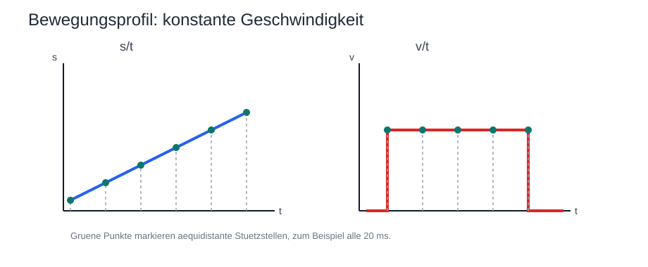

Bei `constant_velocity` verläuft `s(t)` idealisiert linear. Das zugehörige `v(t)` bleibt zwischen Start und Ziel konstant und weist an den Übergängen sprunghafte Änderungen auf. Dieses Profil ist konzeptionell einfach, erzeugt aber an Bewegungsbeginn und Bewegungsende die härtesten Übergänge.

#### `constant_acceleration`

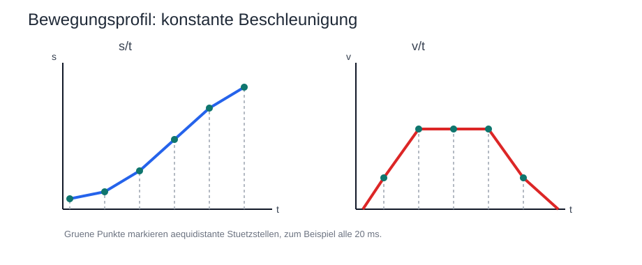

Bei `constant_acceleration` wird die Geschwindigkeit zunächst linear aufgebaut, anschließend gegebenenfalls konstant gehalten und vor dem Ziel linear wieder abgebaut. Im `v/t`-Diagramm ergibt sich dadurch typischerweise ein trapezförmiger Verlauf, im `s/t`-Diagramm ein entsprechend gekrümmter Wegverlauf.

#### `smooth_start_stop`

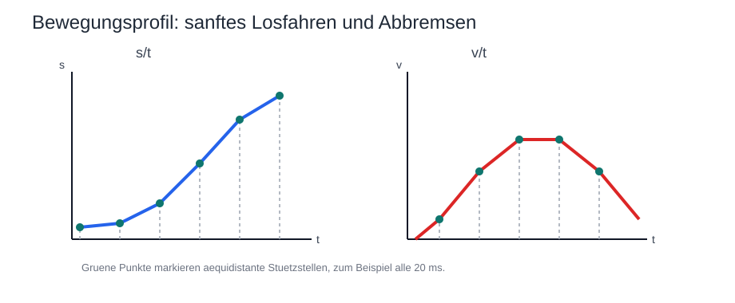

Bei `smooth_start_stop` werden Beschleunigung und Verzögerung weicher ein- und ausgeblendet. Das `v(t)`-Diagramm zeigt deshalb keinen harten Knick am Anfang und Ende der Bewegung, sondern einen geglätteten Verlauf. Im `s/t`-Diagramm führt das zu einem S-förmigen, besonders ruhigen Wegverlauf.

Damit bleibt die Architektur erweiterbar:

* `Kinematics` bleibt für Zielerreichung und Gelenkberechnung zuständig
* `Validation` bewertet auch profilbezogene Randbedingungen
* der `Motion Profile Generator` erzeugt die zeitliche Abfolge der Sollzustände
* `Hardware Abstraction` und `Hardware Driver` bleiben unverändert auf die Ausgabe einzelner Zwischenstände fokussiert

Da keine Positionsrückführung vorhanden ist, beschreibt ein erfolgreiches `MotionResult` in der ersten Ausbaustufe keinen physisch bestätigten Zielerfolg. Es beschreibt vielmehr, dass die Anforderung fachlich akzeptiert, rechnerisch verarbeitet, als `MotionPlan` ausgeformt und hardwareseitig ohne gemeldeten technischen Fehler ausgegeben wurde.

Für Reset, Neustart oder unklaren physischen Zustand folgt daraus dieselbe Konsequenz wie bei der Initialisierung: Der Softwarezustand darf nicht stillschweigend als gültiges Abbild des realen Arms weiterverwendet werden. In solchen Fällen ist erneut von der definierten `Home Position` und der dazugehörigen `Init Position` auszugehen oder der Betrieb bleibt gesperrt, bis diese Annahme wieder hergestellt ist.

## Kalibration und Hardwareabbildung

Dieses Kapitel beschreibt, wie fachliche Zustände des Roboters in hardwarenahe Stellwerte überführt werden. Dabei wird bewusst zwischen modellbezogenen Korrekturen auf der Robotikseite und der eigentlichen Aktorabbildung auf der Hardwareseite unterschieden. Diese Trennung ist wichtig, damit Kinematik, Validierung und Hardwareansteuerung nicht dieselben Korrekturen mehrfach oder widersprüchlich anwenden.

### Abgrenzung der beiden Kalibrationsebenen

Für die erste Ausbaustufe werden zwei Kalibrationsebenen unterschieden:

* `RobotModelOffset` beschreibt modellbezogene Korrekturen des realen Arms gegenüber dem idealisierten Robotermodell
* `HardwareCalibration` beschreibt die Abbildung eines fachlichen `JointState` auf konkrete PWM-bezogene Ausgabewerte

`RobotModelOffset` wirkt damit auf der Seite der fachlichen Bewegungsbeschreibung. Diese Korrekturen betreffen insbesondere Geometrie, bekannte Montageabweichungen und modellrelevante Offsets, die schon vor der eigentlichen IK-Berechnung oder in unmittelbarer Nähe dazu berücksichtigt werden müssen.

`HardwareCalibration` wirkt dagegen erst nach der fachlichen Freigabe eines `JointState`. Sie ist Teil der hardwarenahen Abbildung und beschreibt, wie die idealisierten Gelenk- und Greiferwerte in reale Aktorstellwerte umgesetzt werden.

Damit gilt für die Verantwortlichkeiten:

* `Kinematics` und `Validation` arbeiten mit `TargetPose`, `OffsetTargetPose`, `JointState` und `RobotModelOffset`
* der `Motion Profile Generator` arbeitet mit Start- und Ziel-`JointState`, `MotionProfile` und `MotionPlan`
* `Hardware Abstraction` arbeitet mit `TimedJointState`, `HardwareCalibration` und `JointPwmState`
* der `Hardware Driver` arbeitet ausschließlich mit dem bereits vorbereiteten `JointPwmState`

### Abbildung von fachlichen Sollwerten auf Hardwarewerte

Die hardwarenahe Abbildung beginnt erst dann, wenn ein fachlich freigegebener `MotionPlan` vorliegt und daraus `TimedJointState`-Zwischenstände zur Ausgabe anstehen. Ab diesem Punkt übernimmt die `Hardware Abstraction` die Umrechnung in konkrete hardwaregeeignete Werte.

Der logische Abbildungsweg ist dabei wie folgt:

1. Der `Orchestrator` übergibt einen `TimedJointState` aus dem aktuellen `MotionPlan` an die `Hardware Abstraction`.
2. Für jede Achse wird der zugehörige Kalibrationseintrag aus `HardwareCalibration` ausgewählt.
3. Der fachliche Sollwert in `[°]` beziehungsweise `[%]` wird auf den zulässigen kalibrierten Arbeitsbereich begrenzt.
4. Der begrenzte Fachwert wird linear auf die gerichteten PWM-Endpunkte der Achse abgebildet.
5. Eine gegenläufige mechanische Richtung ergibt sich aus `min_pwm > max_pwm` und benötigt keinen separaten Schalter.
6. Aus allen resultierenden Achswerten wird ein vollständiger `JointPwmState` erzeugt.
7. Erst dieser `JointPwmState` wird an den `Hardware Driver` übergeben.

Diese Struktur stellt sicher, dass die darüberliegenden Softwarebausteine keine Kenntnis über PWM-Bereiche, Kanalzuordnungen oder servoindividuelle Drehrichtungen benötigen.

### Kalibrationsparameter pro Aktor

Für Rotationsachsen wie `d`, `s`, `e`, `hp` und `hr` werden pro Achse mindestens folgende Kalibrationsparameter benötigt:

* minimal zulässiger Fachwert `min_deg`
* maximal zulässiger Fachwert `max_deg`
* PWM-Wert am minimalen Fachwert `min_pwm`
* PWM-Wert am maximalen Fachwert `max_pwm`

Für den Greifer `g` wird ein separates Prozentmodell verwendet. Dafür werden mindestens benötigt:

* minimal zulässiger Öffnungswert `min_pct`
* maximal zulässiger Öffnungswert `max_pct`
* PWM-Wert am minimalen Öffnungswert `min_pwm`
* PWM-Wert am maximalen Öffnungswert `max_pwm`

Die konkrete Kanalzuordnung der Aktoren zum PCA9685 gehört konzeptionell ebenfalls zur Hardwareseite. Sie kann entweder Teil der `HardwareCalibration` sein oder als separate, aber eng benachbarte Konfiguration der `Hardware Abstraction` geführt werden. Für die erste Ausbaustufe ist wichtig, dass diese Zuordnung nicht in `Kinematics` oder `Orchestrator` eingestreut wird.

### Umgang mit Drehrichtung, Grenzen und PWM-Abbildung

Die Kalibrationsabbildung soll in der ersten Ausbaustufe bewusst einfach und deterministisch bleiben. Für jede Achse wird deshalb von einer im Wesentlichen linearen Abbildung zwischen fachlichem Sollbereich und PWM-Bereich ausgegangen.

Dabei gelten folgende Regeln:

* fachliche Grenzwerte werden vor der PWM-Erzeugung geprüft und nötigenfalls begrenzt
* die Abbildung erfolgt in der ersten Ausbaustufe linear zwischen `min_deg` und `max_deg` beziehungsweise `min_pct` und `max_pct`
* die PWM-Endpunkte sind gerichtet; `min_pwm > max_pwm` bildet eine gegenläufige Servo- oder Greiferrichtung ab
* ein separater Parameter wie `inverted` wird bewusst nicht verwendet, damit die Richtung direkt aus den kalibrierten Endpunkten hervorgeht
* die PWM-Erzeugung erfolgt erst nach Anwendung aller fachlich relevanten Begrenzungen
* die Ausgabe an den Treiber erfolgt ausschließlich über vollständig gebildete `JointPwmState`-Objekte

Damit bleibt die Hardwareabbildung nachvollziehbar und testbar. Spätere Erweiterungen wie nichtlineare Kennlinien, achsspezifische Totzonen oder mehrere Betriebsprofile können auf dieser Struktur aufbauen, ohne den fachlichen Datenfluss zu verändern.

### Durchsetzung von Grenzen in der Hardware Abstraction

Die `Hardware Abstraction` ist die letzte Softwareschicht vor der realen Ausgabe. Sie muss deshalb alle hardwarenahen Grenzen konsequent durchsetzen, auch wenn darüberliegende Komponenten bereits fachliche Prüfungen vorgenommen haben.

Insbesondere sollte die `Hardware Abstraction` mindestens folgende Schutzfunktionen übernehmen:

* Begrenzung auf kalibrierte Minimal- und Maximalwerte je Achse
* Verhinderung der Ausgabe unvollständiger oder unplausibler `JointPwmState`
* Erkennung fehlender oder widersprüchlicher Kalibrationsdaten
* Ablehnung von Ansteuerungen ausserhalb des zulässigen PWM-Bereichs
* saubere Rückmeldung technischer Fehler an den `Orchestrator`

Diese zusätzliche Schutzebene ist sinnvoll, weil `Validation` fachliche Zulässigkeit bewertet, während die `Hardware Abstraction` die konkrete technische Ausführbarkeit sicherstellen muss. Erst das Zusammenspiel beider Ebenen ergibt eine robuste und nachvollziehbare Aktoransteuerung.

## Fehlerbehandlung und Rückmeldungen

Dieses Kapitel beschreibt, wie fachliche Ablehnungen, algorithmische Misserfolge und technische Fehler in der Software unterschieden und an die Anwendung zurückgemeldet werden. Da keine sensorische Rückmeldung über die reale Zielerreichung vorhanden ist, kommt den Rückgabemodellen eine zentrale Bedeutung zu. Fehler und Ablehnungen werden daher nicht nur als Sonderfälle betrachtet, sondern als reguläre und auswertbare Verarbeitungsergebnisse modelliert.

### Arten von Rückmeldungen

Für die erste Ausbaustufe sollten mindestens vier Arten von Rückmeldungen unterschieden werden:

* fachlich gültige und erfolgreich weiterverarbeitete Anforderungen
* fachlich abgelehnte Anforderungen
* rechnerisch nicht lösbare oder nicht erreichbare Anforderungen
* technische Fehler während Initialisierung oder Ausgabe

Diese Trennung ist wichtig, weil nicht jede fehlgeschlagene Bewegung dieselbe Bedeutung hat. Eine ungültige `TargetPose`, ein nicht konvergierender IK-Solver und ein I2C-Fehler am `PCA9685` sind drei unterschiedliche Situationen und sollten deshalb auch unterschiedlich behandelt und protokolliert werden.

### Struktur von MotionResult

`MotionResult` ist das zentrale Rückgabemodell des `Orchestrator` an die `Run Engine` beziehungsweise Anwendung. Es sollte in der ersten Ausbaustufe mindestens folgende Aussagen transportieren:

* ob die Bewegungsanforderung fachlich akzeptiert oder abgelehnt wurde
* ob ein berechneter `JointState` vorliegt
* ob die Anforderung nicht erreichbar oder algorithmisch nicht erfolgreich lösbar war
* ob ein technischer Fehler aufgetreten ist
* welcher Begründungs- oder Fehlercode zur Einordnung zurückgegeben wird

Die bereits vorgesehene Struktur mit `MotionStatus`, optionalem `JointState` und `ResultCode` passt dafür gut. Inhaltlich sollte sie so verwendet werden, dass `MotionStatus` die grobe fachliche Klasse beschreibt, während `ResultCode` die konkrete Ursache differenziert.

Ein zweckmässiges Verständnis wäre zum Beispiel:

* `MotionStatus` beschreibt Zustände wie akzeptiert, abgelehnt, nicht erreichbar, technisch fehlgeschlagen oder vollständig ausgegeben
* `ResultCode` beschreibt die genauere Ursache wie ungültige Zielpose, Verletzung von Gelenkgrenzen, Iterationslimit erreicht, fehlende Kalibrationsdaten oder Treiberfehler

Damit bleibt das Ergebnis für die aufrufende Ebene einfach auswertbar, ohne auf präzisere Diagnosen verzichten zu müssen.

### Fachliche Ablehnungen und Nichterreichbarkeit

Fachliche Ablehnungen entstehen dann, wenn eine Bewegungsanforderung zwar formal verarbeitet werden kann, unter den geltenden Regeln aber nicht freigegeben wird. Dazu gehören insbesondere:

* ungültige oder unplausible `TargetPose`
* Verletzung von Gelenkgrenzen im berechneten `JointState`
* Verletzung definierter Bewegungsrandbedingungen
* Verletzung profilbezogener Grenzen wie maximale Geschwindigkeit oder Beschleunigung
* Widersprüche zwischen Modellannahmen und freizugebendem Zustand

Davon zu unterscheiden ist die Nichterreichbarkeit oder rechnerische Nichtlösbarkeit. Diese liegt beispielsweise vor, wenn:

* `Kinematics` keine Lösung für die angeforderte Pose findet
* ein iteratives Verfahren wie `CCD` oder `FABRIK` innerhalb seiner Grenzen nicht konvergiert
* eine Zielbeschreibung rechnerisch ausserhalb des bearbeitbaren Arbeitsraums liegt

Beide Fälle führen in der ersten Ausbaustufe dazu, dass keine Weitergabe an die `Hardware Abstraction` erfolgt. Der Unterschied ist jedoch für Diagnose, Tests und spätere Strategien wichtig und sollte deshalb im `ResultCode` erhalten bleiben.

### Technische Fehler und Hardwarefehler

Technische Fehler betreffen nicht die fachliche Gültigkeit einer Bewegung, sondern die Fähigkeit des Systems, diese Bewegung software- und hardwarenah korrekt auszugeben. Dazu gehören insbesondere:

* fehlende oder widersprüchliche `HardwareCalibration`
* unplausible oder unvollständige `JointPwmState`
* Fehler in der Initialisierung von `Hardware Driver` oder `Hardware Abstraction`
* Kommunikationsprobleme mit dem PCA9685 oder anderen hardwarenahen Schnittstellen

Treten solche Fehler auf, soll die betroffene Bewegungsanforderung nicht als fachlich erfolgreich behandelt werden. Stattdessen gibt die Hardwareseite einen `HardwareResult` mit technischem Fehlerstatus an den `Orchestrator` zurück, und dieser überführt den Zustand in ein entsprechendes `MotionResult`.

### Reaktionsregeln im Laufzeitmodell

Für die erste Ausbaustufe bietet sich folgende Reaktionslogik an:

* fachlich abgelehnte Anforderungen werden nicht ausgegeben und als reguläres `MotionResult` zurückgemeldet
* nicht erreichbare oder nicht gelöste Anforderungen werden nicht ausgegeben und ebenfalls als reguläres `MotionResult` zurückgemeldet
* technische Fehler bei Initialisierung oder Ausgabe führen zu einer technischen Fehlerrückmeldung und sollen den weiteren Ablauf mindestens anhalten
* nur freigegebene und hardwareseitig erfolgreich verarbeitete Anforderungen dürfen als erfolgreich abgearbeitet gelten

Für die `Run Engine` bedeutet das:

* bei fachlicher Ablehnung kann ein einzelner Schritt verworfen oder der Ablauf angehalten werden
* bei Nichterreichbarkeit kann der Schritt abgelehnt und der Ablauf abhängig von der gewählten Strategie beendet oder übersprungen werden
* bei technischen Fehlern soll der Ablauf nicht stillschweigend fortgesetzt werden

Welche dieser Entscheidungen später konfigurierbar werden, kann offen bleiben. Wichtig ist zunächst, dass die Software diese Fehlerklassen eindeutig unterscheidet und nicht als unspezifischen Misserfolg zusammenfasst.

### Grenzen der Rückmeldung ohne Sensorik

Auch ein erfolgreiches `MotionResult` bestätigt in diesem Projekt nicht, dass die reale Pose physisch vermessen oder verifiziert erreicht wurde. Es bestätigt nur, dass:

* die Anforderung fachlich akzeptiert wurde
* gegebenenfalls eine rechnerische Lösung vorlag
* die hardwarenahe Ausgabe ohne gemeldeten technischen Fehler erfolgt ist

Damit bleibt die Rückmeldung fachlich ehrlich und konsistent mit der gewählten Systemgrenze ohne Positionssensorik.

## Teststruktur

> [!Note]
> In diesem Kapitel sollte beschrieben werden:
> 
> * welche Teile nativ getestet werden
> * welche Teile als Embedded-Test auf dem ESP32 geprüft werden
> * wie `Unity` in die Softwarestruktur eingebunden wird
> * welche Kernkomponenten zuerst mit Tests abgesichert werden sollen

## Konventionen

Dieses Kapitel hält nur die Konventionen fest, die für einen konsistenten Start der Implementierung zwingend notwendig sind. Ziel ist nicht ein vollständiges Stilhandbuch, sondern ein kleines Set verbindlicher Regeln, damit Datenmodelle, Module und hardwarenahe Abbildung von Anfang an einheitlich benannt und interpretiert werden.

### Namespaces

Für die erste Ausbaustufe soll die Namespace-Struktur direkt aus der Komponentenstruktur unter `src/` abgeleitet werden. Damit bleibt sichtbar, aus welchem fachlichen Bereich ein Typ oder eine Funktion stammt.

Dafür gelten folgende Regeln:

* jeder grössere Komponentenordner unter `src/` erhält einen gleichnamigen Namespace in `lowercase`
* zentrale Namespaces der ersten Ausbaustufe sind `application`, `orchestration`, `robotics`, `hardware` und `common`
* öffentliche Typen, Funktionen und Hilfsstrukturen einer Komponente liegen grundsätzlich im zugehörigen Komponenten-Namespace
* verschachtelte Namespaces sollen nur eingeführt werden, wenn innerhalb einer Komponente eine echte fachliche Unterstruktur entsteht

Dadurch bleibt beispielsweise sofort erkennbar, ob ein Typ zur Robotik, zur Ablaufsteuerung oder zur Hardwareseite gehört. Gleichzeitig wird vermieden, dass fachlich unterschiedliche Begriffe in einem globalen Namensraum vermischt werden.

### Typ- und Modulnamen

Für fachliche Typen und zentrale Softwarebausteine werden sprechende, code-nahe Bezeichner verwendet, die direkt an die Dokumentation anschließen. Für die erste Ausbaustufe genügen dabei folgende Regeln:

* Typnamen werden in `UpperCamelCase` geschrieben, zum Beispiel `TargetPose`, `JointState`, `MotionRequest`, `MotionProfile`, `MotionResult`, `RobotModelOffset` und `HardwareCalibration`
* Komponentenordner unter `src/` werden in `lowercase` geführt und entsprechen nach Möglichkeit dem jeweiligen Namespace, zum Beispiel `application`, `orchestration`, `robotics`, `hardware` und `common`
* Klassen, Strukturen und öffentliche Typen eines Komponentenordners liegen im gleichnamigen Namespace
* Begriffe aus der Dokumentation sollen möglichst direkt übernommen werden, solange sie als C++-Bezeichner praktikabel bleiben

Damit bleibt die Zuordnung zwischen Dokumentation, Verzeichnisstruktur und Implementierung einfach nachvollziehbar.

### Benennung von Zuständen und Fachgrößen

Für Zustandsmodelle gilt die bereits eingeführte fachliche Trennung zwischen Task Space und Joint Space. Diese soll auch im Code konsequent sichtbar bleiben:

* kartesische Zielzustände werden als `TargetPose` bezeichnet
* Gelenkraumzustände werden als `JointState` bezeichnet
* PWM-bezogene Ausgabewerte werden als `JointPwmState` bezeichnet
* modellbezogene Korrekturen werden als `RobotModelOffset` bezeichnet
* hardwarenahe Abbildungsdaten werden als `HardwareCalibration` bezeichnet

Kurzbezeichner der Achsen bleiben dabei konsistent zur restlichen Dokumentation:

* `d`, `s`, `e`, `hp`, `hr`, `g`

Damit werden Namenskollisionen zwischen Task Space und Joint Space vermieden, insbesondere bei Pitch und Roll.

### Felder, Einheiten und Suffixe

Für numerische Felder soll die Einheit direkt im Namen sichtbar sein. Das ist für dieses Projekt wichtiger als besonders kurze Bezeichner.

Für die erste Ausbaustufe gelten deshalb folgende Regeln:

* Winkel im Gelenkraum oder Task Space erhalten das Suffix `_deg`
* kartesische Längen erhalten das Suffix `_mm`
* Greiferwerte in Prozent erhalten das Suffix `_pct`
* PWM-Werte erhalten das Suffix `_pwm`
* boolesche Zustände werden als fachliche Aussagen formuliert, zum Beispiel `has_wait`

Beispiele dafür sind bereits in den Datenmodellen verankert:

* `x_mm`, `y_mm`, `z_mm`
* `p_deg`, `r_deg`
* `d_deg`, `s_deg`, `e_deg`, `hp_deg`, `hr_deg`
* `g_pct`
* `d_pwm`, `s_pwm`, `e_pwm`, `hp_pwm`, `hr_pwm`, `g_pwm`

Diese Regel soll verhindern, dass Einheiten nur implizit aus Kommentaren oder Kontext erschlossen werden müssen.

### Dateinamen und Ablage

Für die erste Implementationsstufe reichen wenige klare Regeln:

* Header- und Implementierungsdateien einer Komponente liegen im selben Komponentenordner
* Dateinamen sollen den Haupttyp oder die Hauptverantwortung der Datei widerspiegeln
* für zentrale Typen und Module werden nach Möglichkeit dieselben Stammnamen wie in der Dokumentation verwendet
* generische Sammeldateien wie `utils.cpp` oder `misc.h` sollen vermieden werden, wenn die Verantwortung auch präziser benannt werden kann

Damit bleibt die Codebasis auch bei wachsender Modulzahl gut durchsuchbar.

### Verantwortungsgrenzen in der Benennung

Benennung soll nicht nur schön aussehen, sondern Verantwortlichkeiten sichtbar machen. Deshalb gelten zusätzlich folgende inhaltliche Regeln:

* `Kinematics` und `Validation` arbeiten nicht mit PWM-Bezeichnern
* `Hardware Abstraction` und `Hardware Driver` arbeiten nicht mit `TargetPose`
* `RobotModelOffset` beschreibt keine hardwarebezogenen PWM-Grenzen
* `HardwareCalibration` beschreibt keine geometrischen Modellkorrekturen des Arms

Diese letzte Regel ist besonders wichtig, weil viele spätere Inkonsistenzen nicht aus Syntaxfehlern, sondern aus unscharfen Verantwortungsgrenzen entstehen.

## Offene Softwarepunkte

> [!Important]
> ### Offene Fragen
> #### Bewegungsprofile zwischen aktuellem Zustand und Zielzustand
> * Die Erweiterung ist mit dem vorhandenen Design möglich, wenn zwischen `Kinematics` und `Hardware Abstraction` ein expliziter `Motion Profile Generator` eingeführt wird.
> * `Kinematics` liefert weiterhin nur den fachlichen Ziel-`JointState`.
> * Der zeitliche Übergang von aktuellem Zustand zu Zielzustand wird danach separat als `MotionPlan` modelliert und ausgeführt.
> * Eine erste Näherung mit konstanter Geschwindigkeit passt direkt in dieses Modell.
> * Eine zweite Näherung mit konstanter Beschleunigung passt ebenfalls hinein und benötigt keine fundamentale Architekturänderung.
> * Für sanftes Losfahren und Abbremsen wird derselbe Baustein lediglich um ein drittes Profilschema erweitert.
> * Offen bleibt nur, ob die Profilgrenzen global konfiguriert oder pro `MotionRequest` übergeben werden sollen.
> 
> #### Euler Winkel
> * Macht es Sinn, wenn wir für meinen 5-Achsen plus Greifer Robotter für das Welt-Koordinatensystem Euler Winkel einführen?
> * Vorteil: Womöglich vereinfacht es die Beschreibung der `TargetPose` natürlicher indem 3 Raumwinkel für die Greifer Position definiert werden.
> * Nachteil: Womöglich wird die Validierung und die Umrechnung in den Arbeitsraum etwas schwieriger.
> * Hier bräuchte ich eine Einschätzung.


> [!Note]
> In diesem Kapitel sollte weiter beschrieben werden:
> 
> * welche Implementationsentscheidungen noch offen sind
> * welche Punkte vor dem Start der eigentlichen Codierung noch festgelegt werden sollten
> * welche Themen bewusst erst in einer späteren Ausbaustufe behandelt werden

## Anhang

### Glossar und Abkürzungen

| Begriff / Abkürzung | Beschreibung |
| --- | --- |
| HardwareResult | Technisches Rückgabemodell der Hardwareseite an den `Orchestrator`. Es beschreibt, ob eine hardwarenahe Ausgabe technisch erfolgreich verarbeitet wurde oder ein Fehler vorliegt. |
| ControllerHandler | Zustandsbehaftete Orchestrierungskomponente für kontinuierliche, geräteunabhängige Jog-Befehle. Sie erzeugt unmittelbare Gelenk-Sollwerte, jedoch keinen MotionPlan. |
| IkSolverMode | Explizite Auswahl des IK-Lösungsverfahrens für einen `MotionRequest`. Vorgesehen sind `analytical`, `ccd` und `fabrik`; ein automatischer Auswahlmodus ist vorerst bewusst nicht Teil des Modells. |
| JointPwmState | PWM-bezogenes Ausgabemodell mit den vorbereiteten Stellwerten pro Aktor zwischen `Hardware Abstraction` und `Hardware Driver`. |
| JointStateResult | Fachliches Prüfergebnis zur Bewertung eines berechneten `JointState`. |
| JogCommand | Geräteunabhängiger kontinuierlicher Bewegungsbefehl mit kartesischen Eingaben, Joint-Geschwindigkeiten und Weltroll-Lock-Toggle. |
| MotionPlan | Zeitlich geordnete Folge von Zwischenzuständen im Gelenkraum für die Ausführung eines Bewegungsübergangs einschließlich der berechneten Gesamtdauer. |
| MotionProfile | Fachliches Profilmodell zur Beschreibung von Profiltyp, Zielgeschwindigkeit und fester Sampling-Zeit eines Bewegungsübergangs. |
| MotionProfileType | Auswahl des Profilschemas, nämlich `constant_velocity`, `constant_acceleration` oder `smooth_start_stop`. |
| MotionRequest | Übergabemodell zwischen Anwendung und `Orchestrator` für die Verarbeitung einer einzelnen Bewegungsanforderung. |
| MotionResult | Zentrales Rückgabemodell des `Orchestrator` an die Anwendung beziehungsweise `Run Engine`. Es beschreibt den fachlichen und technischen Bearbeitungsstatus einer Anforderung. |
| MotionStatus | Grobe fachliche oder technische Statusklasse innerhalb eines `MotionResult`, beispielsweise akzeptiert, abgelehnt, nicht erreichbar oder technisch fehlgeschlagen. |
| OffsetTargetPose | Modellkorrigierte Zwischenrepräsentation einer Zielpose nach Anwendung von `RobotModelOffset` und vor der kinematischen Berechnung. |
| ResultCode | Präzisierende Ursachencodierung innerhalb eines `MotionResult`, beispielsweise für Gelenkgrenzen, Iterationsabbruch oder Hardwarefehler. |
| RobotModelOffset | Softwareseitiges Datenmodell für modellbezogene Offsets und Korrekturwerte des realen Arms gegenüber dem idealisierten Robotermodell. |
| Run Engine | Anwendungskomponente zur sequentiellen Ausführung vordefinierter Bewegungsabläufe. |
| SequenceState | Softwaremodell zur Beschreibung des aktuellen Fortschritts eines mehrschrittigen Ablaufs. |
| TargetPoseResult | Fachliches Prüfergebnis zur Bewertung einer `TargetPose` vor der kinematischen Verarbeitung. |
| TimedJointState | Einzelner zeitlich markierter Zwischenzustand im Gelenkraum innerhalb eines `MotionPlan`. |

### Dokumentenverweise

Die folgenden Dokumente werden in der Softwarebeschreibung direkt referenziert oder bilden deren fachliche und technische Grundlage [[1]](#ref-1) [[2]](#ref-2) [[3]](#ref-3) [[4]](#ref-4).

<a id="ref-1"></a>
[1] Projektbeschreibung. Lokale Ablage: [projektbeschreibung.md](../doc/projektbeschreibung.md)

<a id="ref-2"></a>
[2] Hardwarebeschreibung. Lokale Ablage: [hardware.md](../hw/hardware.md)

<a id="ref-3"></a>
[3] PlatformIO-Konfiguration des Projekts. Lokale Ablage: [platformio.ini](../platformio.ini)

<a id="ref-4"></a>
[4] Google C++ Style Guide. Offizielle Projektseite: https://google.github.io/styleguide/cppguide.html
