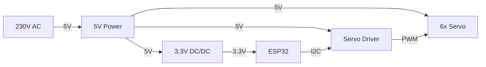

# Hardware

## Einleitung

Dieses Dokument beschreibt die Hardwaregrundlage des Projekts zur Steuerung eines 6-achsigen Roboterarms. Es ergänzt die Projektbeschreibung um die physische Systemsicht und bildet die Basis für Verdrahtung, Inbetriebnahme, Kalibration und hardwarenahe Softwareentwicklung.

## Systemübersicht

Die Hardware des Systems besteht im Kern aus folgenden Baugruppen:

* Roboterarm mit sechs Servoantrieben
* ESP32 als zentrale Steuerplattform
* PCA9685-basierte Servoansteuerung
* Stromversorgung für Logik und Aktorik
* optionale Status- und Diagnoseelemente

Das folgende Übersichtsdiagramm zeigt die aktuell bekannten Hauptkomponenten und ihre groben Beziehungen:

Das Diagramm dient zunächst nur der Systemübersicht. Pinbelegung, genaue Spannungsführung, Kanalzuordnung und optionale Signale wie `OE` werden in späteren Kapiteln konkretisiert.

## Hardware-Ziele und Randbedingungen

Die Hardwareauslegung verfolgt insbesondere folgende Ziele:

* reproduzierbare und stabile Ansteuerung eines 6-achsigen Roboterarms
* Trennung zwischen fachlicher Steuerlogik und hardwarenaher Signalausgabe
* praktikable Inbetriebnahme ohne sensorische Rückführung
* Eignung für schrittweise Kalibration und Testbarkeit
* Auslegung auf eine erste Implementationsstufe ohne REST API und ohne zusätzliche Sensorik

## Komponentenliste

Die folgenden Hauptkomponenten sind für die erste Ausbaustufe vorgesehen:

| Komponente | Auswahl | Funktion | Bemerkung |
| --- | --- | --- | --- |
| Roboterarm | [Joy-it Grab-it](../doc/datasheet/Robot02_Datasheet_2019_09_19.pdf) | mechanische Plattform des Systems | 6 Achsen mit Greifer |
| Servoantriebe | [6x COM-Motor02](../doc/datasheet/COM-Motor02-Datasheet.pdf) | Aktorik der Gelenke und des Greifers | 6 Servos für Achsen und Greifer |
| Mikrocontroller | [Waveshare ESP32-S3 Entwicklungsboard](https://www.bastelgarage.ch/waveshare-esp32-s3-entwicklungsboard) | zentrale Steuerplattform | Auswahl für die erste Implementationsstufe |
| Servo-Treiber | [16-Kanal PWM / Servo Treiber I2C (PCA9685)](https://www.bastelgarage.ch/16-kanal-pwm-servo-treiber-i2c-pca9685), [PCA9685-Datenblatt](../doc/datasheet/PCA9685_NXP_Datasheet_Rev4_2015-04-16.pdf) | PWM-Ausgabe für die Servos | basiert auf dem PCA9685 |
| 5V-Netzteil | kleines Schaltnetzteil 230V auf 5V, Hersteller unbekannt | primäre Versorgung des Systems | Ausgangsdaten und Belastbarkeit sind noch zu verifizieren |
| 3.3V-Wandler | [S09 3.3V Step Up/Down Converter 3-15V nach 3.3V 600mA](https://www.bastelgarage.ch/s09-3-3v-step-up-down-converter-3-15v-nach-3-3v-600ma) | geregelte 3.3V-Versorgung | Eingang `3-15V`, Ausgang `3.3V`, max. `600mA` |

## Zielplattform

Als Zielplattform ist für die erste Implementationsstufe das [Waveshare ESP32-S3 Entwicklungsboard](https://www.bastelgarage.ch/waveshare-esp32-s3-entwicklungsboard) vorgesehen.

Aus aktueller Sicht ergeben sich daraus insbesondere folgende Eigenschaften und Erwartungen:

* ESP32-S3 als zentrale Mikrocontroller-Plattform
* Eignung für moderne C/C++-Entwicklung mit PlatformIO
* Nutzung einer I2C-Schnittstelle zur Anbindung des PCA9685
* USB-Schnittstelle für Firmware-Upload, serielle Diagnose und Entwicklung
* ausreichende Leistungsfähigkeit für Orchestrierung, Kinematik, Validierung und Ablaufsteuerung

Für die weitere Spezifikation sind noch konkret festzulegen:

* exakte Pinbelegung für SDA und SCL
* Versorgungskonzept des Boards im Zusammenspiel mit der externen Servo-Versorgung
* Nutzung zusätzlicher GPIOs, beispielsweise für Status-LED oder Enable-Signale
* Boot- und Reset-relevante Pins, die bei der Verdrahtung nicht störend belegt werden dürfen

## Mechanik des Roboterarms

Dieses Kapitel beschreibt den physischen Aufbau des Arms aus Hardwaresicht. Die Benennung orientiert sich an der in der Projektbeschreibung eingeführten Nomenklatur.

Wesentliche mechanische Bezugspunkte und Gelenke sind:

* `D`: Drehteller, fest bei `(0,0,0)` als mechanischer Basispunkt des Arms
* `E`: Ellenbogen als kartesischer Gelenkpunkt `E(x,y,z)`
* `H`: Handgelenk als kartesischer Gelenkpunkt `H(x,y,z)`
* `G`: Greiferspitze als kartesischer Endpunkt `G(x,y,z)`

Die mechanisch betätigten Achsen werden wie folgt bezeichnet:

* `d`: Drehtellerachse
* `s`: Schulterachse
* `e`: Ellenbogenachse
* `h`: Handgelenk-Pitch
* `r`: Handgelenk-Roll
* `g`: Greiferöffnung

Für die Hardwarebetrachtung sind dabei insbesondere relevant:

* die physische Zuordnung jedes Servos zu einer dieser Achsen
* die realen mechanischen Anschläge und nutzbaren Winkelbereiche
* montagebedingte Offsets gegenüber dem idealisierten Modell
* die definierte Home Position als reproduzierbare Ausgangslage

## Aktoren

Als Aktoren werden sechs Servoantriebe des Typs [COM-Motor02](../doc/datasheet/COM-Motor02-Datasheet.pdf) eingesetzt. Sie bilden die mechanisch betätigten Achsen des Roboterarms und des Greifers ab.

Für die erste Hardwarebeschreibung wird folgende fachliche Zuordnung verwendet:

| Servo | Achse | Bedeutung | Sollbereich gemäss Projektbeschreibung |
| --- | --- | --- | --- |
| Servo 1 | `d` | Drehtellerachse | `-180° .. 90°` |
| Servo 2 | `s` | Schulterachse | `-90° .. 90°` |
| Servo 3 | `e` | Ellenbogenachse | `-100° .. 100°` |
| Servo 4 | `h` | Handgelenk-Pitch | `0° .. 135°` |
| Servo 5 | `r` | Handgelenk-Roll | `-180° .. 180°` |
| Servo 6 | `g` | Greiferöffnung | `0% .. 100%` |

Für alle sechs Aktoren sind aus aktueller Sicht insbesondere relevant:

* Versorgung aus der `5V`-Ebene
* Kalibration je Achse wegen mechanischer Offsets und Montageabweichungen
* spätere Zuordnung auf konkrete PWM-Kanäle des `Servo Driver`

## Ansteuerung der Servos

Die Servoansteuerung soll über das Modul [16-Kanal PWM / Servo Treiber I2C (PCA9685)](https://www.bastelgarage.ch/16-kanal-pwm-servo-treiber-i2c-pca9685) erfolgen. Das zugehörige PCA9685-Datenblatt ist lokal unter [PCA9685_NXP_Datasheet_Rev4_2015-04-16.pdf](../doc/datasheet/PCA9685_NXP_Datasheet_Rev4_2015-04-16.pdf) abgelegt.

Für die erste Hardwareplanung sind dabei folgende Punkte relevant:

* Ansteuerung über I2C mit nur zwei Steuerleitungen zwischen ESP32 und Treibermodul
* Standard-I2C-Adresse `0x40`, sofern keine Adressbrücken gesetzt werden
* 16 PWM-Kanäle, wodurch die 6 Achsen des Arms mit deutlicher Reserve angesteuert werden können
* 12-Bit-Auflösung des PCA9685
* Versorgung des Moduls mit `5V`
* separate Servo-Versorgung über `5V`

Für die Softwareseite wird vorläufig davon ausgegangen, dass eine etablierte PCA9685-Bibliothek verwendet wird. Auf der Produktseite wird dazu explizit die Adafruit PWM Servo Driver Library genannt.

Noch offen beziehungsweise später zu verifizieren sind insbesondere:

* konkrete PWM-Frequenz für die verwendeten Servos
* exakte Zuordnung der sechs Achsen zu den PWM-Kanälen
* Nutzung oder feste Beschaltung des `OE`-Signals
* elektrische Qualität der Servo-Versorgung unter Last

## Stromversorgung

Die Stromversorgung ist für einen stabilen Betrieb besonders kritisch und soll daher gesondert spezifiziert werden.

Für die aktuelle Planung ist folgende Grundstruktur vorgesehen:

* ein kleines Schaltnetzteil `230V -> 5V` versorgt das System primär
* die Servos werden aus der `5V`-Ebene versorgt
* die `3.3V`-Versorgung wird über den [S09 Step Up/Down Converter](https://www.bastelgarage.ch/s09-3-3v-step-up-down-converter-3-15v-nach-3-3v-600ma) bereitgestellt
* der ESP32-S3 und weitere reine Logikkomponenten werden aus der `3.3V`-Ebene versorgt
* alle Baugruppen benötigen einen gemeinsamen Massebezug

Zum S09-Wandler sind aktuell folgende technische Eckdaten relevant:

* Eingangsspannung `3-15V DC`
* Ausgangsspannung `3.3V DC`
* maximaler Ausgangsstrom `600mA`
* Wirkungsgrad laut Produktseite etwa `75%`
* Enable-Pin `EN` zur gezielten Aktivierung oder Deaktivierung des Wandlers

Für das Versorgungskonzept bedeutet dies:

* die `5V`-Schiene ist für die Servoantriebe leistungskritisch
* die `3.3V`-Schiene ist für Mikrocontroller und Logik funktional kritisch
* Störungen oder Einbrüche auf der `5V`-Ebene können sich über Masse oder Versorgungskopplung indirekt auf die Steuerlogik auswirken
* ein Brownout oder Reset des ESP32 unter Servo-Last muss bei der Inbetriebnahme explizit beobachtet werden

Der derzeit grösste Unsicherheitsfaktor ist das verwendete `230V -> 5V`-Schaltnetzteil ohne Hersteller- oder Leistungsangaben. Solange dessen Strombelastbarkeit, Spannungsstabilität und Schutzverhalten nicht bekannt sind, bleibt offen, ob es für den gleichzeitigen Betrieb mehrerer Servos ausreichend dimensioniert ist.

## Elektrische Verschaltung

Dieses Kapitel beschreibt die konkrete Verdrahtung der Hardwarekomponenten.

Für die erste Ausbaustufe wird von folgender grundlegender Verschaltung ausgegangen:

* das `230V -> 5V`-Schaltnetzteil versorgt die `5V`-Ebene des Systems
* der `Servo Driver` wird mit `5V` versorgt
* die sechs Servos werden ebenfalls aus der `5V`-Ebene versorgt
* der `S09 3.3V DC/DC` erzeugt aus der vorhandenen Eingangsspannung die `3.3V`-Versorgung für den `ESP32`
* `ESP32` und `Servo Driver` sind über `I2C` miteinander verbunden
* der `Servo Driver` erzeugt die `PWM`-Signale für die sechs Servos
* alle Komponenten verwenden einen gemeinsamen `GND`

Konzeptionell ergeben sich daraus mindestens folgende elektrische Verbindungen:

* `5V` vom Netzteil zum `Servo Driver`
* `5V` vom Netzteil zu den Servos
* Eingangsspannung zum `S09 3.3V DC/DC`
* `3.3V` vom `S09 3.3V DC/DC` zum `ESP32`
* `SDA` und `SCL` zwischen `ESP32` und `Servo Driver`
* `GND` zwischen Netzteil, `S09 3.3V DC/DC`, `ESP32`, `Servo Driver` und Servos

Für die weitere Detaillierung sind noch festzulegen:

* konkrete I2C-Pins des `ESP32`
* genaue Einspeisung der Eingangsspannung in den `S09 3.3V DC/DC`
* Servo-Kanalzuordnung `0..5` oder vergleichbare Zuordnung auf dem `Servo Driver`
* eventuelle Nutzung des `OE`-Pins des PCA9685
* zusätzliche Pufferung oder Entstörung der Versorgung

## Signal- und Kommunikationsschnittstellen

Hier werden die elektrischen und logischen Schnittstellen zwischen den Baugruppen beschrieben.

Dazu gehören insbesondere:

* I2C zwischen ESP32 und PCA9685
* serielle Schnittstelle für Debugging
* optionale Erweiterungsschnittstellen
* Reset-, Enable- oder Statussignale, falls verwendet

Für die erste Ausbaustufe ergibt sich damit folgende Hauptsignalkette:

`ESP32-S3 -> I2C -> PCA9685 -> PWM -> Servos`

## Startverhalten und sichere Inbetriebnahme

Da das System ohne sensorische Rückmeldung arbeitet, ist das Startverhalten fachlich und sicherheitstechnisch besonders wichtig.

Zu beschreiben sind insbesondere:

* definierte Ausgangslage des Arms vor dem Einschalten
* Bezug zur Home Position
* Reihenfolge der Inbetriebnahme
* Verhalten beim Aktivieren der Servos
* Massnahmen zur Reduktion ruckartiger Bewegungen

## Kalibrationsrelevante Hardwareaspekte

Dieses Kapitel beschreibt alle hardwarebezogenen Punkte, welche für die Kalibration relevant sind.

Dazu gehören insbesondere:

* Nullstellung je Achse
* mechanische Offsets
* Drehrichtung je Servo
* PWM-Minimal- und Maximalwerte
* achsspezifische Besonderheiten

## Mess-, Test- und Diagnosepunkte

Dieses Kapitel soll später die praktische Inbetriebnahme und Fehlersuche unterstützen.

Mögliche Inhalte sind:

* Messpunkte für Spannungen
* serielle Diagnose
* Einzeltest von Servokanälen
* Sichtprüfung mechanischer Freigängigkeit
* Beobachtung von Erwärmung und Stromaufnahme

## Sicherheits- und Risikobetrachtung

Die Hardware birgt insbesondere durch bewegte Aktoren und elektrische Lasten verschiedene Risiken.

Zu betrachten sind insbesondere:

* unkontrollierte Bewegungen beim Start
* mechanische Anschläge und Quetschstellen
* thermische Belastung der Servos
* Überstrom oder Spannungsabfall
* Fehlverdrahtung

## Offene Punkte und Annahmen

Dieses Kapitel sammelt bewusst alle noch nicht abschliessend geklärten Hardwarefragen.

Beispiele:

* elektrische Daten und Belastbarkeit des eingesetzten `230V -> 5V`-Netzteils
* reale Stromaufnahme unter Last
* belastbare Grenzwerte je Achse
* tatsächlich nutzbarer Stellbereich der Servos
* konkrete Pinbelegung des ESP32-S3-Boards für I2C und Diagnose
* Festlegung der Servo-Kanalzuordnung auf dem PCA9685
* Umgang mit dem `OE`-Pin des PCA9685
* Entscheidung, ob der ESP32 über den externen `3.3V`-Wandler oder alternativ über seine eigene Board-Versorgung betrieben werden soll
* spätere optionale Erweiterung um Sensorik

## Anhang

Der Anhang kann später beispielsweise enthalten:

* Pin-Tabellen
* Verdrahtungsübersichten
* Fotos des Aufbaus
* Verweise auf Datenblätter
* hardwarebezogenes Glossar
