# Software

## Einleitung

Dieses Dokument beschreibt die umsetzungsnahe Softwaresicht des Projekts. Es ergänzt die Projektbeschreibung um die konkrete Perspektive auf Implementierung, Modulzuschnitt, Datenmodelle, Initialisierung und Testbarkeit.

## Zweck und Abgrenzung

Dieses Dokument beschreibt die Softwaresicht des Projekts in einer umsetzungsnahen Form. Es steht damit zwischen der fachlich und architektonisch geprägten Projektbeschreibung und der konkreten Implementierung in `src/`.

Die Projektbeschreibung definiert insbesondere Ziele, Randbedingungen, Architekturbausteine, Datenflüsse und fachliche Modelle. Dieses Dokument wiederholt diese Inhalte nicht vollständig, sondern konkretisiert sie im Hinblick auf die spätere Umsetzung im Code. Im Mittelpunkt stehen daher vor allem Modulzuschnitt, Verzeichnisstruktur, Datenmodelle, Schnittstellen, Initialisierung, Kalibration, Fehlerbehandlung und Teststruktur.

Bewusst nicht Gegenstand dieses Dokuments sind ausführliche fachliche Herleitungen der Inversen Kinematik, allgemeine Hardwarebeschreibungen oder eine erneute vollständige Darstellung der Softwarearchitektur auf konzeptioneller Ebene. Diese Inhalte bleiben in der Projektbeschreibung beziehungsweise in der Hardwarebeschreibung verankert.

Ebenso ersetzt dieses Dokument nicht den Quellcode selbst. Konkrete Implementierungsdetails, private Hilfsfunktionen, temporäre Workarounds oder kleinteilige technische Entscheidungen sollen nicht vollständig in der Dokumentation dupliziert werden, sondern primär in `src/` sichtbar sein. Das Dokument soll stattdessen diejenige Struktur und Terminologie festhalten, die für ein konsistentes Verständnis und eine nachvollziehbare Weiterentwicklung der Software erforderlich ist.

## Implementationsziele

Die erste Software-Ausbaustufe soll eine fachlich nachvollziehbare und technisch beherrschbare Grundlage für die Steuerung des Roboterarms schaffen. Im Vordergrund steht nicht die maximale funktionale Breite, sondern ein schrittweise erweiterbarer Kern aus Ablaufsteuerung, Kinematik, Prüfung, Modellkalibration und hardwarenaher Ausgabe.

Konkret soll die Implementierung zunächst insbesondere folgende Ziele erfüllen:

* Abbildung der in der Projektbeschreibung beschriebenen fachlichen Kernmodelle in klar benannte C++-Strukturen
* Umsetzung einer einfachen, testbaren Modulstruktur mit klaren Verantwortlichkeiten
* sequentielle Verarbeitung einzelner Bewegungsanforderungen über `Run Engine`, `Orchestrator`, `Validation`, `Kinematics` und `Hardware Abstraction`
* reproduzierbare Initialisierung auf Basis der definierten Startlage und der angenommenen Initialwerte
* nachvollziehbare Abbildung zwischen fachlichen Gelenkwerten und realen Stellwerten
* frühzeitige Testbarkeit mathematischer und fachlicher Kernlogik unabhängig von der realen Hardware

Für die erste Ausbaustufe sollen bestimmte Aspekte bewusst einfach gehalten werden. Dazu gehören insbesondere:

* eine klar lesbare und deterministische Verarbeitung statt frühzeitiger Optimierung
* eine einfache und direkte Datenweitergabe zwischen den Modulen
* eine begrenzte Anzahl gut verständlicher Schnittstellen
* Verzicht auf unnötige Abstraktion, solange sie für die konkrete Implementierung noch keinen praktischen Nutzen bringt

Darüber hinaus verfolgt die Implementierung folgende Qualitätsziele:

* gute Nachvollziehbarkeit der fachlichen Datenflüsse
* klare Trennung zwischen fachlicher Logik und hardwarenaher Ansteuerung
* leichte Erweiterbarkeit für spätere Iterationen
* gute lokale Testbarkeit zentraler Komponenten
* konsistente Benennung zwischen Dokumentation, Verzeichnisstruktur und Quellcode

## Geplante Modulstruktur

> [!Note]
> Klärung, was noch offen ist und was im zweiten Teil schon gemacht worden ist.
> 
> In diesem Kapitel sollte beschrieben werden:
> 
> * welche Hauptmodule in `src/` erwartet werden
> * wie die Trennung zwischen `Application`, `Orchestration`, `Robotics`, `Hardware` und gemeinsamen Datenmodellen im Code abgebildet wird
> * welche Abhängigkeitsrichtung zwischen den Modulen erlaubt ist
> * welche Teile als Bibliothek, Komponente oder einfacher Quellcodeblock umgesetzt werden könnten
> * dass Header- und Implementierungsdateien für den Projektstart bewusst nicht in getrennten Hauptordnern geführt werden, sondern pro Komponente nebeneinander liegen
> * dass jede grössere Komponente einen eigenen Ordner in `src/` erhält
> * dass die Namen dieser Komponentenordner zugleich als Grundlage für die späteren C++-Namespaces verwendet werden
> 
> Für die erste Ausbaustufe wird damit folgende Strukturentscheidung getroffen:
> 
> * die Implementierung liegt vollständig unter `src/`
> * `.h`- und `.cpp`-Dateien einer Komponente liegen im selben Komponentenordner
> * grössere Bausteine wie `application`, `orchestration`, `robotics`, `hardware` und gegebenenfalls `common` werden als eigene Ordner angelegt
> * die Ordnernamen sollen möglichst direkt als C++-Namespaces wiederverwendet werden
> * dadurch bleiben fachliche Struktur, Verzeichnisstruktur und Code-Namensräume möglichst deckungsgleich

## Verzeichnisstruktur

Dieses Kapitel beschreibt die konkrete Ablage der Softwareartefakte im Repository. Im Unterschied zur Modulstruktur steht hier nicht die fachliche Verantwortung der Bausteine im Vordergrund, sondern die praktische Frage, wo Quellcode, Dokumentation, Konfiguration und Tests abgelegt werden.

Für die erste Ausbaustufe wird folgende Grundstruktur vorgesehen:

```text
sw/
  software.md

src/
  main.cpp
  application/
  orchestration/
  robotics/
  hardware/
  common/

test/
  native/
  embedded/
```

Dabei gelten zunächst die folgenden Strukturregeln:

* `sw/` enthält die softwarebezogene Dokumentation und keine Implementierung
* `src/` enthält die produktive Implementierung des Projekts
* `main.cpp` bildet den Einstiegspunkt der Firmware und hält selbst möglichst wenig fachliche Logik
* jeder grössere Softwarebaustein erhält unter `src/` einen eigenen Komponentenordner
* `.h`- und `.cpp`-Dateien liegen innerhalb eines Komponentenordners nebeneinander
* `test/` enthält den automatisierten Testcode getrennt nach nativer und eingebetteter Ausführung

Für die Komponentenordner unter `src/` ist in der ersten Ausbaustufe grob folgende Aufteilung vorgesehen:

* `src/application/` für Run Engine und anwendungsnahe Ablaufsteuerung
* `src/orchestration/` für Orchestrator und Koordination der Verarbeitungsschritte
* `src/robotics/` für Kinematik, Validierung, Robot Model, `RobotModelOffset` und robotiknahe Datenmodelle
* `src/hardware/` für Hardware Abstraction, `HardwareCalibration`, Treiberanbindung und hardwarebezogene Ausgabe
* `src/common/` für gemeinsame, modulübergreifend verwendete Datentypen und Hilfsstrukturen

Für den ersten lauffähigen Stand werden mindestens folgende Dateien oder gleichwertige Strukturen erwartet:

* `src/main.cpp` als Programmeinstieg
* eine erste Implementierung der Run Engine oder eines einfachen Startablaufs
* ein erster Orchestrator als zentrale Koordinationskomponente
* grundlegende Datenmodelle für Zielbeschreibung, Gelenksollzustand, Bewegungsanforderung und Bewegungsergebnis
* ein erster Hardwarezugang für PCA9685 und Servo-Ausgabe
* erste Testdateien unter `test/native/` für fachliche Kernlogik

Ein separater Hauptordner `include/` ist für die erste Ausbaustufe bewusst nicht vorgesehen. Sollte sich später eine klarere Trennung zwischen öffentlicher Schnittstelle und interner Implementierung als hilfreich erweisen, kann diese Struktur zu einem späteren Zeitpunkt gezielt nachgeschärft werden.

## Zentrale Datenmodelle

Dieses Kapitel konkretisiert die in der Projektbeschreibung beschriebenen fachlichen Modelle in eine softwarebezogene Form. Im Vordergrund steht dabei nicht die endgültige C++-Syntax, sondern eine klare und konsistente Beschreibung der Datenstrukturen, ihrer Beziehungen und ihrer fachlichen Bedeutung.

Für die erste Ausbaustufe sollen die Datenmodelle bewusst nah an den dokumentierten Begriffen aus Task Space, Joint Space, Ablaufsteuerung und Kalibration bleiben. Dadurch kann die spätere Implementierung direkt aus den hier beschriebenen Strukturen abgeleitet werden.

Für die Benennung der zentralen Zustandsmodelle werden bewusst die Begriffe `TargetPose` und `JointState` verwendet. Auf Bezeichnungen wie `TargetVector` oder `JointVector` wird verzichtet, obwohl die Modelle jeweils mehrere Werte in fester Reihenfolge zusammenfassen. Der Grund ist, dass es sich hier nicht um mathematische Vektoren im engeren Sinn handelt, sondern um fachliche Zustandscontainer mit unterschiedlichen Bedeutungen und Einheiten. Insbesondere enthält die Zielbeschreibung mit `(x, y, z, p, r, g)` sowohl kartesische Positionen als auch Winkel- und Prozentwerte. `TargetPose` und `JointState` machen deshalb klarer, dass die Modelle eine fachliche Pose beziehungsweise einen Gelenkzustand beschreiben und nicht primär algebraische Vektoroperationen repräsentieren.

Für den Begriff Kalibration wird in diesem Dokument bewusst zwischen zwei Ebenen unterschieden:

* `RobotModelOffset` beschreibt modellbezogene Offsets und Korrekturwerte, welche das geometrische und fachliche Robotermodell betreffen. Dazu gehören beispielsweise Schulter-Offsets oder weitere Korrekturen, die `Kinematics` und `Validation` berücksichtigen müssen.
* `HardwareCalibration` beschreibt die Abbildung von logischen Aktorzuständen auf konkrete hardwarebezogene Stellwerte. Dazu gehören insbesondere Drehrichtung, PWM-Minimum, PWM-Maximum und weitere Parameter, die erst bei der hardwarenahen Ausgabe relevant werden.

Damit wird klar abgegrenzt, dass nicht jede Korrektur dieselbe Bedeutung hat: `RobotModelOffset` gehört zur Robotik- und Modellseite, `HardwareCalibration` zur Hardware Abstraction und zur Ansteuerung der realen Aktoren.

Im Unterschied zur Projektbeschreibung werden in diesem Softwaredokument für Datenmodelle und spätere C++-Typen bewusst code-nahe Bezeichner ohne Leerzeichen verwendet. Der Architekturbaustein `Robot Model Offset` entspricht hier also dem Datentyp beziehungsweise Modell `RobotModelOffset`.

Das folgende Übersichtsdiagramm zeigt die zentralen Modelle und ihre Beziehungen:

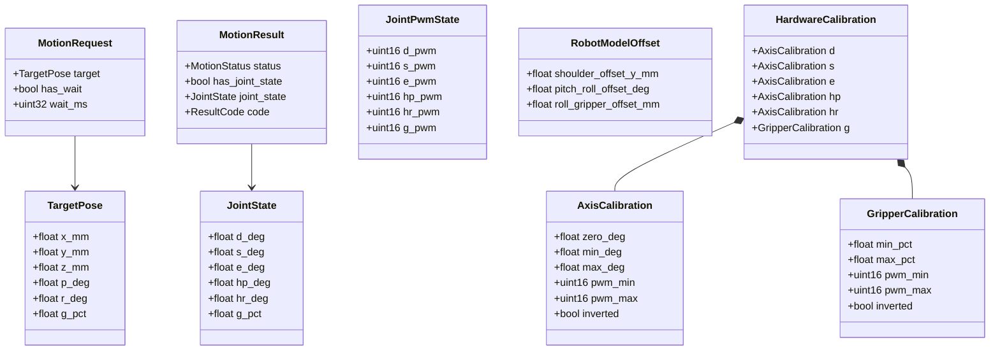

Die fachliche Trennung zwischen Task Space und Joint Space bleibt dabei zentral:

* `TargetPose` beschreibt den Sollzustand des Endeffektors im Task Space mit `(x, y, z, p, r, g)`
* `JointState` beschreibt die berechnete Gelenkkonfiguration im Joint Space mit `(d, s, e, hp, hr, g)`
* `g` bleibt in beiden Modellen bewusst dieselbe fachliche Größe, nämlich die Greiferöffnung in Prozent

### TargetPose

`TargetPose` ist das zentrale Eingabemodell für Bewegungsziele im Task Space.

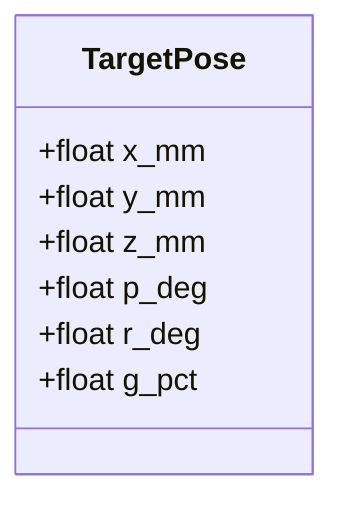

Bedeutung der Felder:

* `x_mm`, `y_mm`, `z_mm`: kartesische Position des Endeffektors in Millimetern
* `p_deg`: Pitch im Task Space in Grad
* `r_deg`: Roll im Task Space in Grad
* `g_pct`: Greiferöffnung in Prozent

### JointState

`JointState` beschreibt das Ergebnis der kinematischen Berechnung im Joint Space.

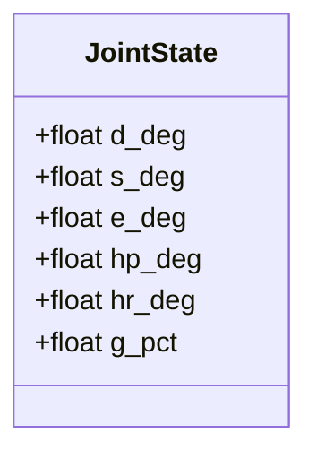

Bedeutung der Felder:

* `d_deg`: Drehtellerwinkel
* `s_deg`: Schulterwinkel
* `e_deg`: Ellenbogenwinkel
* `hp_deg`: Handgelenk-Pitch
* `hr_deg`: Handgelenk-Roll
* `g_pct`: Greiferöffnung

### MotionRequest

`MotionRequest` ist das Übergabemodell zwischen Anwendung und Orchestrierung für eine einzelne Bewegungsanforderung.

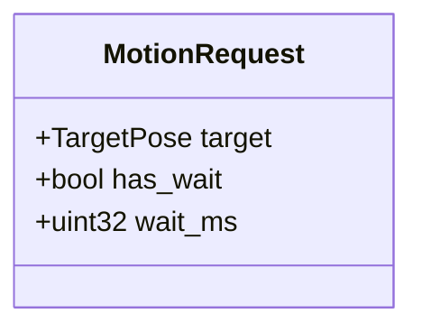

Für die erste Ausbaustufe bleibt dieses Modell bewusst einfach. Es enthält mindestens:

* ein fachliches Bewegungsziel als `TargetPose`
* eine optionale Wartezeit nach der Zielverarbeitung

Spätere Erweiterungen wie LED-Aktionen, Roboter-Aktionen oder Prioritäten können auf diesem Modell aufbauen.

### MotionResult

`MotionResult` beschreibt das fachliche und technische Ergebnis einer verarbeiteten Bewegungsanforderung.

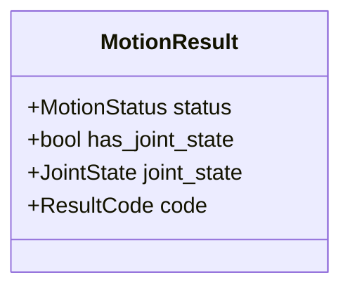

Für die erste Ausbaustufe sollte das Modell insbesondere ausdrücken:

* ob eine Bewegungsanforderung akzeptiert, abgelehnt oder nicht erreichbar war
* ob ein berechneter `JointState` vorliegt
* ob ein technischer Fehler oder ein fachlicher Ablehnungsgrund zurückgegeben wurde

Die genaue Ausgestaltung von `MotionStatus` und `ResultCode` wird im Kapitel zur Fehlerbehandlung weiter konkretisiert.

### JointPwmState

`JointPwmState` beschreibt die PWM-bezogene Aktoransteuerung nach Anwendung der `HardwareCalibration`.

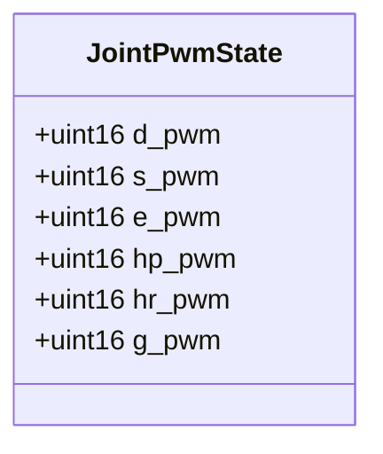

Dieses Modell bildet die Brücke zwischen logischem Gelenkzustand und konkreter Hardwareausgabe:

* es enthält keine fachlichen Winkel oder Prozentwerte mehr
* es beschreibt die kanalbezogenen PWM-Sollwerte pro Aktor
* es ist das naheliegende Übergabemodell zwischen `Hardware Abstraction` und `Hardware Driver`

### RobotModelOffset

`RobotModelOffset` beschreibt modellbezogene Offsets und Korrekturwerte, welche das fachliche Robotermodell betreffen.

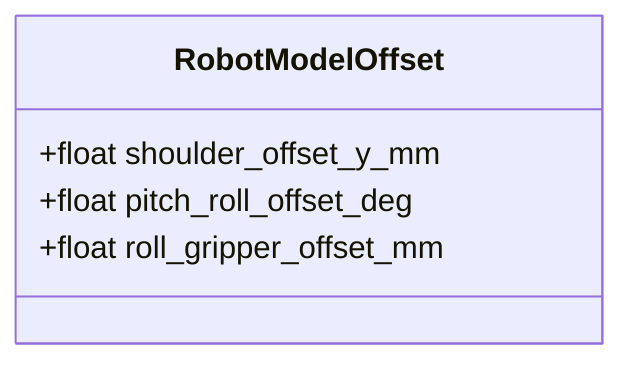

Diese Werte werden nicht zur direkten PWM-Erzeugung verwendet, sondern zur Korrektur und Präzisierung des mathematischen Modells. Sie gehören damit auf die Robotik-Seite und müssen von `Kinematics`, `Validation` und gegebenenfalls einem `Robot Model` berücksichtigt werden. Wird die Korrektur als eigener Verarbeitungsschritt modelliert, entsteht daraus eine `OffsetTargetPose`.

### HardwareCalibration

`HardwareCalibration` beschreibt die Abbildung zwischen fachlichen Sollwerten und realen hardwarebezogenen Stellwerten.

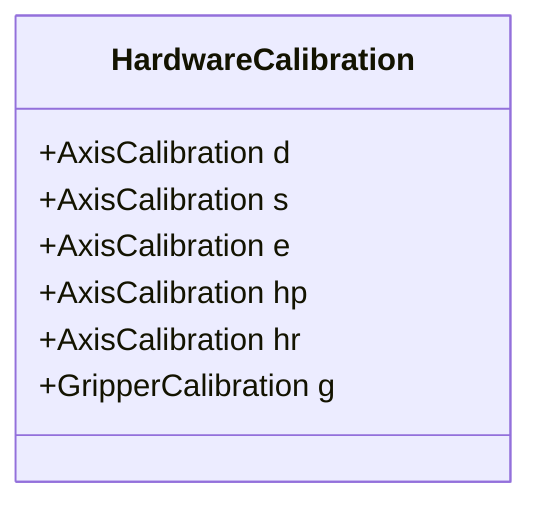

Für Rotationsachsen wird jeweils ein `AxisCalibration`-Eintrag verwendet:

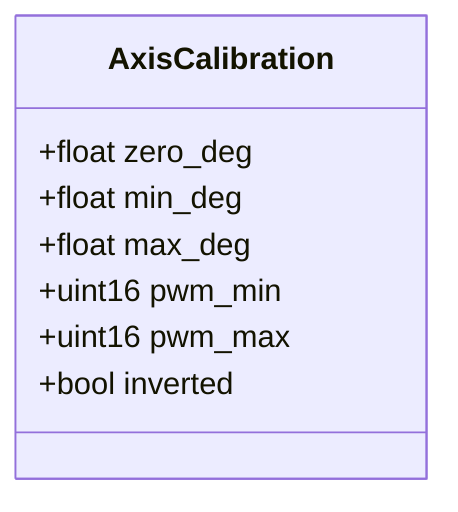

Für den Greifer wird ein separates Modell mit Prozentbezug verwendet:

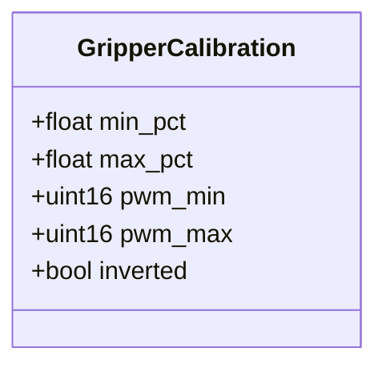

Damit bleibt die Kalibration konsistent mit der fachlichen Entscheidung, dass `g` in Task Space und Joint Space dieselbe Größe beschreibt, während die interne Abbildung auf PWM-Werte dennoch separat dokumentiert wird. `HardwareCalibration` ist damit ausdrücklich von `RobotModelOffset` abgegrenzt und gehört zur hardwarenahen Abbildung in der `Hardware Abstraction`.


## Schnittstellen der Kernmodule

Dieses Kapitel beschreibt die fachlichen und technischen Übergaben zwischen den zentralen Softwarebausteinen. Im Vordergrund stehen die Modelle auf den Schnittstellen sowie die Verantwortungsgrenzen der Module, nicht die konkrete C++-Signatur einzelner Methoden.

Für die erste Ausbaustufe sollen die zentralen Schnittstellen bewusst einfach, synchron und deterministisch gehalten werden. Jede Komponente soll klar benannte Eingaben verarbeiten, ein fachlich interpretierbares Ergebnis zurückgeben und dabei möglichst wenig Wissen über interne Details anderer Bausteine benötigen.

Das folgende Diagramm zeigt die geplanten Hauptschnittstellen zwischen den Kernmodulen:

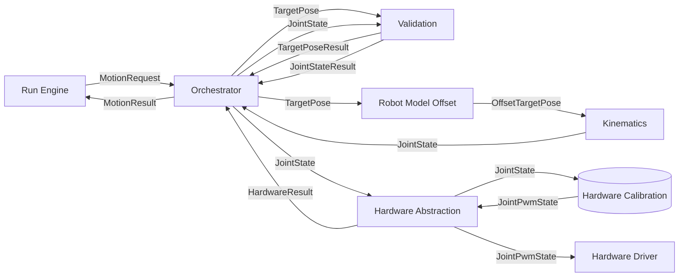

Das Diagramm ist bewusst als Datenflussdiagramm zu lesen. Die Pfeile beschreiben daher in erster Linie, welche Modelle oder Ergebnisobjekte von einer Komponente an die nächste übergeben werden. Es geht an dieser Stelle also nicht nur um statische Abhängigkeiten, sondern um den fachlichen Verarbeitungsfluss einer Bewegungsanforderung.

Besonders wichtig ist dabei die Unterscheidung zwischen fachlichen Zuständen und transformierten Zwischenständen:

* `TargetPose` ist das fachliche Ziel aus Sicht der Anwendung
* `OffsetTargetPose` ist eine durch bekannte Modell-Offsets korrigierte Zwischenrepräsentation für die Kinematik
* `JointState` ist das Ergebnis der kinematischen Berechnung im Gelenkraum
* `JointPwmState` ist die hardwarebezogene Ausgabeform nach Anwendung der Hardwarekalibration

Auf diese Weise wird im Diagramm sichtbar, an welcher Stelle sich die Darstellung einer Bewegung ändert: von der fachlichen Zielbeschreibung über modellkorrigierte Zwischenstände bis hin zur konkreten PWM-Ausgabe für die Aktoren.

Die dabei verwendeten Modellbegriffe sind zunächst fachlich zu verstehen:

* `TargetPoseResult` beschreibt das Ergebnis einer fachlichen Prüfung eines `TargetPose`
* `JointStateResult` beschreibt das Ergebnis einer fachlichen Prüfung eines `JointState`
* `OffsetTargetPose` beschreibt eine durch `RobotModelOffset` korrigierte Zielbeschreibung für die weitere Verarbeitung in der Kinematik
* `JointPwmState` beschreibt die PWM-bezogenen Sollwerte nach Anwendung der `HardwareCalibration`
* `HardwareResult` beschreibt den technischen Rückgabestatus der Hardwareseite

### Run Engine

Die Anwendungsschicht erzeugt fachliche Bewegungsanforderungen und verarbeitet deren Ergebnisse.

Eingaben und Ausgaben:

* Übergabe eines `MotionRequest` an den `Orchestrator`
* Entgegennahme eines `MotionResult`

Die Anwendung kennt dabei:

* fachliche Zielmodelle
* Ablaufzustände
* einfache Ergebniszustände

Die Anwendung kennt dabei nicht:

* konkrete IK-Details
* Kalibrationsparameter
* hardwarebezogene Stellwerte oder Treiberdetails

### Orchestrator

Der `Orchestrator` ist die zentrale Koordinationsinstanz zwischen Anwendung, Robotik und Hardware.

Eingaben und Ausgaben:

* Eingabe eines `MotionRequest`
* Übergabe eines `TargetPose` an `Validation`
* Übergabe eines `TargetPose` an die Komponente `Robot Model Offset`
* Übergabe eines `JointState` an `Validation`
* Übergabe eines `JointState` an `Hardware Abstraction`
* Rückgabe eines `MotionResult` an die Anwendung

Der `Orchestrator` kennt dabei:

* die Reihenfolge der Verarbeitungsschritte
* fachliche und technische Rückgabepfade
* die zentralen Übergabemodelle

Der `Orchestrator` kennt dabei nicht:

* die interne mathematische Implementierung der Kinematik
* die konkrete PWM-Erzeugung im Treiber

### Validation

`Validation` prüft Zielzustände und berechnete Gelenkzustände unter fachlichen Randbedingungen.

Eingaben und Ausgaben:

* Eingabe eines `TargetPose` für Vorprüfungen mit Rückgabe eines `TargetPoseResult`
* Eingabe eines `JointState` für Gelenk- und Freigabeprüfungen mit Rückgabe eines `JointStateResult`

`Validation` kennt dabei:

* Gelenkgrenzen
* Bewegungsrandbedingungen
* fachliche Freigaberegeln

`Validation` kennt dabei nicht:

* hardwarebezogene PWM-Werte
* Treiberdetails

### Kinematics

`Kinematics` berechnet aus einer gültigen Zielbeschreibung einen fachlichen Gelenkzustand.

Für die inverse Kinematik darf diese Komponente intern sowohl analytische als auch iterative Lösungsverfahren kapseln. Insbesondere Verfahren wie `CCD` oder `FABRIK` werden hier als interne Iterationslogik verstanden und nicht als Aufgabe des `Orchestrator`.

Eingaben und Ausgaben:

* Eingabe einer `OffsetTargetPose`
* Rückgabe eines `JointState`

Bei iterativen Verfahren umfasst die Verantwortung von `Kinematics` insbesondere:

* Wahl oder Übernahme eines geeigneten Startzustands
* wiederholte Berechnung von Iterationsschritten bis zur Zielannäherung
* Prüfung von Toleranz, Konvergenz und Abbruchbedingungen
* Rückmeldung, ob eine Lösung gefunden wurde oder ob beispielsweise Iterationsgrenzen beziehungsweise Nichterreichbarkeit vorlagen

`Kinematics` kennt dabei:

* Task Space beziehungsweise modellkorrigierte Zielzustände
* Joint Space
* Robotermodell und geometrische Parameter
* solverinterne Iterationsparameter und Konvergenzregeln

`Kinematics` kennt dabei nicht:

* Hardwaredetails
* PWM-Grenzen
* Ablauflogik der Anwendung
* übergeordnete Ablaufentscheidungen bei Fehlern oder Alternativpfaden

### Hardware Abstraction

`Hardware Abstraction` kapselt den Übergang von hardwarenahen Stellwerten zur konkreten Treiberansteuerung. In der Implementierung kann dieser Baustein als HAL verstanden und entsprechend benannt werden.

Eingaben und Ausgaben:

* Eingabe eines `JointState`
* Anwendung der hinterlegten `HardwareCalibration`
* interne Erzeugung eines `JointPwmState`
* Übergabe eines `JointPwmState` an den `Hardware Driver`
* Rückgabe eines `HardwareResult`

`Hardware Abstraction` kennt dabei:

* zulässige Stellwertbereiche
* Zuordnung zu Ausgabekanälen
* Schutz- und Begrenzungslogik
* `HardwareCalibration`

`Hardware Abstraction` kennt dabei nicht:

* IK-Ziele im Task Space
* fachliche Bewegungslogik der Anwendung

### Hardware Driver

Der `Hardware Driver` ist die unterste Softwareschicht zur direkten Ansteuerung der Hardwarekomponenten.

Eingaben und Ausgaben:

* Eingabe eines `JointPwmState`
* Rückgabe eines technischen Status an die `Hardware Abstraction`

Der Treiber kennt dabei:

* I2C-Kommunikation
* PCA9685-Zugriffe
* konkrete Ausgabedetails einzelner Kanäle

Der Treiber kennt dabei nicht:

* fachliche Zielzustände
* Gelenkmodelle
* Kalibrationslogik auf höherer Ebene

## Initialisierung und Laufzeitmodell

Dieses Kapitel beschreibt, wie die Software von einer definierten Ausgangslage in einen konsistenten Betriebszustand überführt wird und wie sich daraus der reguläre Laufzeitfluss ergibt. Dabei ist besonders wichtig, dass das System in der ersten Ausbaustufe keine sensorische Rückmeldung über die reale Armstellung besitzt. Die Initialisierung basiert daher auf einer fachlich definierten Annahme über den mechanischen Ausgangszustand und nicht auf einer physisch verifizierten Referenzfahrt.

### Initialisierung

Für den Start des Systems wird zwischen `Home Position` und `Init Position` unterschieden:

* `Home Position` beschreibt die mechanische Ausgangslage des Arms im stromlosen Zustand
* `Init Position` beschreibt den angenommenen logischen Anfangszustand der Software nach dem Einschalten

Für die erste Ausbaustufe gilt dabei folgende Betriebsannahme:

* der Arm wird vor dem Einschalten manuell in die definierte `Home Position` gebracht
* nach dem Start übernimmt die Software daraus die projektweit festgelegte `Init Position`
* diese `Init Position` entspricht den fachlichen Nullwerten der Servoachsen
* erst nach erfolgreicher Initialisierung werden reguläre Bewegungsanforderungen freigegeben

Die Initialisierung selbst sollte in einer festen Reihenfolge erfolgen:

1. Start der Basissoftware auf dem ESP32 und Aufbau der elementaren Laufzeitumgebung.
2. Laden oder Erzeugen statischer Konfigurationsdaten wie `RobotModelOffset` und `HardwareCalibration`.
3. Initialisieren der hardwarebezogenen Komponenten wie `Hardware Abstraction` und `Hardware Driver`.
4. Setzen des internen Softwarezustands auf die angenommene `Init Position`.
5. Initialisieren von `Orchestrator`, `Run Engine` und `SequenceState`.
6. Übergang in einen betriebsbereiten Zustand, in dem Bewegungsanforderungen verarbeitet werden dürfen.

Wesentlich ist dabei, dass die Software nicht versucht, aus einem unbekannten physischen Zustand eine implizite Korrektur abzuleiten. Nach Reset, Neustart oder Spannungsunterbruch wird deshalb erneut dieselbe Initialisierungsannahme benötigt. Wenn nicht sichergestellt ist, dass sich der Arm wieder in der definierten `Home Position` befindet, darf die normale Ablaufsteuerung fachlich nicht als konsistent betrachtet werden.

### Laufzeitmodell

Im regulären Betrieb wird eine Bewegungsanforderung schrittweise von der Anwendungsebene bis zur Hardwareausgabe verarbeitet. Der Laufzeitfluss bleibt dabei bewusst streng gerichtet, damit die fachlichen und technischen Zustandswechsel nachvollziehbar bleiben.

Ein typischer Ablauf ist wie folgt aufgebaut:

1. Die `Run Engine` wählt anhand des aktuellen `SequenceState` den nächsten auszuführenden Schritt aus.
2. Aus diesem Schritt wird ein `MotionRequest` mit einer fachlichen `TargetPose` erzeugt.
3. Der `Orchestrator` stößt die Vorprüfung dieser `TargetPose` über `Validation` an.
4. Bei positiver Vorprüfung wird die Zielbeschreibung mithilfe von `RobotModelOffset` in eine `OffsetTargetPose` überführt.
5. `Kinematics` berechnet daraus einen `JointState` oder meldet zurück, dass keine geeignete Lösung gefunden wurde.
6. Der berechnete `JointState` wird durch `Validation` fachlich geprüft und freigegeben oder abgelehnt.
7. Ein freigegebener `JointState` wird in der `Hardware Abstraction` mithilfe der `HardwareCalibration` in einen `JointPwmState` überführt.
8. Der `Hardware Driver` gibt diesen `JointPwmState` an die reale Hardware aus und liefert einen technischen Status zurück.
9. Der `Orchestrator` verdichtet die fachlichen und technischen Teilergebnisse zu einem `MotionResult`.
10. Die `Run Engine` verarbeitet dieses `MotionResult` und entscheidet über Fortsetzung, Wartephase, Abbruch oder Übergang zum nächsten Schritt.

Aus Sicht des Laufzeitmodells hat jede Hauptkomponente dabei eine klar abgegrenzte Rolle:

* `Run Engine` verwaltet den Ablauf und dessen Fortschritt
* `Orchestrator` koordiniert die Verarbeitungsschritte und Rückgabepfade
* `Validation` bewertet fachliche Zulässigkeit und Freigabe
* `Kinematics` berechnet den Gelenkraumzustand
* `Hardware Abstraction` überführt fachliche Sollwerte in hardwarenahe Stellwerte
* `Hardware Driver` setzt die Ausgabe technisch um

Da keine Positionsrückführung vorhanden ist, beschreibt ein erfolgreiches `MotionResult` in der ersten Ausbaustufe keinen physisch bestätigten Zielerfolg. Es beschreibt vielmehr, dass die Anforderung fachlich akzeptiert, rechnerisch verarbeitet und hardwareseitig ohne gemeldeten technischen Fehler ausgegeben wurde.

Für Reset, Neustart oder unklaren physischen Zustand folgt daraus dieselbe Konsequenz wie bei der Initialisierung: Der Softwarezustand darf nicht stillschweigend als gültiges Abbild des realen Arms weiterverwendet werden. In solchen Fällen ist erneut von der definierten `Home Position` und der dazugehörigen `Init Position` auszugehen oder der Betrieb bleibt gesperrt, bis diese Annahme wieder hergestellt ist.

## Kalibration und Hardwareabbildung

Dieses Kapitel beschreibt, wie fachliche Zustände des Roboters in hardwarenahe Stellwerte überführt werden. Dabei wird bewusst zwischen modellbezogenen Korrekturen auf der Robotikseite und der eigentlichen Aktorabbildung auf der Hardwareseite unterschieden. Diese Trennung ist wichtig, damit Kinematik, Validierung und Hardwareansteuerung nicht dieselben Korrekturen mehrfach oder widersprüchlich anwenden.

### Abgrenzung der beiden Kalibrationsebenen

Für die erste Ausbaustufe werden zwei Kalibrationsebenen unterschieden:

* `RobotModelOffset` beschreibt modellbezogene Korrekturen des realen Arms gegenüber dem idealisierten Robotermodell
* `HardwareCalibration` beschreibt die Abbildung eines fachlichen `JointState` auf konkrete PWM-bezogene Ausgabewerte

`RobotModelOffset` wirkt damit auf der Seite der fachlichen Bewegungsbeschreibung. Diese Korrekturen betreffen insbesondere Geometrie, bekannte Montageabweichungen und modellrelevante Offsets, die schon vor der eigentlichen IK-Berechnung oder in unmittelbarer Nähe dazu berücksichtigt werden müssen.

`HardwareCalibration` wirkt dagegen erst nach der fachlichen Freigabe eines `JointState`. Sie ist Teil der hardwarenahen Abbildung und beschreibt, wie die idealisierten Gelenk- und Greiferwerte in reale Aktorstellwerte umgesetzt werden.

Damit gilt für die Verantwortlichkeiten:

* `Kinematics` und `Validation` arbeiten mit `TargetPose`, `OffsetTargetPose`, `JointState` und `RobotModelOffset`
* `Hardware Abstraction` arbeitet mit `JointState`, `HardwareCalibration` und `JointPwmState`
* der `Hardware Driver` arbeitet ausschließlich mit dem bereits vorbereiteten `JointPwmState`

### Abbildung von fachlichen Sollwerten auf Hardwarewerte

Die hardwarenahe Abbildung beginnt erst dann, wenn ein `JointState` fachlich akzeptiert und zur Ausgabe freigegeben wurde. Ab diesem Punkt übernimmt die `Hardware Abstraction` die Umrechnung in konkrete hardwaregeeignete Werte.

Der logische Abbildungsweg ist dabei wie folgt:

1. Der `Orchestrator` übergibt einen freigegebenen `JointState` an die `Hardware Abstraction`.
2. Für jede Achse wird der zugehörige Kalibrationseintrag aus `HardwareCalibration` ausgewählt.
3. Der fachliche Sollwert in `[°]` beziehungsweise `[%]` wird auf den zulässigen kalibrierten Arbeitsbereich begrenzt.
4. Eine eventuell invertierte Drehrichtung wird berücksichtigt.
5. Der begrenzte Fachwert wird auf den PWM-Bereich der Achse abgebildet.
6. Aus allen resultierenden Achswerten wird ein vollständiger `JointPwmState` erzeugt.
7. Erst dieser `JointPwmState` wird an den `Hardware Driver` übergeben.

Diese Struktur stellt sicher, dass die darüberliegenden Softwarebausteine keine Kenntnis über PWM-Bereiche, Kanalzuordnungen oder servoindividuelle Drehrichtungen benötigen.

### Kalibrationsparameter pro Aktor

Für Rotationsachsen wie `d`, `s`, `e`, `hp` und `hr` werden pro Achse mindestens folgende Kalibrationsparameter benötigt:

* fachlicher Nullbezug `zero_deg`
* minimal zulässiger Fachwert `min_deg`
* maximal zulässiger Fachwert `max_deg`
* minimal zulässiger PWM-Wert `pwm_min`
* maximal zulässiger PWM-Wert `pwm_max`
* Drehrichtung `inverted`

Für den Greifer `g` wird ein separates Prozentmodell verwendet. Dafür werden mindestens benötigt:

* minimal zulässiger Öffnungswert `min_pct`
* maximal zulässiger Öffnungswert `max_pct`
* minimal zulässiger PWM-Wert `pwm_min`
* maximal zulässiger PWM-Wert `pwm_max`

Die konkrete Kanalzuordnung der Aktoren zum PCA9685 gehört konzeptionell ebenfalls zur Hardwareseite. Sie kann entweder Teil der `HardwareCalibration` sein oder als separate, aber eng benachbarte Konfiguration der `Hardware Abstraction` geführt werden. Für die erste Ausbaustufe ist wichtig, dass diese Zuordnung nicht in `Kinematics` oder `Orchestrator` eingestreut wird.

### Umgang mit Drehrichtung, Grenzen und PWM-Abbildung

Die Kalibrationsabbildung soll in der ersten Ausbaustufe bewusst einfach und deterministisch bleiben. Für jede Achse wird deshalb von einer im Wesentlichen linearen Abbildung zwischen fachlichem Sollbereich und PWM-Bereich ausgegangen.

Dabei gelten folgende Regeln:

* fachliche Grenzwerte werden vor der PWM-Erzeugung geprüft und nötigenfalls begrenzt
* die Drehrichtung wird über den Kalibrationsparameter `inverted` abgebildet und nicht durch verstreute Sonderfälle im Aufrufcode
* `zero_deg` beschreibt den Bezug zwischen fachlicher Nullstellung und mechanisch kalibrierter Servomitte
* die PWM-Erzeugung erfolgt erst nach Anwendung aller fachlich relevanten Begrenzungen
* die Ausgabe an den Treiber erfolgt ausschließlich über vollständig gebildete `JointPwmState`-Objekte

Damit bleibt die Hardwareabbildung nachvollziehbar und testbar. Spätere Erweiterungen wie nichtlineare Kennlinien, achsspezifische Totzonen oder mehrere Betriebsprofile können auf dieser Struktur aufbauen, ohne den fachlichen Datenfluss zu verändern.

### Durchsetzung von Grenzen in der Hardware Abstraction

Die `Hardware Abstraction` ist die letzte Softwareschicht vor der realen Ausgabe. Sie muss deshalb alle hardwarenahen Grenzen konsequent durchsetzen, auch wenn darüberliegende Komponenten bereits fachliche Prüfungen vorgenommen haben.

Insbesondere sollte die `Hardware Abstraction` mindestens folgende Schutzfunktionen übernehmen:

* Begrenzung auf kalibrierte Minimal- und Maximalwerte je Achse
* Verhinderung der Ausgabe unvollständiger oder unplausibler `JointPwmState`
* Erkennung fehlender oder widersprüchlicher Kalibrationsdaten
* Ablehnung von Ansteuerungen ausserhalb des zulässigen PWM-Bereichs
* saubere Rückmeldung technischer Fehler an den `Orchestrator`

Diese zusätzliche Schutzebene ist sinnvoll, weil `Validation` fachliche Zulässigkeit bewertet, während die `Hardware Abstraction` die konkrete technische Ausführbarkeit sicherstellen muss. Erst das Zusammenspiel beider Ebenen ergibt eine robuste und nachvollziehbare Aktoransteuerung.

## Fehlerbehandlung und Rückmeldungen

Dieses Kapitel beschreibt, wie fachliche Ablehnungen, algorithmische Misserfolge und technische Fehler in der Software unterschieden und an die Anwendung zurückgemeldet werden. Da keine sensorische Rückmeldung über die reale Zielerreichung vorhanden ist, kommt den Rückgabemodellen eine zentrale Bedeutung zu. Fehler und Ablehnungen werden daher nicht nur als Sonderfälle betrachtet, sondern als reguläre und auswertbare Verarbeitungsergebnisse modelliert.

### Arten von Rückmeldungen

Für die erste Ausbaustufe sollten mindestens vier Arten von Rückmeldungen unterschieden werden:

* fachlich gültige und erfolgreich weiterverarbeitete Anforderungen
* fachlich abgelehnte Anforderungen
* rechnerisch nicht lösbare oder nicht erreichbare Anforderungen
* technische Fehler während Initialisierung oder Ausgabe

Diese Trennung ist wichtig, weil nicht jede fehlgeschlagene Bewegung dieselbe Bedeutung hat. Eine ungültige `TargetPose`, ein nicht konvergierender IK-Solver und ein I2C-Fehler am `PCA9685` sind drei unterschiedliche Situationen und sollten deshalb auch unterschiedlich behandelt und protokolliert werden.

### Struktur von MotionResult

`MotionResult` ist das zentrale Rückgabemodell des `Orchestrator` an die `Run Engine` beziehungsweise Anwendung. Es sollte in der ersten Ausbaustufe mindestens folgende Aussagen transportieren:

* ob die Bewegungsanforderung fachlich akzeptiert oder abgelehnt wurde
* ob ein berechneter `JointState` vorliegt
* ob die Anforderung nicht erreichbar oder algorithmisch nicht erfolgreich lösbar war
* ob ein technischer Fehler aufgetreten ist
* welcher Begründungs- oder Fehlercode zur Einordnung zurückgegeben wird

Die bereits vorgesehene Struktur mit `MotionStatus`, optionalem `JointState` und `ResultCode` passt dafür gut. Inhaltlich sollte sie so verwendet werden, dass `MotionStatus` die grobe fachliche Klasse beschreibt, während `ResultCode` die konkrete Ursache differenziert.

Ein zweckmässiges Verständnis wäre zum Beispiel:

* `MotionStatus` beschreibt Zustände wie akzeptiert, abgelehnt, nicht erreichbar, technisch fehlgeschlagen oder vollständig ausgegeben
* `ResultCode` beschreibt die genauere Ursache wie ungültige Zielpose, Verletzung von Gelenkgrenzen, Iterationslimit erreicht, fehlende Kalibrationsdaten oder Treiberfehler

Damit bleibt das Ergebnis für die aufrufende Ebene einfach auswertbar, ohne auf präzisere Diagnosen verzichten zu müssen.

### Fachliche Ablehnungen und Nichterreichbarkeit

Fachliche Ablehnungen entstehen dann, wenn eine Bewegungsanforderung zwar formal verarbeitet werden kann, unter den geltenden Regeln aber nicht freigegeben wird. Dazu gehören insbesondere:

* ungültige oder unplausible `TargetPose`
* Verletzung von Gelenkgrenzen im berechneten `JointState`
* Verletzung definierter Bewegungsrandbedingungen
* Widersprüche zwischen Modellannahmen und freizugebendem Zustand

Davon zu unterscheiden ist die Nichterreichbarkeit oder rechnerische Nichtlösbarkeit. Diese liegt beispielsweise vor, wenn:

* `Kinematics` keine Lösung für die angeforderte Pose findet
* ein iteratives Verfahren wie `CCD` oder `FABRIK` innerhalb seiner Grenzen nicht konvergiert
* eine Zielbeschreibung rechnerisch ausserhalb des bearbeitbaren Arbeitsraums liegt

Beide Fälle führen in der ersten Ausbaustufe dazu, dass keine Weitergabe an die `Hardware Abstraction` erfolgt. Der Unterschied ist jedoch für Diagnose, Tests und spätere Strategien wichtig und sollte deshalb im `ResultCode` erhalten bleiben.

### Technische Fehler und Hardwarefehler

Technische Fehler betreffen nicht die fachliche Gültigkeit einer Bewegung, sondern die Fähigkeit des Systems, diese Bewegung software- und hardwarenah korrekt auszugeben. Dazu gehören insbesondere:

* fehlende oder widersprüchliche `HardwareCalibration`
* unplausible oder unvollständige `JointPwmState`
* Fehler in der Initialisierung von `Hardware Driver` oder `Hardware Abstraction`
* Kommunikationsprobleme mit dem PCA9685 oder anderen hardwarenahen Schnittstellen

Treten solche Fehler auf, soll die betroffene Bewegungsanforderung nicht als fachlich erfolgreich behandelt werden. Stattdessen gibt die Hardwareseite einen `HardwareResult` mit technischem Fehlerstatus an den `Orchestrator` zurück, und dieser überführt den Zustand in ein entsprechendes `MotionResult`.

### Reaktionsregeln im Laufzeitmodell

Für die erste Ausbaustufe bietet sich folgende Reaktionslogik an:

* fachlich abgelehnte Anforderungen werden nicht ausgegeben und als reguläres `MotionResult` zurückgemeldet
* nicht erreichbare oder nicht gelöste Anforderungen werden nicht ausgegeben und ebenfalls als reguläres `MotionResult` zurückgemeldet
* technische Fehler bei Initialisierung oder Ausgabe führen zu einer technischen Fehlerrückmeldung und sollen den weiteren Ablauf mindestens anhalten
* nur freigegebene und hardwareseitig erfolgreich verarbeitete Anforderungen dürfen als erfolgreich abgearbeitet gelten

Für die `Run Engine` bedeutet das:

* bei fachlicher Ablehnung kann ein einzelner Schritt verworfen oder der Ablauf angehalten werden
* bei Nichterreichbarkeit kann der Schritt abgelehnt und der Ablauf abhängig von der gewählten Strategie beendet oder übersprungen werden
* bei technischen Fehlern soll der Ablauf nicht stillschweigend fortgesetzt werden

Welche dieser Entscheidungen später konfigurierbar werden, kann offen bleiben. Wichtig ist zunächst, dass die Software diese Fehlerklassen eindeutig unterscheidet und nicht als unspezifischen Misserfolg zusammenfasst.

### Grenzen der Rückmeldung ohne Sensorik

Auch ein erfolgreiches `MotionResult` bestätigt in diesem Projekt nicht, dass die reale Pose physisch vermessen oder verifiziert erreicht wurde. Es bestätigt nur, dass:

* die Anforderung fachlich akzeptiert wurde
* gegebenenfalls eine rechnerische Lösung vorlag
* die hardwarenahe Ausgabe ohne gemeldeten technischen Fehler erfolgt ist

Damit bleibt die Rückmeldung fachlich ehrlich und konsistent mit der gewählten Systemgrenze ohne Positionssensorik.

## Teststruktur

> [!Note]
> In diesem Kapitel sollte beschrieben werden:
> 
> * welche Teile nativ getestet werden
> * welche Teile als Embedded-Test auf dem ESP32 geprüft werden
> * wie `Unity` in die Softwarestruktur eingebunden wird
> * welche Kernkomponenten zuerst mit Tests abgesichert werden sollen

## Konventionen

Dieses Kapitel hält nur die Konventionen fest, die für einen konsistenten Start der Implementierung zwingend notwendig sind. Ziel ist nicht ein vollständiges Stilhandbuch, sondern ein kleines Set verbindlicher Regeln, damit Datenmodelle, Module und hardwarenahe Abbildung von Anfang an einheitlich benannt und interpretiert werden.

### Namespaces

Für die erste Ausbaustufe soll die Namespace-Struktur direkt aus der Komponentenstruktur unter `src/` abgeleitet werden. Damit bleibt sichtbar, aus welchem fachlichen Bereich ein Typ oder eine Funktion stammt.

Dafür gelten folgende Regeln:

* jeder grössere Komponentenordner unter `src/` erhält einen gleichnamigen Namespace in `lowercase`
* zentrale Namespaces der ersten Ausbaustufe sind `application`, `orchestration`, `robotics`, `hardware` und `common`
* öffentliche Typen, Funktionen und Hilfsstrukturen einer Komponente liegen grundsätzlich im zugehörigen Komponenten-Namespace
* verschachtelte Namespaces sollen nur eingeführt werden, wenn innerhalb einer Komponente eine echte fachliche Unterstruktur entsteht

Dadurch bleibt beispielsweise sofort erkennbar, ob ein Typ zur Robotik, zur Ablaufsteuerung oder zur Hardwareseite gehört. Gleichzeitig wird vermieden, dass fachlich unterschiedliche Begriffe in einem globalen Namensraum vermischt werden.

### Typ- und Modulnamen

Für fachliche Typen und zentrale Softwarebausteine werden sprechende, code-nahe Bezeichner verwendet, die direkt an die Dokumentation anschließen. Für die erste Ausbaustufe genügen dabei folgende Regeln:

* Typnamen werden in `UpperCamelCase` geschrieben, zum Beispiel `TargetPose`, `JointState`, `MotionRequest`, `MotionResult`, `RobotModelOffset` und `HardwareCalibration`
* Komponentenordner unter `src/` werden in `lowercase` geführt und entsprechen nach Möglichkeit dem jeweiligen Namespace, zum Beispiel `application`, `orchestration`, `robotics`, `hardware` und `common`
* Klassen, Strukturen und öffentliche Typen eines Komponentenordners liegen im gleichnamigen Namespace
* Begriffe aus der Dokumentation sollen möglichst direkt übernommen werden, solange sie als C++-Bezeichner praktikabel bleiben

Damit bleibt die Zuordnung zwischen Dokumentation, Verzeichnisstruktur und Implementierung einfach nachvollziehbar.

### Benennung von Zuständen und Fachgrößen

Für Zustandsmodelle gilt die bereits eingeführte fachliche Trennung zwischen Task Space und Joint Space. Diese soll auch im Code konsequent sichtbar bleiben:

* kartesische Zielzustände werden als `TargetPose` bezeichnet
* Gelenkraumzustände werden als `JointState` bezeichnet
* PWM-bezogene Ausgabewerte werden als `JointPwmState` bezeichnet
* modellbezogene Korrekturen werden als `RobotModelOffset` bezeichnet
* hardwarenahe Abbildungsdaten werden als `HardwareCalibration` bezeichnet

Kurzbezeichner der Achsen bleiben dabei konsistent zur restlichen Dokumentation:

* `d`, `s`, `e`, `hp`, `hr`, `g`

Damit werden Namenskollisionen zwischen Task Space und Joint Space vermieden, insbesondere bei Pitch und Roll.

### Felder, Einheiten und Suffixe

Für numerische Felder soll die Einheit direkt im Namen sichtbar sein. Das ist für dieses Projekt wichtiger als besonders kurze Bezeichner.

Für die erste Ausbaustufe gelten deshalb folgende Regeln:

* Winkel im Gelenkraum oder Task Space erhalten das Suffix `_deg`
* kartesische Längen erhalten das Suffix `_mm`
* Greiferwerte in Prozent erhalten das Suffix `_pct`
* PWM-Werte erhalten das Suffix `_pwm`
* boolesche Zustände werden als fachliche Aussagen formuliert, zum Beispiel `has_wait` oder `inverted`

Beispiele dafür sind bereits in den Datenmodellen verankert:

* `x_mm`, `y_mm`, `z_mm`
* `p_deg`, `r_deg`
* `d_deg`, `s_deg`, `e_deg`, `hp_deg`, `hr_deg`
* `g_pct`
* `d_pwm`, `s_pwm`, `e_pwm`, `hp_pwm`, `hr_pwm`, `g_pwm`

Diese Regel soll verhindern, dass Einheiten nur implizit aus Kommentaren oder Kontext erschlossen werden müssen.

### Dateinamen und Ablage

Für die erste Implementationsstufe reichen wenige klare Regeln:

* Header- und Implementierungsdateien einer Komponente liegen im selben Komponentenordner
* Dateinamen sollen den Haupttyp oder die Hauptverantwortung der Datei widerspiegeln
* für zentrale Typen und Module werden nach Möglichkeit dieselben Stammnamen wie in der Dokumentation verwendet
* generische Sammeldateien wie `utils.cpp` oder `misc.h` sollen vermieden werden, wenn die Verantwortung auch präziser benannt werden kann

Damit bleibt die Codebasis auch bei wachsender Modulzahl gut durchsuchbar.

### Verantwortungsgrenzen in der Benennung

Benennung soll nicht nur schön aussehen, sondern Verantwortlichkeiten sichtbar machen. Deshalb gelten zusätzlich folgende inhaltliche Regeln:

* `Kinematics` und `Validation` arbeiten nicht mit PWM-Bezeichnern
* `Hardware Abstraction` und `Hardware Driver` arbeiten nicht mit `TargetPose`
* `RobotModelOffset` beschreibt keine hardwarebezogenen PWM-Grenzen
* `HardwareCalibration` beschreibt keine geometrischen Modellkorrekturen des Arms

Diese letzte Regel ist besonders wichtig, weil viele spätere Inkonsistenzen nicht aus Syntaxfehlern, sondern aus unscharfen Verantwortungsgrenzen entstehen.

## Offene Softwarepunkte

> [!Important]
> ### Offene Fragen
> #### Iterative Implementierung der IK von der StartPose zur TargetPose
> * `StartPose` ist die aktuelle Position, `TargetPose` ist die Zielposition.
> * Zuerst wird die Validierung positiv durchgeführt.
> * Dann wird der Weg von Start nach Target iterativ abgefahren.
> * In einer ersten Näherung mit kontinuierlichen Schritten, sprich konstanter Geschwindigkeit.
> * Kann das mit dem vorhandenen Design implementiert werden oder fehlt eine Schicht?
> * In einer zweiten Näherung möchte ich eine konstante Beschleunigung implementieren.
> * Passt auch das in das vorhandene Modell oder fehlt etwas fundamentales?
> 
> #### Euler Winkel
> * Macht es Sinn, wenn wir für meinen 5-Achsen plus Greifer Robotter für das Welt-Koordinatensystem Euler Winkel einführen?
> * Vorteil: Womöglich vereinfacht es die Beschreibung der `TargetPose` natürlicher indem 3 Raumwinkel für die Greifer Position definiert werden.
> * Nachteil: Womöglich wird die Validierung und die Umrechnung in den Arbeitsraum etwas schwieriger.
> * Hier bräuchte ich eine Einschätzung.


> [!Note]
> In diesem Kapitel sollte weiter beschrieben werden:
> 
> * welche Implementationsentscheidungen noch offen sind
> * welche Punkte vor dem Start der eigentlichen Codierung noch festgelegt werden sollten
> * welche Themen bewusst erst in einer späteren Ausbaustufe behandelt werden

## Anhang

### Glossar und Abkürzungen

| Begriff / Abkürzung | Beschreibung |
| --- | --- |
| HardwareResult | Technisches Rückgabemodell der Hardwareseite an den `Orchestrator`. Es beschreibt, ob eine hardwarenahe Ausgabe technisch erfolgreich verarbeitet wurde oder ein Fehler vorliegt. |
| JointPwmState | PWM-bezogenes Ausgabemodell mit den vorbereiteten Stellwerten pro Aktor zwischen `Hardware Abstraction` und `Hardware Driver`. |
| JointStateResult | Fachliches Prüfergebnis zur Bewertung eines berechneten `JointState`. |
| MotionRequest | Übergabemodell zwischen Anwendung und `Orchestrator` für die Verarbeitung einer einzelnen Bewegungsanforderung. |
| MotionResult | Zentrales Rückgabemodell des `Orchestrator` an die Anwendung beziehungsweise `Run Engine`. Es beschreibt den fachlichen und technischen Bearbeitungsstatus einer Anforderung. |
| MotionStatus | Grobe fachliche oder technische Statusklasse innerhalb eines `MotionResult`, beispielsweise akzeptiert, abgelehnt, nicht erreichbar oder technisch fehlgeschlagen. |
| OffsetTargetPose | Modellkorrigierte Zwischenrepräsentation einer Zielpose nach Anwendung von `RobotModelOffset` und vor der kinematischen Berechnung. |
| ResultCode | Präzisierende Ursachencodierung innerhalb eines `MotionResult`, beispielsweise für Gelenkgrenzen, Iterationsabbruch oder Hardwarefehler. |
| RobotModelOffset | Softwareseitiges Datenmodell für modellbezogene Offsets und Korrekturwerte des realen Arms gegenüber dem idealisierten Robotermodell. |
| Run Engine | Anwendungskomponente zur sequentiellen Ausführung vordefinierter Bewegungsabläufe. |
| SequenceState | Softwaremodell zur Beschreibung des aktuellen Fortschritts eines mehrschrittigen Ablaufs. |
| TargetPoseResult | Fachliches Prüfergebnis zur Bewertung einer `TargetPose` vor der kinematischen Verarbeitung. |

### Dokumentenverweise

Die folgenden Dokumente werden in der Softwarebeschreibung direkt referenziert oder bilden deren fachliche und technische Grundlage [[1]](#ref-1) [[2]](#ref-2) [[3]](#ref-3) [[4]](#ref-4).

<a id="ref-1"></a>
[1] Projektbeschreibung. Lokale Ablage: [projektbeschreibung.md](../doc/projektbeschreibung.md)

<a id="ref-2"></a>
[2] Hardwarebeschreibung. Lokale Ablage: [hardware.md](../hw/hardware.md)

<a id="ref-3"></a>
[3] PlatformIO-Konfiguration des Projekts. Lokale Ablage: [platformio.ini](../platformio.ini)

<a id="ref-4"></a>
[4] Google C++ Style Guide. Offizielle Projektseite: https://google.github.io/styleguide/cppguide.html
