# Software

## Einleitung

Dieses Dokument beschreibt die umsetzungsnahe Softwaresicht des Projekts. Es ergänzt die Projektbeschreibung um die konkrete Perspektive auf Implementierung, Modulzuschnitt, Datenmodelle, Initialisierung und Testbarkeit.

## Zweck und Abgrenzung

Dieses Dokument beschreibt die Softwaresicht des Projekts in einer umsetzungsnahen Form. Es steht damit zwischen der fachlich und architektonisch geprägten Projektbeschreibung und der konkreten Implementierung in `src/`.

Die Projektbeschreibung definiert insbesondere Ziele, Randbedingungen, Architekturbausteine, Datenflüsse und fachliche Modelle. Dieses Dokument wiederholt diese Inhalte nicht vollständig, sondern konkretisiert sie im Hinblick auf die spätere Umsetzung im Code. Im Mittelpunkt stehen daher vor allem Modulzuschnitt, Verzeichnisstruktur, Datenmodelle, Schnittstellen, Initialisierung, Kalibration, Fehlerbehandlung und Teststruktur.

Bewusst nicht Gegenstand dieses Dokuments sind ausführliche fachliche Herleitungen der Inversen Kinematik, allgemeine Hardwarebeschreibungen oder eine erneute vollständige Darstellung der Softwarearchitektur auf konzeptioneller Ebene. Diese Inhalte bleiben in der Projektbeschreibung beziehungsweise in der Hardwarebeschreibung verankert.

Ebenso ersetzt dieses Dokument nicht den Quellcode selbst. Konkrete Implementierungsdetails, private Hilfsfunktionen, temporäre Workarounds oder kleinteilige technische Entscheidungen sollen nicht vollständig in der Dokumentation dupliziert werden, sondern primär in `src/` sichtbar sein. Das Dokument soll stattdessen diejenige Struktur und Terminologie festhalten, die für ein konsistentes Verständnis und eine nachvollziehbare Weiterentwicklung der Software erforderlich ist.

## Implementationsziele

Die erste Software-Ausbaustufe soll eine fachlich nachvollziehbare und technisch beherrschbare Grundlage für die Steuerung des Roboterarms schaffen. Im Vordergrund steht nicht die maximale funktionale Breite, sondern ein schrittweise erweiterbarer Kern aus Ablaufsteuerung, Kinematik, Prüfung, Modellkalibration und hardwarenaher Ausgabe.

Konkret soll die Implementierung zunächst insbesondere folgende Ziele erfüllen:

* Abbildung der in der Projektbeschreibung beschriebenen fachlichen Kernmodelle in klar benannte C++-Strukturen
* Umsetzung einer einfachen, testbaren Modulstruktur mit klaren Verantwortlichkeiten
* sequentielle Verarbeitung einzelner Bewegungsanforderungen über `Run Engine`, `Orchestrator`, `Validation`, `Kinematics` und `Hardware Abstraction`
* reproduzierbare Initialisierung auf Basis der definierten Startlage und der angenommenen Initialwerte
* nachvollziehbare Abbildung zwischen fachlichen Gelenkwerten und realen Stellwerten
* frühzeitige Testbarkeit mathematischer und fachlicher Kernlogik unabhängig von der realen Hardware

Für die erste Ausbaustufe sollen bestimmte Aspekte bewusst einfach gehalten werden. Dazu gehören insbesondere:

* eine klar lesbare und deterministische Verarbeitung statt frühzeitiger Optimierung
* eine einfache und direkte Datenweitergabe zwischen den Modulen
* eine begrenzte Anzahl gut verständlicher Schnittstellen
* Verzicht auf unnötige Abstraktion, solange sie für die konkrete Implementierung noch keinen praktischen Nutzen bringt

Darüber hinaus verfolgt die Implementierung folgende Qualitätsziele:

* gute Nachvollziehbarkeit der fachlichen Datenflüsse
* klare Trennung zwischen fachlicher Logik und hardwarenaher Ansteuerung
* leichte Erweiterbarkeit für spätere Iterationen
* gute lokale Testbarkeit zentraler Komponenten
* konsistente Benennung zwischen Dokumentation, Verzeichnisstruktur und Quellcode

## Geplante Modulstruktur

In diesem Kapitel sollte beschrieben werden:

* welche Hauptmodule in `src/` erwartet werden
* wie die Trennung zwischen `Application`, `Orchestration`, `Robotics`, `Hardware` und gemeinsamen Datenmodellen im Code abgebildet wird
* welche Abhängigkeitsrichtung zwischen den Modulen erlaubt ist
* welche Teile als Bibliothek, Komponente oder einfacher Quellcodeblock umgesetzt werden könnten
* dass Header- und Implementierungsdateien für den Projektstart bewusst nicht in getrennten Hauptordnern geführt werden, sondern pro Komponente nebeneinander liegen
* dass jede grössere Komponente einen eigenen Ordner in `src/` erhält
* dass die Namen dieser Komponentenordner zugleich als Grundlage für die späteren C++-Namespaces verwendet werden

Für die erste Ausbaustufe wird damit folgende Strukturentscheidung getroffen:

* die Implementierung liegt vollständig unter `src/`
* `.h`- und `.cpp`-Dateien einer Komponente liegen im selben Komponentenordner
* grössere Bausteine wie `application`, `orchestration`, `robotics`, `hardware` und gegebenenfalls `common` werden als eigene Ordner angelegt
* die Ordnernamen sollen möglichst direkt als C++-Namespaces wiederverwendet werden
* dadurch bleiben fachliche Struktur, Verzeichnisstruktur und Code-Namensräume möglichst deckungsgleich

## Verzeichnisstruktur

Dieses Kapitel beschreibt die konkrete Ablage der Softwareartefakte im Repository. Im Unterschied zur Modulstruktur steht hier nicht die fachliche Verantwortung der Bausteine im Vordergrund, sondern die praktische Frage, wo Quellcode, Dokumentation, Konfiguration und Tests abgelegt werden.

Für die erste Ausbaustufe wird folgende Grundstruktur vorgesehen:

```text
sw/
  software.md

src/
  main.cpp
  application/
  orchestration/
  robotics/
  hardware/
  common/

test/
  native/
  embedded/
```

Dabei gelten zunächst die folgenden Strukturregeln:

* `sw/` enthält die softwarebezogene Dokumentation und keine Implementierung
* `src/` enthält die produktive Implementierung des Projekts
* `main.cpp` bildet den Einstiegspunkt der Firmware und hält selbst möglichst wenig fachliche Logik
* jeder grössere Softwarebaustein erhält unter `src/` einen eigenen Komponentenordner
* `.h`- und `.cpp`-Dateien liegen innerhalb eines Komponentenordners nebeneinander
* `test/` enthält den automatisierten Testcode getrennt nach nativer und eingebetteter Ausführung

Für die Komponentenordner unter `src/` ist in der ersten Ausbaustufe grob folgende Aufteilung vorgesehen:

* `src/application/` für Run Engine und anwendungsnahe Ablaufsteuerung
* `src/orchestration/` für Orchestrator und Koordination der Verarbeitungsschritte
* `src/robotics/` für Kinematik, Validierung, Robot Model, RobotModelCalibration und robotiknahe Datenmodelle
* `src/hardware/` für Hardware Abstraction, HardwareCalibration, Treiberanbindung und hardwarebezogene Ausgabe
* `src/common/` für gemeinsame, modulübergreifend verwendete Datentypen und Hilfsstrukturen

Für den ersten lauffähigen Stand werden mindestens folgende Dateien oder gleichwertige Strukturen erwartet:

* `src/main.cpp` als Programmeinstieg
* eine erste Implementierung der Run Engine oder eines einfachen Startablaufs
* ein erster Orchestrator als zentrale Koordinationskomponente
* grundlegende Datenmodelle für Zielbeschreibung, Gelenksollzustand, Bewegungsanforderung und Bewegungsergebnis
* ein erster Hardwarezugang für PCA9685 und Servo-Ausgabe
* erste Testdateien unter `test/native/` für fachliche Kernlogik

Ein separater Hauptordner `include/` ist für die erste Ausbaustufe bewusst nicht vorgesehen. Sollte sich später eine klarere Trennung zwischen öffentlicher Schnittstelle und interner Implementierung als hilfreich erweisen, kann diese Struktur zu einem späteren Zeitpunkt gezielt nachgeschärft werden.

## Zentrale Datenmodelle

Dieses Kapitel konkretisiert die in der Projektbeschreibung beschriebenen fachlichen Modelle in eine softwarebezogene Form. Im Vordergrund steht dabei nicht die endgültige C++-Syntax, sondern eine klare und konsistente Beschreibung der Datenstrukturen, ihrer Beziehungen und ihrer fachlichen Bedeutung.

Für die erste Ausbaustufe sollen die Datenmodelle bewusst nah an den dokumentierten Begriffen aus Task Space, Joint Space, Ablaufsteuerung und Kalibration bleiben. Dadurch kann die spätere Implementierung direkt aus den hier beschriebenen Strukturen abgeleitet werden.

Für die Benennung der zentralen Zustandsmodelle werden bewusst die Begriffe `TargetPose` und `JointState` verwendet. Auf Bezeichnungen wie `TargetVector` oder `JointVector` wird verzichtet, obwohl die Modelle jeweils mehrere Werte in fester Reihenfolge zusammenfassen. Der Grund ist, dass es sich hier nicht um mathematische Vektoren im engeren Sinn handelt, sondern um fachliche Zustandscontainer mit unterschiedlichen Bedeutungen und Einheiten. Insbesondere enthält die Zielbeschreibung mit `(x, y, z, p, r, g)` sowohl kartesische Positionen als auch Winkel- und Prozentwerte. `TargetPose` und `JointState` machen deshalb klarer, dass die Modelle eine fachliche Pose beziehungsweise einen Gelenkzustand beschreiben und nicht primär algebraische Vektoroperationen repräsentieren.

Für den Begriff Kalibration wird in diesem Dokument bewusst zwischen zwei Ebenen unterschieden:

* `RobotModelCalibration` beschreibt Kalibrations- und Korrekturwerte, welche das geometrische und fachliche Robotermodell betreffen. Dazu gehören beispielsweise modellrelevante Offsets oder weitere Korrekturen, die `Kinematics` und `Validation` berücksichtigen müssen.
* `HardwareCalibration` beschreibt die Abbildung von logischen Aktorzuständen auf konkrete hardwarebezogene Stellwerte. Dazu gehören insbesondere Drehrichtung, PWM-Minimum, PWM-Maximum und weitere Parameter, die erst bei der hardwarenahen Ausgabe relevant werden.

Damit wird klar abgegrenzt, dass nicht jede Kalibration dieselbe Bedeutung hat: `RobotModelCalibration` gehört zur Robotik- und Modellseite, `HardwareCalibration` zur Hardware-Abstraction und zur Ansteuerung der realen Aktoren.

Das folgende Übersichtsdiagramm zeigt die zentralen Modelle und ihre Beziehungen:

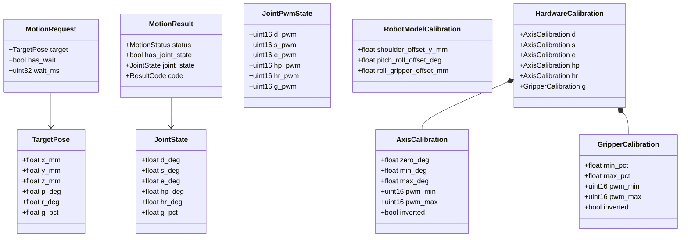

Die fachliche Trennung zwischen Task Space und Joint Space bleibt dabei zentral:

* `TargetPose` beschreibt den Sollzustand des Endeffektors im Task Space mit `(x, y, z, p, r, g)`
* `JointState` beschreibt die berechnete Gelenkkonfiguration im Joint Space mit `(d, s, e, hp, hr, g)`
* `g` bleibt in beiden Modellen bewusst dieselbe fachliche Größe, nämlich die Greiferöffnung in Prozent

### TargetPose

`TargetPose` ist das zentrale Eingabemodell für Bewegungsziele im Task Space.

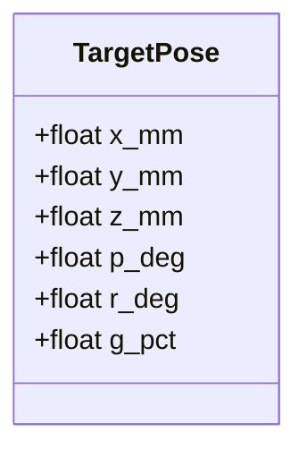

Bedeutung der Felder:

* `x_mm`, `y_mm`, `z_mm`: kartesische Position des Endeffektors in Millimetern
* `p_deg`: Pitch im Task Space in Grad
* `r_deg`: Roll im Task Space in Grad
* `g_pct`: Greiferöffnung in Prozent

### JointState

`JointState` beschreibt das Ergebnis der kinematischen Berechnung im Joint Space.

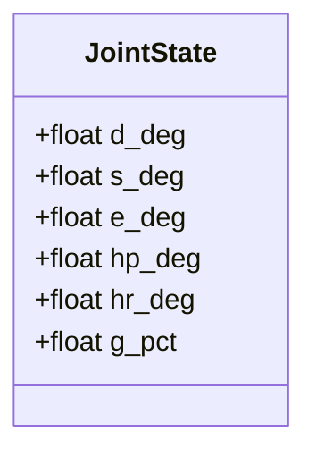

Bedeutung der Felder:

* `d_deg`: Drehtellerwinkel
* `s_deg`: Schulterwinkel
* `e_deg`: Ellenbogenwinkel
* `hp_deg`: Handgelenk-Pitch
* `hr_deg`: Handgelenk-Roll
* `g_pct`: Greiferöffnung

### MotionRequest

`MotionRequest` ist das Übergabemodell zwischen Anwendung und Orchestrierung für eine einzelne Bewegungsanforderung.

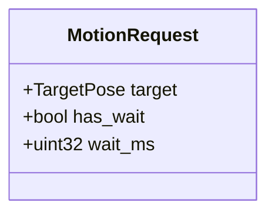

Für die erste Ausbaustufe bleibt dieses Modell bewusst einfach. Es enthält mindestens:

* ein fachliches Bewegungsziel als `TargetPose`
* eine optionale Wartezeit nach der Zielverarbeitung

Spätere Erweiterungen wie LED-Aktionen, Roboter-Aktionen oder Prioritäten können auf diesem Modell aufbauen.

### MotionResult

`MotionResult` beschreibt das fachliche und technische Ergebnis einer verarbeiteten Bewegungsanforderung.

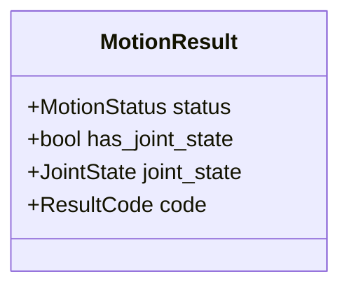

Für die erste Ausbaustufe sollte das Modell insbesondere ausdrücken:

* ob eine Bewegungsanforderung akzeptiert, abgelehnt oder nicht erreichbar war
* ob ein berechneter `JointState` vorliegt
* ob ein technischer Fehler oder ein fachlicher Ablehnungsgrund zurückgegeben wurde

Die genaue Ausgestaltung von `MotionStatus` und `ResultCode` wird im Kapitel zur Fehlerbehandlung weiter konkretisiert.

### JointPwmState

`JointPwmState` beschreibt die PWM-bezogene Aktoransteuerung nach Anwendung der `HardwareCalibration`.

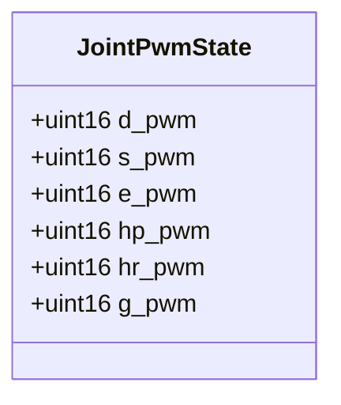

Dieses Modell bildet die Brücke zwischen logischem Gelenkzustand und konkreter Hardwareausgabe:

* es enthält keine fachlichen Winkel oder Prozentwerte mehr
* es beschreibt die kanalbezogenen PWM-Sollwerte pro Aktor
* es ist das naheliegende Übergabemodell zwischen `Hardware Abstraction` und `Hardware Driver`

### RobotModelCalibration

`RobotModelCalibration` beschreibt Kalibrations- und Korrekturwerte, welche das fachliche Robotermodell betreffen.

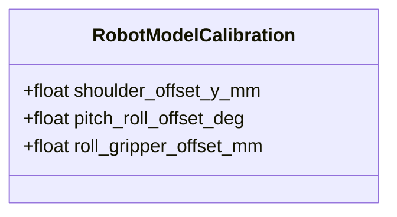

Diese Werte werden nicht zur direkten PWM-Erzeugung verwendet, sondern zur Korrektur und Präzisierung des mathematischen Modells. Sie gehören damit auf die Robotik-Seite und müssen von `Kinematics`, `Validation` und gegebenenfalls einem `Robot Model` berücksichtigt werden.

### HardwareCalibration

`HardwareCalibration` beschreibt die Abbildung zwischen fachlichen Sollwerten und realen hardwarebezogenen Stellwerten.

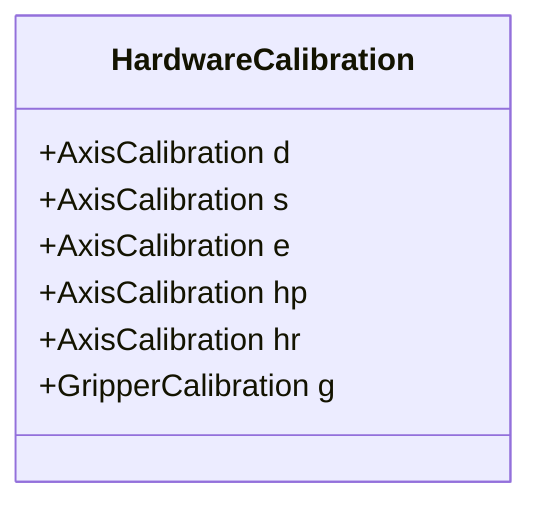

Für Rotationsachsen wird jeweils ein `AxisCalibration`-Eintrag verwendet:

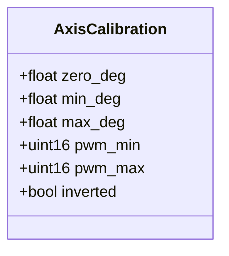

Für den Greifer wird ein separates Modell mit Prozentbezug verwendet:

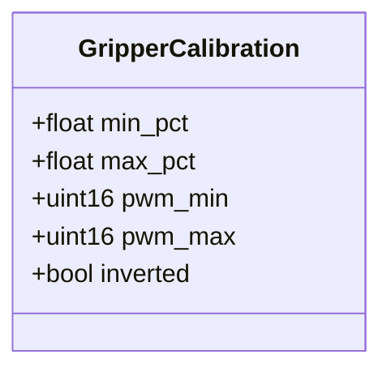

Damit bleibt die Kalibration konsistent mit der fachlichen Entscheidung, dass `g` in Task Space und Joint Space dieselbe Größe beschreibt, während die interne Abbildung auf PWM-Werte dennoch separat dokumentiert wird. `HardwareCalibration` ist damit ausdrücklich von `RobotModelCalibration` abgegrenzt und gehört zur hardwarenahen Abbildung in der `Hardware Abstraction`.


## Schnittstellen der Kernmodule

Dieses Kapitel beschreibt die fachlichen und technischen Übergaben zwischen den zentralen Softwarebausteinen. Im Vordergrund stehen die Modelle auf den Schnittstellen sowie die Verantwortungsgrenzen der Module, nicht die konkrete C++-Signatur einzelner Methoden.

Für die erste Ausbaustufe sollen die zentralen Schnittstellen bewusst einfach, synchron und deterministisch gehalten werden. Jede Komponente soll klar benannte Eingaben verarbeiten, ein fachlich interpretierbares Ergebnis zurückgeben und dabei möglichst wenig Wissen über interne Details anderer Bausteine benötigen.

Das folgende Diagramm zeigt die geplanten Hauptschnittstellen zwischen den Kernmodulen:

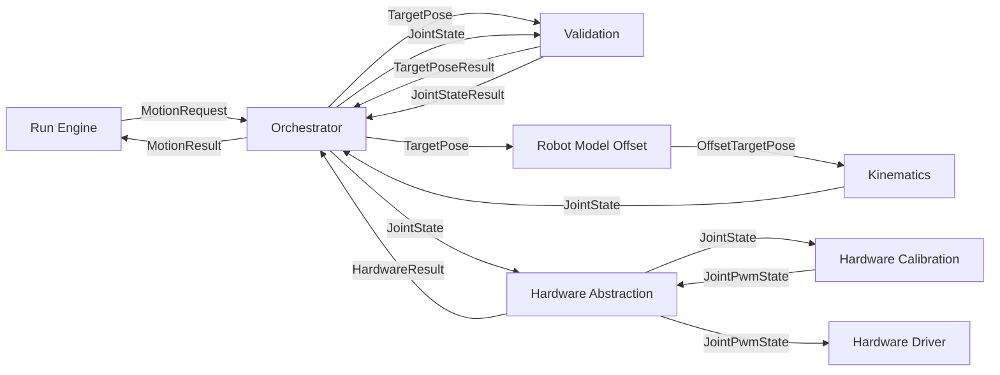

Das Diagramm ist bewusst als Datenflussdiagramm zu lesen. Die Pfeile beschreiben daher in erster Linie, welche Modelle oder Ergebnisobjekte von einer Komponente an die nächste übergeben werden. Es geht an dieser Stelle also nicht nur um statische Abhängigkeiten, sondern um den fachlichen Verarbeitungsfluss einer Bewegungsanforderung.

Besonders wichtig ist dabei die Unterscheidung zwischen fachlichen Zuständen und transformierten Zwischenständen:

* `TargetPose` ist das fachliche Ziel aus Sicht der Anwendung
* `OffsetTargetPose` ist eine durch bekannte Modell-Offsets korrigierte Zwischenrepräsentation für die Kinematik
* `JointState` ist das Ergebnis der kinematischen Berechnung im Gelenkraum
* `JointPwmState` ist die hardwarebezogene Ausgabeform nach Anwendung der Hardwarekalibration

Auf diese Weise wird im Diagramm sichtbar, an welcher Stelle sich die Darstellung einer Bewegung ändert: von der fachlichen Zielbeschreibung über modellkorrigierte Zwischenstände bis hin zur konkreten PWM-Ausgabe für die Aktoren.

Die dabei verwendeten Modellbegriffe sind zunächst fachlich zu verstehen:

* `TargetPoseResult` beschreibt das Ergebnis einer fachlichen Prüfung eines `TargetPose`
* `JointStateResult` beschreibt das Ergebnis einer fachlichen Prüfung eines `JointState`
* `OffsetTargetPose` beschreibt eine durch `RobotModelOffset` korrigierte Zielbeschreibung für die weitere Verarbeitung in der Kinematik
* `JointPwmState` beschreibt die PWM-bezogenen Sollwerte nach Anwendung der `HardwareCalibration`
* `HardwareResult` beschreibt den technischen Rückgabestatus der Hardwareseite

### Run Engine

Die Anwendungsschicht erzeugt fachliche Bewegungsanforderungen und verarbeitet deren Ergebnisse.

Eingaben und Ausgaben:

* Übergabe eines `MotionRequest` an den `Orchestrator`
* Entgegennahme eines `MotionResult`

Die Anwendung kennt dabei:

* fachliche Zielmodelle
* Ablaufzustände
* einfache Ergebniszustände

Die Anwendung kennt dabei nicht:

* konkrete IK-Details
* Kalibrationsparameter
* hardwarebezogene Stellwerte oder Treiberdetails

### Orchestrator

Der `Orchestrator` ist die zentrale Koordinationsinstanz zwischen Anwendung, Robotik und Hardware.

Eingaben und Ausgaben:

* Eingabe eines `MotionRequest`
* Übergabe eines `TargetPose` an `Validation`
* Übergabe eines `TargetPose` an `Kinematics`
* Übergabe eines `JointState` an `Validation`
* Übergabe eines `JointState` an `Hardware Abstraction`
* Rückgabe eines `MotionResult` an die Anwendung

Der `Orchestrator` kennt dabei:

* die Reihenfolge der Verarbeitungsschritte
* fachliche und technische Rückgabepfade
* die zentralen Übergabemodelle

Der `Orchestrator` kennt dabei nicht:

* die interne mathematische Implementierung der Kinematik
* die konkrete PWM-Erzeugung im Treiber

### Validation

`Validation` prüft Zielzustände und berechnete Gelenkzustände unter fachlichen Randbedingungen.

Eingaben und Ausgaben:

* Eingabe eines `TargetPose` für Vorprüfungen mit Rückgabe eines `TargetPoseResult`
* Eingabe eines `JointState` für Gelenk- und Freigabeprüfungen mit Rückgabe eines `JointStateResult`

`Validation` kennt dabei:

* Gelenkgrenzen
* Bewegungsrandbedingungen
* fachliche Freigaberegeln

`Validation` kennt dabei nicht:

* hardwarebezogene PWM-Werte
* Treiberdetails

### Kinematics

`Kinematics` berechnet aus einer gültigen Zielbeschreibung einen fachlichen Gelenkzustand.

Eingaben und Ausgaben:

* Eingabe eines `TargetPose`
* Rückgabe eines `JointState`

`Kinematics` kennt dabei:

* Task Space
* Joint Space
* Robotermodell und geometrische Parameter

`Kinematics` kennt dabei nicht:

* Hardwaredetails
* PWM-Grenzen
* Ablauflogik der Anwendung

### Hardware Abstraction

`Hardware Abstraction` kapselt den Übergang von hardwarenahen Stellwerten zur konkreten Treiberansteuerung. In der Implementierung kann dieser Baustein als HAL verstanden und entsprechend benannt werden.

Eingaben und Ausgaben:

* Eingabe eines `JointState` zusammen mit `HardwareCalibration`
* interne Erzeugung eines `JointPwmState`
* Übergabe eines `JointPwmState` an den `Hardware Driver`
* Rückgabe eines `HardwareResult`

`Hardware Abstraction` kennt dabei:

* zulässige Stellwertbereiche
* Zuordnung zu Ausgabekanälen
* Schutz- und Begrenzungslogik
* `HardwareCalibration`

`Hardware Abstraction` kennt dabei nicht:

* IK-Ziele im Task Space
* fachliche Bewegungslogik der Anwendung

### Hardware Driver

Der `Hardware Driver` ist die unterste Softwareschicht zur direkten Ansteuerung der Hardwarekomponenten.

Eingaben und Ausgaben:

* Eingabe eines `JointPwmState`
* Rückgabe eines technischen Status an die `Hardware Abstraction`

Der Treiber kennt dabei:

* I2C-Kommunikation
* PCA9685-Zugriffe
* konkrete Ausgabedetails einzelner Kanäle

Der Treiber kennt dabei nicht:

* fachliche Zielzustände
* Gelenkmodelle
* Kalibrationslogik auf höherer Ebene

## Initialisierung und Laufzeitmodell

In diesem Kapitel sollte beschrieben werden:

* wie die Software startet und welche Initialisierungsreihenfolge vorgesehen ist
* wie die angenommene Home Position beziehungsweise Init Position in die Software übernommen wird
* wie aus Initialisierung, RobotModelCalibration, HardwareCalibration und Ablaufsteuerung ein konsistenter Laufzeitfluss entsteht
* wie mit Reset, Neustart oder unklarem physischem Zustand umgegangen werden soll

## Kalibration und Hardwareabbildung

In diesem Kapitel sollte beschrieben werden:

* wie `RobotModelCalibration` und `HardwareCalibration` voneinander abgegrenzt werden
* wie fachliche Sollwerte in hardwarenahe Stellwerte überführt werden
* welche Kalibrationsparameter pro Aktor benötigt werden
* wie Drehrichtung, PWM-Minimum, PWM-Maximum und Offsets abgebildet werden
* welche Grenzen in der Hardware Abstraction durchgesetzt werden sollen

## Fehlerbehandlung und Rückmeldungen

In diesem Kapitel sollte beschrieben werden:

* welche Fehlerzustände fachlich und technisch unterschieden werden
* wie `Motion Result` strukturiert ist
* wie nicht erreichbare Ziele, ungültige Zustände und Hardwarefehler behandelt werden
* welche Fehler nur gemeldet und welche direkt zur Bewegungsablehnung führen

## Teststruktur

In diesem Kapitel sollte beschrieben werden:

* welche Teile nativ getestet werden
* welche Teile als Embedded-Test auf dem ESP32 geprüft werden
* wie `Unity` in die Softwarestruktur eingebunden wird
* welche Kernkomponenten zuerst mit Tests abgesichert werden sollen

## Benennung und Konventionen

In diesem Kapitel sollte beschrieben werden:

* welche Regeln für Dateinamen, Typnamen und Modulnamen gelten
* wie Task-Space- und Joint-Space-Größen konsistent benannt werden
* wie mit Einheiten, Winkeln, Prozentwerten und Grenzwerten umgegangen wird
* welche Begriffe aus der Dokumentation direkt in Codebezeichner übernommen werden sollen

## Offene Softwarepunkte

In diesem Kapitel sollte beschrieben werden:

* welche Implementationsentscheidungen noch offen sind
* welche Punkte vor dem Start der eigentlichen Codierung noch festgelegt werden sollten
* welche Themen bewusst erst in einer späteren Ausbaustufe behandelt werden

## Anhang

### Glossar und Abkürzungen

In diesem Kapitel sollte beschrieben werden:

* softwarebezogene Begriffe und Abkürzungen
* zentrale Modulnamen und ihre Bedeutung
* wiederkehrende technische Kurzformen

### Dokumentenverweise

In diesem Kapitel sollte beschrieben werden:

* Verweise auf die Projektbeschreibung
* Verweise auf die Hardwarebeschreibung
* spätere Verweise auf Quellcode, Tests oder ergänzende technische Dokumente
